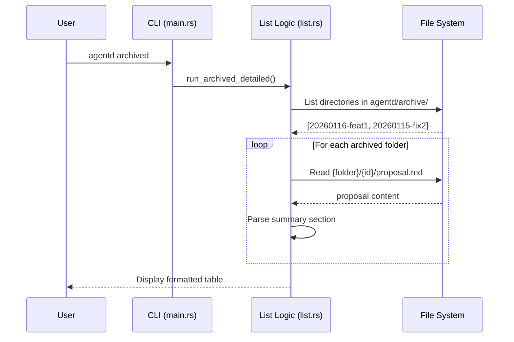

# Specification: Archived Command

## Overview

The `archived` command provides a way for users to browse the history of completed changes in an Agentd project. It reads the `agentd/archive/` directory, parses the archived change folders, and displays a formatted list of changes including the date they were archived and a brief summary.

## Requirements

### R1: Command Discovery
The command must be accessible via `agentd archived`.

### R2: Archive Parsing
The command must scan `agentd/archive/` for directories. Directory names follow the pattern `{YYYYMMDD}-{change_id}`. Malformed folder names should be skipped with a warning.

### R3: Summary Extraction
For each archived change, the command should attempt to read `{change_id}/proposal.md` within the archive folder and extract the content of the `## Summary` section. 
- The parser should extract the first non-empty paragraph under the heading.
- Summaries should be truncated at 80 characters with an ellipsis if they exceed that length.

### R4: Formatted Output
The output must be displayed in a clear, aligned table format with the following columns:
- **Date**: Extracted from the folder prefix (e.g., `2026-01-16`)
- **ID**: The original change ID
- **Summary**: The extracted and truncated summary

### R5: Empty State Handling
The command must display "No archived changes found." if:
- The `agentd/archive/` directory does not exist.
- The `agentd/archive/` directory exists but contains no subdirectories.

## Flow



## Interfaces

```
FUNCTION run_archived_detailed() -> Result<void>
  INPUT: none
  OUTPUT: Prints formatted list to stdout
  ERRORS: 
    - FileReadError (if proposal.md cannot be read)

FUNCTION extract_heading_section(content: string, heading: string) -> string
  INPUT: Markdown content, heading name (e.g., "Summary")
  OUTPUT: The first paragraph under the heading, trimmed and truncated at 80 chars
```

## Acceptance Criteria

### Scenario: List archived changes when they exist
- **WHEN** I run `agentd archived` and there are folders like `20260116-test-retry` in `agentd/archive/`
- **THEN** I should see a table-like output with "2026-01-16", "test-retry", and the summary from its proposal.md.

### Scenario: No archived changes
- **WHEN** I run `agentd archived` and `agentd/archive/` is empty or missing
- **THEN** I should see a message "No archived changes found."

### Scenario: Proposal summary extraction
- **WHEN** An archived `proposal.md` has a summary like "## Summary\n\nAdd a new command."
- **THEN** The extracted summary should be "Add a new command."