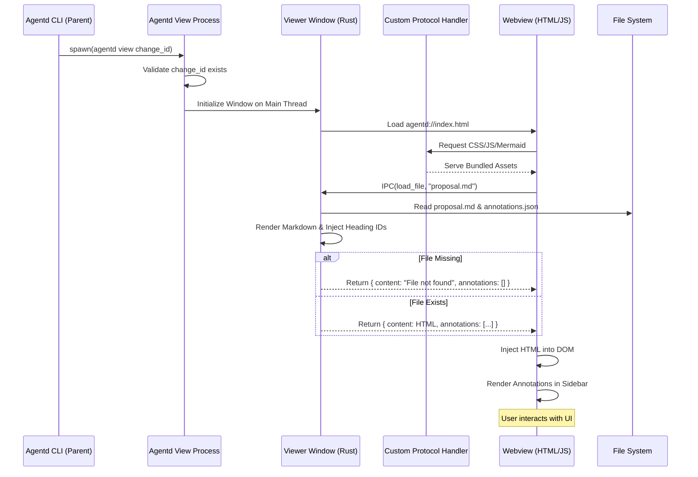

# Specification: Plan Viewer UI

## Overview

The Plan Viewer is a standalone native window that renders `agentd` plan files in a human-friendly format. It aims to provide a high-fidelity preview of technical designs, including rendered diagrams and interactive elements for review.

## Requirements

### R1: Native Window Rendering
The viewer must open as a native desktop window (not just a browser tab) using the `wry` library. It must be feature-gated (e.g., `feature = "ui"`) to avoid bloat in minimal builds.

### R2: Multi-file Support
The viewer must be able to display and switch between `proposal.md`, `CHALLENGE.md`, and `STATE.yaml`.
- Markdown files must be rendered to HTML with syntax highlighting for code blocks (using `highlight.js` or similar).
- YAML files (`STATE.yaml`) must be rendered as syntax-highlighted text (e.g., wrapped in a `<pre><code class="language-yaml">` block for `highlight.js` to process).
- When a file is loaded, the backend must also fetch any associated annotations and send them to the frontend.
- If a requested file (e.g., `CHALLENGE.md`) does not exist, the backend must return a rendered HTML placeholder (e.g., "File not found") instead of crashing or returning an error.

### R3: Mermaid Rendering
Mermaid diagrams defined in Markdown code blocks must be rendered as SVG diagrams within the content area. Mermaid assets must be bundled into the binary (e.g., using `include_dir`) and served via a custom protocol (e.g., `agentd://`) to support completely offline usage.

### R4: Markdown Fidelity
Markdown content should be rendered with proper headings, lists, tables, and code highlighting.
- Must enable GFM extensions: tables, strikethrough, task lists.
- Must inject stable, deterministic ID slugs for all headings to support annotation targeting. (Injection occurs in the backend during rendering).

### R5: Responsive Navigation
A navigation component (sidebar or tabs) must allow the user to switch between tracked files within the active change.

### R6: Process Isolation & Fallback
The viewer must run on the main thread to satisfy `tao` requirements on macOS.
- The `agentd` binary entry point (`main.rs`) must be refactored to conditionally run the viewer on the main thread *before* initializing any async runtime.
- When triggered from `agentd proposal`, it should spawn as a **detached child process** so the CLI can exit or continue independently.
- **Fallback**: If the `ui` feature is disabled, the auto-open logic in `agentd proposal` must NOT attempt to spawn a process. Instead, it must log the exact message: "UI feature disabled. View plan manually at: [path]"

### R7: Error Handling
The viewer must handle invalid inputs gracefully.
- The CLI command must validate `change_id` before opening the window. If the change directory does not exist, it must print "Change '[change_id]' not found" and exit with a non-zero status code.
- Save operations must use atomic writes to prevent data corruption.
- If a save operation fails (e.g., permissions), the backend must return an error response via IPC, and the UI must display a toast/banner notification to the user.

### R8: Review Actions
The viewer must provide action buttons for completing the review process.
- **Approve Button**: Marks the review as complete, updates `STATE.yaml` phase to `complete`, and closes the viewer.
- **Request Changes Button**: Saves current annotations as review feedback and updates phase to indicate changes needed.
- **Submit Comments Button**: Saves annotations without changing phase, allowing continued review.
- All buttons must be prominently displayed in a toolbar or footer area.
- The backend must handle `complete_review` IPC message to update `STATE.yaml` and optionally trigger next workflow steps.

## Flow



## Interfaces

```
FUNCTION start_viewer(change_id: String, project_root: Path) -> Result<()>
  INPUT: change_id of the plan to view, project_root for file access
  OUTPUT: Blocks the main thread until window is closed
  SIDE_EFFECTS: Opens a native window, claims main thread, registers custom protocol
  ERRORS: ChangeNotFound (handled before call), InvalidPath

FUNCTION render_plan_to_html(file_path: Path) -> String
  INPUT: Path to a markdown or yaml file
  OUTPUT: HTML string with embedded CSS and layout
  ERRORS: FileNotFound (returns placeholder HTML), ParseError
  NOTE: Must inject id="..." attributes into headings during rendering

FUNCTION handle_ipc_message(message: JsonValue) -> JsonValue
  INPUT: JSON message from the webview
  OUTPUT: JSON response or action (like saving a file)
  SIDE_EFFECTS: May update local files (atomic write) or window state
```

## Acceptance Criteria

### Scenario: WHEN user opens valid change THEN viewer displays files
- **WHEN** user runs `agentd view my-change`
- **THEN** a native window opens with a sidebar listing `proposal.md`, `CHALLENGE.md`, and `STATE.yaml`

### Scenario: WHEN user opens invalid change THEN error is shown
- **WHEN** user runs `agentd view non-existent-change`
- **THEN** the command exits with message "Change 'non-existent-change' not found" and status code 1, and does not open a window

### Scenario: WHEN UI feature disabled THEN fallback message is logged
- **WHEN** `agentd proposal` completes and updates phase to `CHALLENGED` (with `ui` feature disabled)
- **THEN** a message "UI feature disabled. View plan manually at: [path]" is logged, and no process is spawned

### Scenario: WHEN file is missing THEN placeholder is shown
- **WHEN** user clicks `CHALLENGE.md` but the file does not exist
- **THEN** the viewer displays a "File not found" placeholder instead of crashing

### Scenario: WHEN annotation save fails THEN error notification appears
- **WHEN** user attempts to save an annotation but the file system is read-only
- **THEN** the UI displays an error notification

### Scenario: WHEN user approves review THEN phase is updated
- **WHEN** user clicks the "Approve" button after reviewing the plan
- **THEN** `STATE.yaml` phase is updated to `complete`, a success message is shown, and the viewer closes

### Scenario: WHEN user requests changes THEN annotations are saved
- **WHEN** user clicks the "Request Changes" button with annotations added
- **THEN** annotations are saved, `STATE.yaml` phase remains unchanged (or set to needs-revision), and the viewer closes with a summary

### Scenario: WHEN user submits comments THEN viewer stays open
- **WHEN** user clicks "Submit Comments" button
- **THEN** annotations are saved but the viewer remains open for continued review
