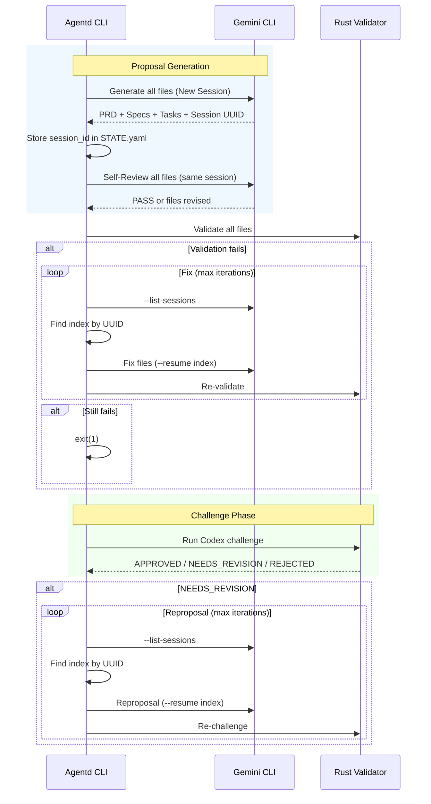

# Specification: Progressive Proposal Workflow Enhancements

## Overview
This specification defines three enhancements to the existing progressive proposal workflow: self-review prompts, explicit session ID resume, and non-zero exit on failure.

## Requirements

### R1: Self-Review After Generation
After the proposal generation completes (which creates PRD, Specs, and Tasks files together), a separate self-review prompt MUST run in the same session. The prompt asks Gemini to review all generated files against quality criteria.

**Output Format**: The self-review MUST output either:
- `<review>PASS</review>` if no issues found
- `<review>NEEDS_REVISION</review>` followed by Gemini editing the files directly

**Application**: Since Gemini has file editing capabilities (same as reproposal workflow), the self-review prompt instructs Gemini to edit the generated files directly if issues are found. The orchestrator only needs to detect `NEEDS_REVISION` to log that revisions were made.

**Note**: Self-review uses the same Gemini session and inherits the same tool permissions as the generation step. It runs once after full proposal generation, reviewing all files together.

**Marker Detection**: Gemini output is stream-json. The detector MUST:
1. Parse stream-json events and extract text segments from assistant messages
2. Assemble text and search for `<review>PASS</review>` or `<review>NEEDS_REVISION</review>`
3. Handle escaped characters and multi-line content
4. If no marker found, log a warning and treat as PASS (non-blocking, proceed to validation)

### R2: Resume-by-Index (Gemini Only)
The session UUID MUST be parsed from Gemini's output after the initial generation and stored in STATE.yaml under `session_id` (existing field). Before each subsequent **Gemini** call, the system MUST:
1. Run `gemini --list-sessions` to get available sessions
2. Parse the output to find the index of the stored UUID
3. Use `--resume <index>` instead of `--resume latest`

**Scope**: This applies to Gemini calls only (PRD, Specs, Tasks generation, self-review, reproposal fixes). Challenge phase uses Codex and continues to use its existing session handling.

**Working Directory**: All Gemini CLI commands (including `--list-sessions`) MUST run with `current_dir` set to `project_root` to ensure project-scoped session lookup.

**`--list-sessions` Output Format** (1-indexed):
```
Available sessions for this project (N):
  1. <prompt preview> (time ago) [UUID]
  2. <prompt preview> (time ago) [UUID]
  ...
```

The parser extracts the index (1-based) from the line number and UUID from brackets.

**Fallbacks and Error Handling**:
- If the initial PRD generation does not yield a session_id, log "Failed to capture session ID" and exit with non-zero status.
- If the stored UUID is not found in `--list-sessions`, log "Session not found, please re-run proposal" and exit with non-zero status.
- If `--list-sessions` command fails (non-zero exit code, auth error, timeout), log the command's stderr/stdout and exit with non-zero status. Do not attempt to resume or fall back to `--resume latest`.
- If `--list-sessions` output format is unexpected (no "Available sessions" header, no UUID in brackets, unparseable lines), log "Failed to parse session list" with the raw output and exit with non-zero status.

### R3: Non-Zero Exit on Failure
When validation or challenge fails, the system MUST exit with `std::process::exit(1)`.

**Exit scenarios**:
- Format validation still failing after `format_iterations` attempts
- Challenge verdict is `NEEDS_REVISION` and still failing after `planning_iterations` attempts
- Challenge verdict is `REJECTED` (immediate exit, no retry)
- Session ID capture or lookup fails (per R2 fallbacks)

Currently the workflow returns `Ok(())` in these cases. This change makes failures detectable in CI/scripts.

## Flow



## Acceptance Criteria

### Scenario: WHEN proposal generation completes THEN self-review runs
- **WHEN** Gemini finishes generating all proposal files (PRD, Specs, Tasks)
- **THEN** a separate self-review prompt runs in the same session
- **AND** if issues found, Gemini edits the files directly and outputs `<review>NEEDS_REVISION</review>`
- **AND** the orchestrator logs that revisions were made

### Scenario: WHEN resuming session THEN explicit index is used
- **WHEN** the workflow needs to resume a Gemini session
- **THEN** it runs `--list-sessions`, finds the stored UUID's index, and uses `--resume <index>`
- **AND** does NOT use `--resume latest`

### Scenario: WHEN session UUID not found THEN command exits with error
- **WHEN** the stored session_id is not found in `--list-sessions` output
- **THEN** the command logs "Session not found, please re-run proposal" and exits with status code 1

### Scenario: WHEN validation fails after max iterations THEN exit non-zero
- **WHEN** format validation or challenge fails after `planning_iterations` attempts
- **THEN** the command logs remaining errors and exits with status code 1
- **AND** does NOT return `Ok(())`
