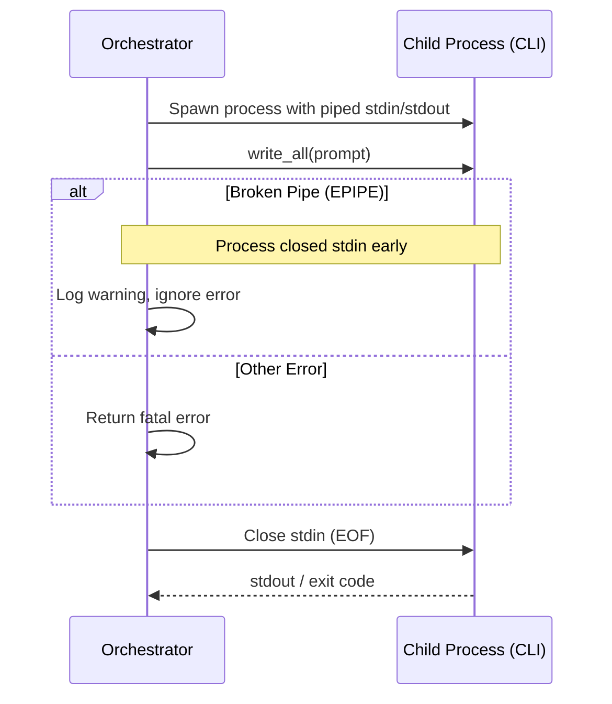

# Specification: Robust Stdin Orchestration

## Overview

Enhance the `ScriptRunner` to handle stdin pipe errors (Broken Pipe) more robustly. This ensures that the orchestration doesn't fail prematurely if the child process (LLM CLI) starts processing and closes its stdin before the orchestrator has finished writing the prompt, which is common with large prompts or streaming-optimized CLIs.

## Requirements

### RO-R1: Graceful `BrokenPipe` Handling
When writing the prompt to the child process's stdin, `BrokenPipe` errors (EPIPE) SHOULD be caught and treated as a non-fatal event, as long as the process is still running or has exited successfully.

### RO-R2: Improved Error Context
If a fatal error occurs during stdin communication, the error message MUST include the command name and relevant context to distinguish it from a simple process crash.

### RO-R3: Stdin Lifecycle Management
Ensure that the stdin handle is explicitly closed/dropped after writing (or upon a non-EPIPE error) to correctly signal EOF to the child process.

## Flow



## Interfaces

```
FUNCTION write_to_stdin(child: Child, prompt: String) -> Result<()>
  INPUT: Child process handle and the prompt string
  OUTPUT: Success or Error
  SIDE_EFFECTS: Writes to child.stdin, handles BrokenPipe specifically
```

## Acceptance Criteria

### Scenario: Early Pipe Closure by CLI
- **WHEN** A large prompt is sent to an LLM CLI that reads only what it needs and closes stdin immediately
- **THEN** The `ScriptRunner` ignores the `BrokenPipe` error and continues to wait for the process output.

### Scenario: Real Stdin Error
- **WHEN** A real permission error or OS error occurs during stdin writing
- **THEN** The `ScriptRunner` returns a descriptive error that identifies the failed command.

### Scenario: Process Crash Before Write
- **WHEN** The child process crashes immediately before any data is written to stdin
- **THEN** The orchestrator correctly identifies the process exit status instead of reporting a generic pipe error.