# Specification: High-Level Workflows

## Overview

This specification defines the behavior of the consolidated high-level Agentd workflows: `plan`, `impl`, and `archive`. These workflows automate transitions by inspecting only the `phase` field in `STATE.yaml`. This version includes enhancements for implementation review tooling and task processing robustness.

**Key Design Principle**: Workflow commands only check `phase`. The `challenge` command is responsible for updating `phase` based on planning verdict, and the `review` command updates it based on implementation verdict.

## Terminology

| Term | Definition | Examples |
|------|------------|----------|
| **workflow** | High-level orchestration | `plan`, `impl`, `archive` |
| **command** | CLI commands called by workflows | `proposal`, `challenge`, `reproposal`, `implement`, `review` |
| **phase** | State in STATE.yaml | `proposed`, `challenged`, `implementing`, `complete` |
| **REVIEW.md** | Structured implementation feedback | Generated by `create_review` tool |

## Requirements

### WF-R1: Phase-Only State Machine

All workflow commands MUST determine their action solely based on the `phase` field in `STATE.yaml`. Valid phases are:

| Phase | Description |
|-------|-------------|
| `proposed` | Proposal exists, not yet challenged or needs revision |
| `challenged` | Challenge passed (APPROVED) or iteration limit reached with minor issues |
| `rejected` | Challenge rejected, requires manual intervention |
| `implementing` | Implementation in progress (code being written or under review) |
| `complete` | Implementation finished and approved (READY for archive) |
| `archived` | Change archived to agentd/specs/ |

### WF-R2: Planning Verdict Updates

The `challenge` step in the `plan` workflow MUST update `STATE.yaml` phase based on verdict:

| Verdict | New Phase | Rationale |
|---------|-----------|-----------|
| `APPROVED` | `challenged` | Ready for implementation |
| `NEEDS_REVISION` | `proposed` | Stays in proposed, triggers reproposal |
| `REJECTED` | `rejected` | Fundamental issues, manual intervention needed |

**Note**: Planning review content is stored as a review block in `proposal.md`.

### WF-R3: Sequential Planning Workflow

The `plan` workflow MUST orchestrate commands in a strict sequential order:
1. **`proposal` generation**: Gemini generates `proposal.md`.
2. **Spec generation**: Gemini generates `specs/*.md` in dependency order.
3. **Task generation**: Gemini generates `tasks.md` with explicit `change_id` metadata.
4. **`challenge` loop**: Codex reviews the whole plan and appends verdict to `proposal.md`.
5. **`reproposal` loop**: If `NEEDS_REVISION`, Gemini updates the plan and re-challenges (up to `planning_iterations`).

### WF-R4: Robust Implementation Workflow

The `impl` workflow MUST manage the implementation and review cycle:
1. **Implementation**: Claude writes code and tests based on `tasks.md`.
2. **Structured Review**: Codex uses the `create_review` MCP tool to submit structured findings to `REVIEW.md`.
3. **Phase Update**:
   - If Review is `APPROVED` → Set phase to `complete`.
   - If Review is `NEEDS_FIX` → Stay in `implementing`, trigger auto-fix loop.
   - If Review is `MAJOR_ISSUES` → Stay in `implementing`, stop loop for manual intervention.

### WF-R5: Tasks Robustness (Layer Inference)

The system MUST be able to process `tasks.md` even if YAML frontmatter is missing or incomplete by:
- Inferring the `change_id` from the directory structure.
- Inferring implementation layers (Data, Logic, Integration, Testing) from markdown headings (e.g., "## 1. Data Layer").

## Flow

### Phase State Machine

```mermaid
stateDiagram-v2
    [*] --> proposed: agentd plan (init)
    proposed --> challenged: challenge APPROVED
    proposed --> proposed: challenge NEEDS_REVISION → reproposal
    proposed --> rejected: challenge REJECTED
    rejected --> proposed: manual edit + re-challenge
    challenged --> implementing: agentd impl
    implementing --> implementing: review NEEDS_FIX → auto-fix
    implementing --> complete: review APPROVED
    complete --> archived: agentd archive
```



### Plan Workflow Logic (Sequential)

```mermaid
graph TD
    Start[agentd:plan] --> CheckState{STATE.yaml?}
    CheckState -- No --> Proposal[1. Generate proposal.md]
    CheckState -- Yes --> Phase{phase?}

    Proposal --> Specs[2. Generate specs in order]
    Specs --> Tasks[3. Generate tasks.md]
    Tasks --> Challenge[4. Challenge whole plan]

    Phase -- proposed --> Challenge
    Phase -- challenged --> Done[✅ Planning complete<br/>Run /agentd:impl]
    Phase -- rejected --> Rejected[⛔ Rejected<br/>Review proposal.md]
    Phase -- other --> Beyond[ℹ️ Beyond planning phase]

    Challenge --> Verdict{verdict?}
    Verdict -- APPROVED --> AskUser[AskUserQuestion:<br/>Implement / View]
    Verdict -- NEEDS_REVISION --> CheckIter{iterations<br/>< max?}
    Verdict -- REJECTED --> Rejected
    CheckIter -- Yes --> Reproposal[5. Reproposal loop]
    CheckIter -- No --> AskUserMinor[AskUserQuestion:<br/>Implement / View / Continue]
    Reproposal --> Challenge
    AskUser --> Done
```



### Implementation Workflow Logic (Structured)


## Interfaces

```
FUNCTION plan_workflow(change_id: String, description: Option<String>) -> Result<WorkflowAction, Error>
  INPUT: Change ID and optional description for initial proposal
  OUTPUT: Action taken (Proposed, Challenged, AlreadyComplete, etc.)
  SIDE_EFFECTS: Updates STATE.yaml phase

FUNCTION impl_workflow(change_id: String) -> Result<WorkflowAction, Error>
  INPUT: Change ID
  OUTPUT: Implementation status
  SIDE_EFFECTS: Updates STATE.yaml phase, generates/updates REVIEW.md

FUNCTION archive_workflow(change_id: String) -> Result<WorkflowAction, Error>
  INPUT: Change ID
  OUTPUT: Archival confirmation
  SIDE_EFFECTS: Moves directory, updates specs/, sets phase: archived
```

## Acceptance Criteria

### Scenario: Sequential Generation with Metadata
- **WHEN** `agentd plan` is run for a new change
- **THEN** it generates `proposal.md`, then `specs/`, then `tasks.md`
- **THEN** `tasks.md` contains the `change_id` in its frontmatter.

### Scenario: Structured Implementation Review
- **WHEN** `agentd impl` runs the review step
- **THEN** it uses the `create_review` tool to generate a structured `REVIEW.md`
- **THEN** if the verdict is `APPROVED`, the phase is updated to `complete`.

### Scenario: Task Layer Inference
- **WHEN** `agentd impl` is run on a change with a `tasks.md` file that lacks YAML frontmatter but has "## 1. Data Layer" headings
- **THEN** it correctly identifies the tasks as belonging to the Data Layer and proceeds with implementation.

### Scenario: Orchestration Robustness
- **WHEN** an LLM orchestration script encounters a `BrokenPipe` error during stdin communication
- **THEN** the workflow handles it gracefully (e.g., retries or clear error message) instead of crashing with a generic exit code error.
