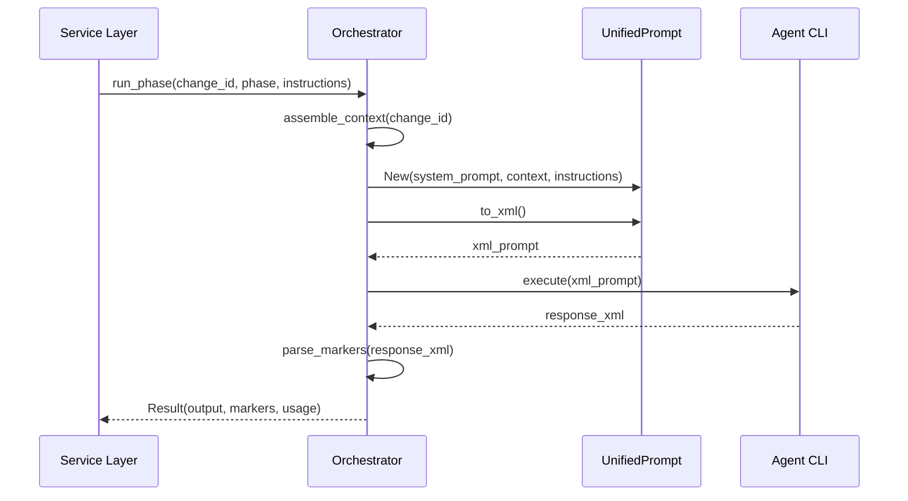

<spec>

# Agent Orchestration Update

## Overview

This specification defines the architectural changes required to transition the Agentd orchestration layer to a fully agent-agnostic, XML-based prompt system. By removing session-based state and hardcoded CLI flags, orchestrators will achieve greater reliability and flexibility. This update enables seamless context-passing via structured artifacts, supporting complex multi-turn workflows without requiring persistence in the underlying LLM providers.

## Requirements

### R1 - Removal of Orchestrator-side Session Persistence

```yaml
id: R1
priority: high
status: draft
```

Orchestrators must eliminate reliance on agent-specific session IDs or indexes for maintaining conversation state. Each interaction must be treated as a complete request where all necessary context is provided explicitly via the UnifiedPrompt structure.

### R2 - Adoption of UnifiedPrompt Model

```yaml
id: R2
priority: high
status: draft
```

Refactor all orchestrators (Gemini, Claude, Codex) in `src/orchestrator/` to use the `UnifiedPrompt` data model for prompt construction and execution. Orchestrators must call `to_xml()` to generate the standardized input for the agents.

### R3 - Transition to Prepended System Prompts

```yaml
id: R3
priority: high
status: draft
```

Eliminate the use of agent-specific environment variables or CLI flags (e.g., `GEMINI_SYSTEM_MD`) for delivering system instructions. System prompts must be loaded from phase-specific templates and embedded directly within the XML structure under the `<system_prompt>` tag.

### R4 - Structured Response Parsing Utilities

```yaml
id: R4
priority: medium
status: draft
```

Implement centralized utility functions in `src/orchestrator/mod.rs` to parse structured markers from agent responses. This function must handle all standard review verdicts: `PASS`, `NEEDS_REVISION`, `NEEDS_CHANGES`, `REJECTED`, and `MAJOR_ISSUES`, returning a unified `ReviewResult` enum.

### R5 - Centralized Prompt Assembly Logic

```yaml
id: R5
priority: medium
status: draft
```

Centralize the logic for loading system templates, gathering context files, and assembling the final `UnifiedPrompt` in `src/orchestrator/prompts.rs`, ensuring that all orchestrators follow the same assembly pattern.

## Flow Diagram



## Interfaces

```
FUNCTION orchestrator.run_phase(change_id: String, phase: Phase, instructions: String) -> Result<(String, Vec<Marker>, UsageMetrics)>
  INPUT: Change ID, current phase (plan, implement, review), and task-specific instructions
  OUTPUT: Raw response text, detected markers (e.g., ReviewResult), and usage metrics
  SIDE_EFFECTS: Spawns child process for agent CLI without session resume flags

FUNCTION orchestrator.parse_review_marker(output: String) -> ReviewResult
  INPUT: Raw string output from agent
  OUTPUT: Enum(Pass, NeedsRevision, NeedsChanges, Rejected, MajorIssues)
  ERRORS: Error(MissingReviewMarker) if no valid marker is found.
```

## Acceptance Criteria

### Scenario: Executing a proposal without session resume
- **WHEN** GeminiOrchestrator is called to generate a proposal for "feature-x".
- **THEN** It does NOT call `find_session_index`.
- **AND** The CLI command generated for `gemini` contains NO `--resume` or `--session` flags.
- **AND** The input provided to the command is the complete XML rendered by `UnifiedPrompt.to_xml()`.

### Scenario: Transitioning system prompts to XML
- **WHEN** ClaudeOrchestrator executes an implementation task.
- **THEN** It no longer sets agent-specific environment variables for system instructions.
- **AND** The rendered XML contains the system prompt for the 'implement' phase within a `<system_prompt>` block.

### Scenario: Parsing markers from structured XML response
- **WHEN** The Codex agent returns a response containing `<review>NEEDS_REVISION</review>`.
- **THEN** The orchestrator's `parse_review_marker` function returns `ReviewResult::NeedsRevision`.
- **WHEN** The agent returns `<review>NEEDS_CHANGES</review>`.
- **THEN** The orchestrator returns `ReviewResult::NeedsChanges`.

### Scenario: Handling missing or conflicting review markers
- **WHEN** An agent returns a response without a `<review>` marker.
- **THEN** `parse_review_marker` returns a `MissingReviewMarker` Error to prevent ambiguous states.
- **WHEN** An agent returns both `<review>PASS</review>` and `<review>NEEDS_REVISION</review>`.
- **THEN** `NEEDS_REVISION` takes precedence for safety.

</spec>
