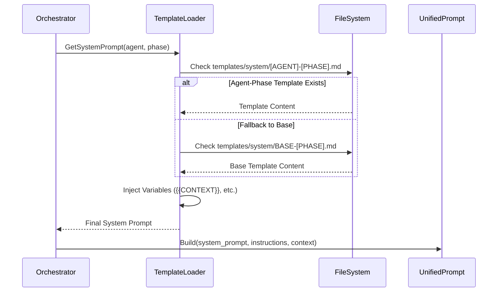

<spec>

# Specification: System Prompt Templates

## Overview

This specification defines the structure, organization, and mandatory content of the system prompt templates used by the Agentd orchestration layer. By moving hardcoded prompts from Rust code into phase-specific Markdown templates, we achieve greater flexibility, easier maintenance, and agent-agnostic consistency. These templates are loaded dynamically based on the current workflow phase and the specific AI agent being used, then injected into the `UnifiedPrompt` XML structure.

## Requirements

### R1: Template Organization and Naming

Templates must be stored in the `templates/system/` directory and follow a strict naming convention to enable dynamic loading by the orchestrator.

- **Path**: `templates/system/[AGENT]-[PHASE].md`
- **Agent Names**: `GEMINI`, `CLAUDE`, `CODEX` (must be uppercase)
- **Phase Names**: `plan`, `challenge`, `implement`, `review`, `archive` (must be lowercase)
- **Fallback**: If an agent-specific phase template is missing, the orchestrator should look for `BASE-[PHASE].md`.

### R2: Mandatory Template Structure

Each template must be a Markdown file with a consistent internal structure to ensure the agent receives all necessary context.

1.  **Identity & Role**: Clear definition of the agent's persona (e.g., "You are an Agentd SDD Specialist").
2.  **Core Principles**: High-level SDD principles (e.g., "No code in planning", "Use abstractions").
3.  **Context Placeholders**: Mandatory markers for dynamic data injection (e.g., `{{PROJECT_CONTEXT}}`).
4.  **Workflow Context**: Explanation of the current phase and state transitions.

### R3: Phase-Specific Directives

Templates must contain instructions tailored to the specific goals of each workflow phase.

- **plan**: Focus on PRD (proposal.md), TD (specs/), and Tickets (tasks.md). Use of abstractions (Mermaid, JSON Schema).
- **challenge**: Focus on technical review, logical consistency, and identifying gaps in proposals.
- **implement**: Focus on task-driven coding, test generation (unit/integration), and progress tracking in `IMPLEMENTATION.md`.
- **review**: Focus on verification via test execution, security scans, and code quality assessment.
- **archive**: Focus on changelog generation, final spec updates, and cleanup.

### R4: Variable Interpolation Support

The template loading system must support a set of standardized variables for dynamic content injection.

| Variable | Description |
|----------|-------------|
| `{{PROJECT_CONTEXT}}` | Content from `agentd/project.md` describing the tech stack and conventions. |
| `{{PROJECT_STRUCTURE}}` | A directory tree representation of the current project. |
| `{{ARTIFACTS}}` | Relevant files for the current context (e.g., relevant specs for implementation). |
| `{{SKELETON}}` | Structural guidance for generating specific files (e.g., proposal or spec skeletons). |
| `{{TASKS}}` | For implementation: the specific tasks from `tasks.md` to be executed. |

### R5: Response Marker Requirements (XML Tags)

Templates must explicitly instruct agents to use specific XML tags to communicate state and feedback back to the orchestrator.

- `<review>PASS|NEEDS_REVISION|NEEDS_CHANGES|REJECTED|MAJOR_ISSUES</review>`: Used for automated verdicts.
  - `PASS`: Used when the output meets all criteria.
  - `NEEDS_REVISION`: Used in 'plan' or 'challenge' phases when the proposal needs refinement.
  - `NEEDS_CHANGES`: Used in 'review' phase when implementation needs adjustment.
  - `REJECTED`: Used in 'challenge' phase for fundamentally flawed proposals.
  - `MAJOR_ISSUES`: Used in 'review' phase for critical failures (e.g., security, performance).
- `<task_status id="X.Y">COMPLETED|FAILED</task_status>`: Used to track progress during implementation.
- `<thought>`: Used for agent internal reasoning (to be filtered out from final outputs).

## Flow



## Data Model

```json
{
  "$schema": "http://json-schema.org/draft-07/schema#",
  "type": "object",
  "title": "SystemTemplateMetadata",
  "required": ["agent", "phase", "variables"],
  "properties": {
    "agent": {
      "type": "string",
      "enum": ["GEMINI", "CLAUDE", "CODEX", "BASE"]
    },
    "phase": {
      "type": "string",
      "enum": ["plan", "challenge", "implement", "review", "archive"]
    },
    "variables": {
      "type": "array",
      "items": {
        "type": "string"
      },
      "description": "List of variables detected/required in the template"
    }
  }
}
```

## Interfaces

```
FUNCTION load_system_template(agent: Agent, phase: Phase) -> Result<String, Error>
  INPUT: Agent type and current workflow phase
  OUTPUT: Raw template content from templates/system/
  ERRORS: TemplateNotFound if neither agent-specific nor BASE template exists

FUNCTION inject_variables(template: String, context: Map<String, String>) -> String
  INPUT: Raw template string and map of variable names to values
  OUTPUT: Template with all {{VARIABLE}} placeholders replaced
  SIDE_EFFECTS: Logs warning if a mandatory variable is missing from context
```

## Acceptance Criteria

### Scenario: Successfully loading an agent-specific implementation template
- **WHEN** Orchestrator requests 'implement' phase for 'CLAUDE'.
- **THEN** It successfully reads `templates/system/CLAUDE-implement.md`.
- **AND** The output includes the specific implementation instructions for Claude Sonnet.

### Scenario: Falling back to BASE template when agent-specific is missing
- **WHEN** Orchestrator requests 'archive' phase for 'GEMINI', but `GEMINI-archive.md` is missing.
- **THEN** The system successfully loads `templates/system/BASE-archive.md`.
- **AND** The orchestrator logs a debug message indicating the fallback.

### Scenario: Variable injection during template loading
- **WHEN** A template contains `{{PROJECT_CONTEXT}}`.
- **THEN** The loader replaces it with the contents of `agentd/project.md`.
- **AND** If `{{PROJECT_CONTEXT}}` is not available, it injects a "Context not provided" warning to inform the agent.

### Scenario: Instruction for outputting review markers
- **WHEN** `CODEX-challenge.md` is loaded.
- **THEN** It contains a specific instruction: "You MUST output <review>PASS</review> or <review>NEEDS_REVISION</review>".
- **AND** The orchestrator is able to parse this marker from the agent's XML response.

</spec>