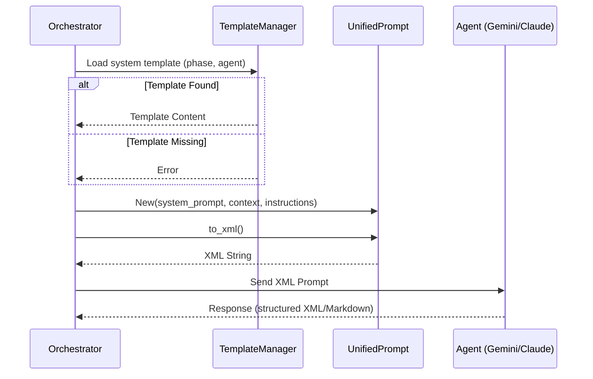

<spec>

# Unified Prompt System

## Overview

This specification defines the architecture for a unified, agent-agnostic prompt system. It introduces a structured XML-based communication format between the orchestrator and various AI agents (Gemini, Claude, Codex), ensuring consistency in how system prompts, context, and instructions are delivered across the platform. This move eliminates agent-specific formatting logic in the orchestrators and enables seamless cross-agent workflows.

## Requirements

### R1 - UnifiedPrompt Data Model

```yaml
id: R1
priority: high
status: draft
```

Define a structured data model in src/models/prompt.rs that encapsulates system instructions, multi-turn context (artifacts, files, thoughts), and user instructions.

### R2 - XML Rendering (to_xml)

```yaml
id: R2
priority: high
status: draft
```

Implement a to_xml() method for UnifiedPrompt that generates a standardized XML structure, allowing agents to clearly distinguish between system context and specific task instructions.

### R3 - Phase-Specific Template System

```yaml
id: R3
priority: medium
status: draft
```

Support loading system prompt templates from `templates/system/[AGENT]-[PHASE].md` or `templates/system/BASE-[PHASE].md`. This ensures that each agent receives instructions tailored to the current change phase (plan, challenge, implement, review) while allowing for a common fallback.

### R4 - Orchestrator Integration

```yaml
id: R4
priority: high
status: draft
```

Update all orchestrators in src/orchestrator/ to use UnifiedPrompt for prompt construction, moving away from hardcoded strings and CLI-specific prompt flags.

### R5 - Context Artifact Support

```yaml
id: R5
priority: medium
status: draft
```

The unified prompt must support 'artifacts' (previously generated code or specs) as part of the context, enabling multi-turn-like behavior without requiring agent-side session persistence.

## Acceptance Criteria

### Scenario: Constructing a basic Plan prompt

- **WHEN** The orchestrator creates a UnifiedPrompt for the 'plan' phase with a user request 'Add login'.
- **THEN** to_xml() produces a string containing <system_prompt> loaded from `templates/system/BASE-plan.md` (or agent specific), <instructions>Add login</instructions>, and appropriate context tags.

### Scenario: Rendering context files

- **WHEN** A UnifiedPrompt includes a context file 'src/main.rs' with its content.
- **THEN** The rendered XML includes a <context> block with a <file path='src/main.rs'> element containing the file's source code.

### Scenario: Error handling for missing templates

- **WHEN** The orchestrator attempts to load a template for an unknown phase 'invalid-phase' and no BASE template exists.
- **THEN** The system returns a clear `TemplateNotFound` error. It does NOT silently fallback or use an empty prompt, ensuring configuration issues are caught early.

## Flow Diagram



## Data Model

```json
{
  "type": "object",
  "required": [
    "instructions"
  ],
  "properties": {
    "system_prompt": {
      "type": "string"
    },
    "context": {
      "type": "array",
      "items": {
        "type": "object",
        "properties": {
          "type": {
            "type": "string",
            "enum": [
              "file",
              "artifact",
              "thought"
            ]
          },
          "name": {
            "type": "string"
          },
          "content": {
            "type": "string"
          }
        }
      }
    },
    "instructions": {
      "type": "string"
    }
  }
}
```

</spec>