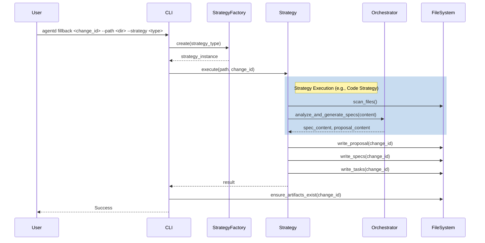

# Specification: Fillback Command

## Overview
The `fillback` command allows users to bootstrap their Agentd specifications by importing existing data from other formats (OpenSpec, GitHub Speckit) or by reverse-engineering the codebase.

## Requirements

### R1: Command CLI Structure
The `fillback` command must accept arguments for source path, import strategy, and target change ID.

### R2: Strategy Selection
The system must support explicit strategy selection (openspec, speckit, code) and an "auto" mode that attempts to detect the correct strategy based on file content.

### R3: Output Generation
The command must generate standard Agentd artifacts (`proposal.md`, `specs/*.md`, `tasks.md`) in the specified change directory.

### R4: Conflict Resolution
If the target `change_id` already exists, the command must prompt the user or fail unless a force flag (not yet defined, so defaulting to fail or reuse existing resolution prompts) is provided. It should reuse `resolve_change_id_conflict` logic used in other commands.

## Flow


## Data Model
```json
{
  "$schema": "http://json-schema.org/draft-07/schema#",
  "type": "object",
  "properties": {
    "change_id": {
      "type": "string",
      "description": "The ID of the change to create/populate (Required, Positional)"
    },
    "path": {
      "type": "string",
      "description": "Path to the source directory or file (Flag: --path, Default: current dir)"
    },
    "strategy": {
      "type": "string",
      "enum": ["auto", "openspec", "speckit", "code"],
      "default": "auto",
      "description": "Import strategy (Flag: --strategy)"
    }
  },
  "required": ["change_id"]
}
```

## Interfaces
```
ASYNC FUNCTION run(change_id: String, path: Option<String>, strategy: Option<String>) -> Result<()>
  INPUT: 
    - change_id: Target change ID
    - path: Source directory/file path (defaults to ".")
    - strategy: Import strategy (defaults to "auto")
  OUTPUT: Success or Error
  ERRORS: 
    - PathNotFound
    - InvalidStrategy
    - ParseError
    - GenerationError

INTERFACE ImportStrategy
  FUNCTION execute(source: &Path, change_id: &str) -> Result<()>
  FUNCTION can_handle(source: &Path) -> bool
```

## Acceptance Criteria

### Scenario: Code Strategy Execution
- **WHEN** user runs `agentd fillback --path . --strategy code --change-id init`
- **THEN** it scans the current directory and generates specs in `agentd/changes/init`.

### Scenario: Invalid Strategy
- **WHEN** user runs `agentd fillback` with an invalid strategy argument
- **THEN** it returns an error indicating supported strategies.

### Scenario: Full Artifact Generation
- **WHEN** any strategy is executed
- **THEN** the change directory must contain `proposal.md`, `tasks.md`, and `specs/*.md` (even if placeholders are used for non-spec files).