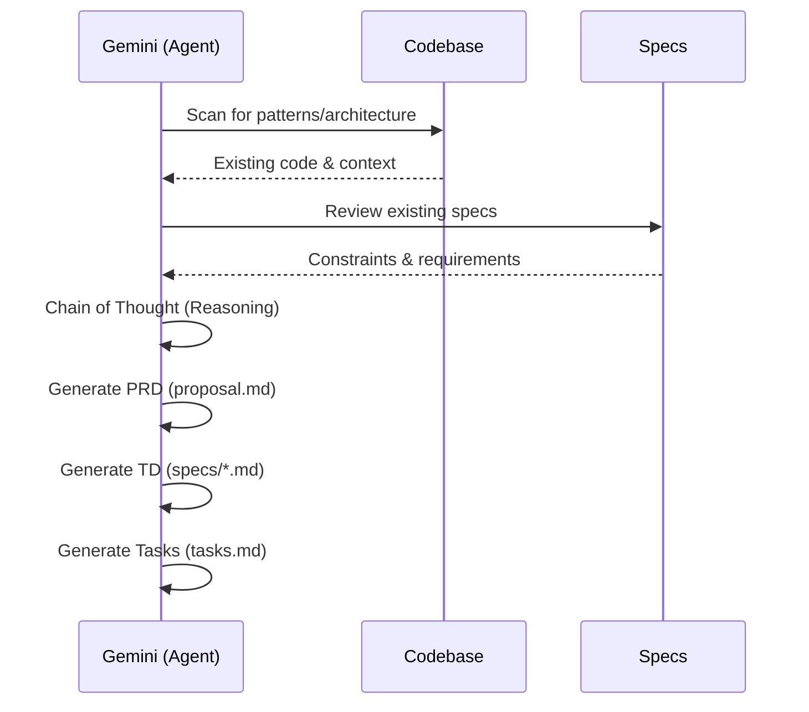

# Specification: Proposal Prompt Enhancement

## Overview
This specification defines the improved prompt structure for the `agentd:proposal` command. It leverages prompt engineering techniques to maximize the utility of Gemini's 2M context window for generating high-quality spec-driven development artifacts.

## Prompt Architecture

### 1. Persona and Context
The agent is cast as a Senior Staff Systems Engineer. This sets the tone for professional, deep-dive technical analysis rather than superficial code generation.

### 2. Reasoning Process (Chain of Thought)
The prompt will explicitly instruct the agent to:
1.  **Analyze**: Scan the codebase for relevant patterns, existing models, and architectural decisions.
2.  **Plan**: Outline the proposed changes and their dependencies before writing files.
3.  **Validate**: Cross-reference the proposed changes with existing specs to avoid regressions.



### 3. Structural Organization
Using headers and clear bullet points to separate "Role", "Process", "Constraints", and "Output Formats".

## Data Model (Prompt Structure)
```json
{
  "$schema": "http://json-schema.org/draft-07/schema#",
  "type": "object",
  "properties": {
    "role": { "type": "string", "description": "The persona the AI should adopt." },
    "objectives": { "type": "array", "items": { "type": "string" } },
    "process": { "type": "array", "items": { "type": "string" }, "description": "Steps for Chain-of-Thought." },
    "constraints": { "type": "array", "items": { "type": "string" } },
    "output_format": { "type": "string" }
  },
  "required": ["role", "objectives", "process", "constraints", "output_format"]
}
```

## Interfaces
```
FUNCTION generate_enhanced_prompt() -> PromptString
  INPUT: Current project context, User request
  OUTPUT: A fully engineered prompt for the Gemini agent
  
FUNCTION analyze_codebase(path: String) -> AnalysisReport
  INPUT: Directory path
  OUTPUT: Summary of patterns, types, and architecture relevant to the request
```

## Acceptance Criteria

### Scenario: High-Quality Specification Generation
- **WHEN** a user provides a complex feature request (e.g., "Implement a new caching layer with Redis support")
- **THEN** the agent should first list the existing modules it has analyzed.
- **THEN** it should produce Mermaid diagrams that show the interaction between the new cache and existing services.
- **THEN** the task list should include specific file modifications in the `src/` directory with clear dependencies.

### Scenario: Adherence to Constraints
- **WHEN** the agent generates a spec
- **THEN** it must NOT contain any implementation code blocks (e.g., `fn main() { ... }`).
- **THEN** it must NOT contain any placeholders like `[to be filled]`.

### Scenario: Consistency with Project Patterns
- **WHEN** the agent generates tasks
- **THEN** the task titles and descriptions must follow the existing style seen in `agentd/archive/` or other `agentd/changes/` folders.
