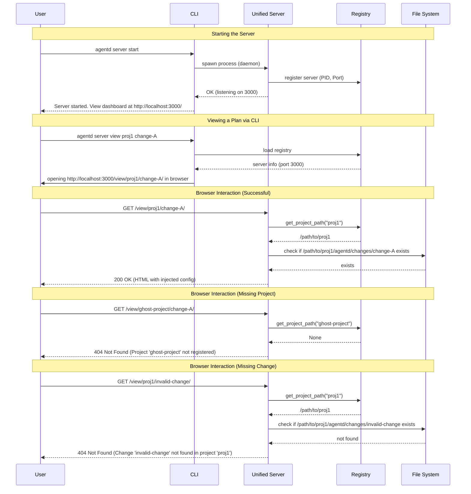

# Specification: Server Unification

## Overview

Consolidate the standalone Plan Viewer and MCP Server into a unified `agentd server` command. This unification reduces infrastructure duplication, simplifies the CLI surface, and provides a central hub for all agent-human interactions. The server will provide both an MCP JSON-RPC endpoint and a web-based UI for reviewing proposals and managing projects.

## Requirements

### R1: Unified Subcommand
The `agentd mcp-server` subcommand shall be renamed to `agentd server`. The existing `mcp-server` functionality (starting, stopping, status, list) shall be preserved under this new command. The independent `agentd view` command shall be removed.

### R2: Combined HTTP Server
A single `axum` server instance shall handle both MCP requests and Viewer web traffic. MCP traffic will be routed to `/mcp`, while web traffic will be routed to `/` (Dashboard) and `/view/:project/:change` (Plan Viewer).

### R3: URL Scoping and Project Isolation
The Plan Viewer shall be accessible via scoped URLs: `/view/:project/:change/`.
- `:project`: The name of the project as registered in the Agentd Registry.
- `:change`: The unique identifier for the change proposal.
The server must resolve the project name to a local path using the Registry before serving change data. Access to projects not in the Registry must be denied.

### R4: Static Asset Management
Static assets for the web UI (CSS, JS, fonts) shall be served from a unified `/static/` prefix. Assets should be embedded in the binary to ensure the server is self-contained.

### R5: Configuration Injection
The server shall inject a configuration object into the Viewer's HTML template based on the requested `:project` and `:change`. This configuration must include:
- `base_path`: The root API path for the current scope (e.g., `/view/my-proj/my-change/api`).
- `project`: The project name.
- `change_id`: The change identifier.
The frontend must use this `base_path` for all its API calls.

### R6: Server Dashboard
A dashboard shall be served at the root path (`/`). This dashboard will:
- List all projects currently registered in the Agentd Registry.
- For each project, list active changes (those found in `agentd/changes/`).
- Provide direct links to the Plan Viewer for each active change.

### R7: CLI Convenience Command
An `agentd server view <project> <change>` command shall be provided. This command will:
1. Load the Registry to find the server's port.
2. If the server is running, construct the URL and open it in the default browser.
3. If the server is not running, inform the user they must start the server first using `agentd server start`.

### R8: Registry-Based Data Resolution
All viewer API requests must resolve the project and change via the Registry and file system. If a project name is not found in the Registry, or if the change ID does not exist within that project's directory, the server must return a 404 error with a clear message.

## Flow



## Data Model

The Server uses the existing `Registry` data model for project lookups. The Dashboard generates a dynamic view of the registry and local changes.

### Dashboard Context Schema
```json
{
  "$schema": "http://json-schema.org/draft-07/schema#",
  "title": "DashboardState",
  "type": "object",
  "properties": {
    "server_info": {
      "type": "object",
      "properties": {
        "port": { "type": "integer" },
        "pid": { "type": "integer" },
        "started_at": { "type": "string", "format": "date-time" }
      }
    },
    "projects": {
      "type": "array",
      "items": {
        "type": "object",
        "properties": {
          "name": { "type": "string" },
          "path": { "type": "string" },
          "changes": {
            "type": "array",
            "items": {
              "type": "object",
              "properties": {
                "id": { "type": "string" },
                "status": { "type": "string" }
              }
            }
          }
        },
        "required": ["name", "path", "changes"]
      }
    }
  },
  "required": ["server_info", "projects"]
}
```

## Interfaces

### Subcommand: `agentd server`
```
FUNCTION run_server_command(args: ServerArgs) -> Result
  COMMANDS:
    start [--port, --daemon] -> Starts the unified server process
    stop [project]           -> Unregisters a project from the server
    status                   -> Displays server and project status
    list                     -> Lists all registered projects
    view <project> <change>  -> Opens browser to the Plan Viewer URL
    shutdown                 -> Stops the entire server process
```

### Server Routing Table
```
ROUTER UnifiedRouter
  GET  /                        -> handle_dashboard (R6)
  POST /mcp                     -> handle_mcp_request (Existing)
  GET  /static/*path            -> serve_static_asset (R4)
  
  SCOPE /view/:project/:change
    GET  /                      -> serve_viewer_html (R3, R5)
    GET  /api/info              -> api_info (R8)
    GET  /api/files             -> api_list_files (R8)
    GET  /api/files/*path       -> api_load_file (R8)
    POST /api/annotations       -> api_save_annotation (R8)
    ... (other viewer APIs)
```

### Injected Configuration
The HTML template will contain a script tag for configuration injection:
```
INJECTION CONFIG (into index.html)
  INPUT: project_name, change_id, port
  OUTPUT: <script id="agentd-config" type="application/json">...</script>
```

## Acceptance Criteria

### Scenario: Successful Server Startup and Discovery
- **WHEN** I run `agentd server start --port 3000`
- **THEN** the server starts and prints the URL `http://localhost:3000/`
- **AND** visiting `http://localhost:3000/` displays a dashboard listing all registered projects and their active changes.

### Scenario: Viewing a Specific Change via CLI
- **WHEN** the server is running
- **AND** project `my-app` is registered and contains change `add-feature-x`
- **AND** I run `agentd server view my-app add-feature-x`
- **THEN** my default browser opens to `http://localhost:3000/view/my-app/add-feature-x/`
- **AND** the Plan Viewer correctly displays the files and annotations for `add-feature-x`.

### Scenario: Project and Change Isolation
- **WHEN** I am viewing `my-app/change-1`
- **THEN** all API requests (e.g., `api/info`) must be routed to `/view/my-app/change-1/api/info`
- **AND** the server must verify that `my-app` is a valid registered project before returning any data.

### Scenario: Error Handling for Invalid Identifiers
- **WHEN** I navigate to `/view/unknown-project/any-change/`
- **THEN** the server returns a 404 Not Found error with the message "Project 'unknown-project' not registered".
- **WHEN** I navigate to `/view/my-app/ghost-change/`
- **THEN** the server returns a 404 Not Found error with the message "Change 'ghost-change' not found in project 'my-app'".