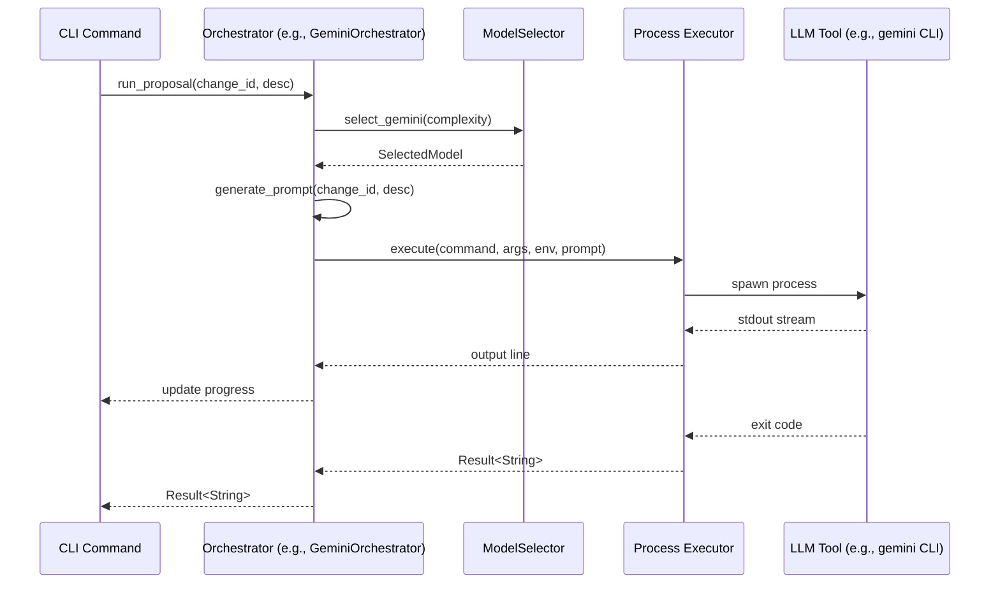

# Specification: Orchestrator Refactor

## Overview

The Orchestrator layer is responsible for translating high-level agent tasks (proposal, challenge, implement) into specific CLI commands for LLM tools (Gemini, Claude, Codex). This specification describes the move from shell-based execution to direct Rust-based orchestration.

## Requirements

### R1: Prompt Management in Rust
The system must manage all LLM prompts within the Rust codebase. Prompts should be parameterized based on change ID, description, and other relevant context.

### R2: Direct CLI Invocation
The system must invoke LLM CLI tools (`gemini`, `claude`, `codex`) directly using `tokio::process::Command` without intermediate shell scripts.

### R3: Environment Context
The system must correctly set up the environment for CLI tools. This includes:
- `GEMINI_SYSTEM_MD` or `GEMINI_INSTRUCTIONS_FILE` for Gemini (standardized to `GEMINI_SYSTEM_MD` where possible).
- `CODEX_INSTRUCTIONS_FILE` for Codex.
- Appropriate model selection environment variables (`AGENTD_MODEL`, etc.).

### R4: ModelSelector Integration
Orchestrators must use the `ModelSelector` to determine the correct model and parameters for each task based on complexity. This allows for dynamic selection between Flash/Pro or Sonnet/Opus based on the change's complexity level.

### R5: Progress Streaming
The system must stream output from CLI tools and update the progress UI in real-time, maintaining the current "spinner + message" UX.

### R6: Review Pipeline Pre-processing
The `CodexOrchestrator` must be able to execute local tools (e.g., `cargo test`, `cargo clippy`, `cargo audit`) and capture their output to be included in the review prompt. This ensures the LLM has access to actual build and test results.


## Flow



## Interfaces

```
FUNCTION run_command(cmd: SelectedModel, prompt: String, env: Map<String, String>) -> Result<String>
  INPUT: Selected model (command + model id), prompt string to pipe to stdin, environment variables
  OUTPUT: Captured stdout from the command
  ERRORS: Command not found, non-zero exit code, pipe failure

FUNCTION GeminiOrchestrator::run_proposal(change_id: String, description: String) -> Result<String>
  INPUT: Change ID and user request
  OUTPUT: Proposal generation output
  SIDE_EFFECTS: Calls gemini CLI, sets GEMINI_SYSTEM_MD

FUNCTION CodexOrchestrator::run_review(change_id: String, iteration: u32) -> Result<String>
  INPUT: Change ID and iteration count
  PROCESS:
    1. Execute local verification tools (cargo test, clippy, audit, semgrep)
    2. Capture tool outputs and format into the review prompt
    3. Invoke Codex CLI with the enriched prompt and change context
  OUTPUT: Captured review report (REVIEW.md content)
  ERRORS: Tool execution failure (non-zero exit not necessarily an error, but process failure is), Codex CLI failure

FUNCTION ClaudeOrchestrator::run_implement(change_id: String, tasks: Option<String>) -> Result<String>
  INPUT: Change ID and optional comma-separated task filter
  OUTPUT: Implementation output
  SIDE_EFFECTS: Calls claude CLI with tool access enabled
```

## Acceptance Criteria

### Scenario: Successful Proposal Generation
- **WHEN** `agentd proposal "add-auth" "Add OAuth support"` is run
- **THEN** `GeminiOrchestrator` generates the prompt in Rust
- **THEN** `gemini` CLI is invoked directly with `GEMINI_SYSTEM_MD` set to the correct path
- **THEN** The output is streamed to the terminal and saved to `proposal.md`

### Scenario: Claude Implementation with Task Filter
- **WHEN** `agentd implement --tasks 1.1,1.2` is run
- **THEN** `ClaudeOrchestrator` includes the task filter in the prompt
- **THEN** `claude` CLI is invoked with `--allowedTools "Write,Edit,Read,Bash,Glob,Grep"`
- **THEN** Implementation progress is shown in the terminal

### Scenario: CLI Tool Missing
- **WHEN** An orchestrator is called but the underlying CLI tool (e.g., `gemini`) is not in PATH
- **THEN** The system returns a clear error message: "Command 'gemini' not found. Please ensure it is installed and in your PATH."

### Scenario: Script Failure
- **WHEN** The LLM CLI tool returns a non-zero exit code
- **THEN** The orchestrator captures the error and returns it as a `Result::Err`, including any relevant stderr output.
