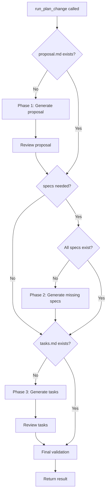

<spec>

# Idempotent Plan-Change Workflow

## Overview

This spec defines the new idempotent `run_plan_change` function that replaces both `run_proposal_loop` and `run_proposal_step_sequential`. The function checks for existing outputs before each phase and skips completed work, ensuring safe re-runs without side effects or duplicate change IDs.

## Requirements

### R1 - Phase skip logic

```yaml
id: R1
priority: high
status: draft
```

Before executing each phase (proposal, specs, tasks), check if the output file already exists. If it exists, skip that phase entirely. This makes the function idempotent.

### R2 - Remove conflict resolution from engine

```yaml
id: R2
priority: high
status: draft
```

The `resolve_change_id_conflict` call must be removed from `run_plan_change`. The caller (plan.rs) is responsible for determining if this is a new change or continuing an existing one.

### R3 - Single unified function

```yaml
id: R3
priority: high
status: draft
```

Merge `run_proposal_loop` and `run_proposal_step_sequential` into a single `run_plan_change` function. Remove the outer challenge/reproposal loop since reviews are already integrated in each phase.

### R4 - Validation-only mode

```yaml
id: R4
priority: medium
status: draft
```

When all phases are complete (all output files exist), only run the final structure validation and return success without calling any LLM APIs.

### R5 - Caller handles new vs continue

```yaml
id: R5
priority: medium
status: draft
```

plan.rs must check STATE.yaml existence before calling run_plan_change. For new changes, it may prompt for confirmation if a directory with the same name exists.

## Acceptance Criteria

### Scenario: New change with no existing files

- **GIVEN** Change directory does not exist or is empty
- **WHEN** run_plan_change is called
- **THEN** All three phases execute: generate proposal.md, specs, and tasks.md with their review loops

### Scenario: Continue change with proposal.md exists

- **GIVEN** proposal.md exists but specs and tasks.md do not
- **WHEN** run_plan_change is called
- **THEN** Phase 1 is skipped, Phase 2 and 3 execute normally

### Scenario: Continue change with all files exist

- **GIVEN** proposal.md, all specs, and tasks.md all exist
- **WHEN** run_plan_change is called
- **THEN** All phases are skipped, only final validation runs, no LLM API calls

### Scenario: Partial specs exist

- **GIVEN** proposal.md exists, 2 of 3 specs exist, tasks.md does not exist
- **WHEN** run_plan_change is called
- **THEN** Phase 1 skipped, only missing spec generated in Phase 2, Phase 3 executes normally

## Flow Diagram



</spec>
