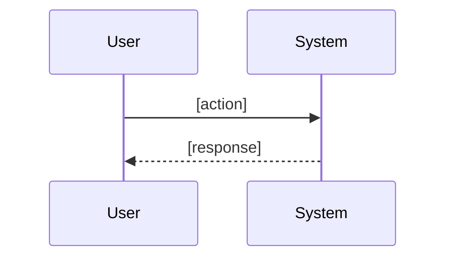
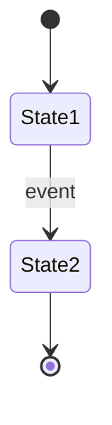

# Spec: [Feature Name]

<!--
Technical Design + Acceptance Criteria.
Use abstraction tools: Mermaid, JSON Schema, OpenAPI, Pseudo code.
NO actual implementation code.
-->

## Overview
[Brief description of what this spec covers]

## Flow


## State (if applicable)


## Data Model
```json
{
  "$schema": "http://json-schema.org/draft-07/schema#",
  "type": "object",
  "properties": {
    "field1": { "type": "string", "description": "..." },
    "field2": { "type": "integer" }
  },
  "required": ["field1"]
}
```

## Interfaces
```
FUNCTION function_name(param1: type, param2: type) -> ResultType
  INPUT: [describe inputs]
  OUTPUT: [describe outputs]
  ERRORS: [possible error conditions]

FUNCTION another_function() -> void
  SIDE_EFFECTS: [what it modifies]
```

## Acceptance Criteria
- WHEN [trigger condition] THEN [expected behavior]
- WHEN [error condition] THEN [error handling]
- WHEN [edge case] THEN [expected behavior]
