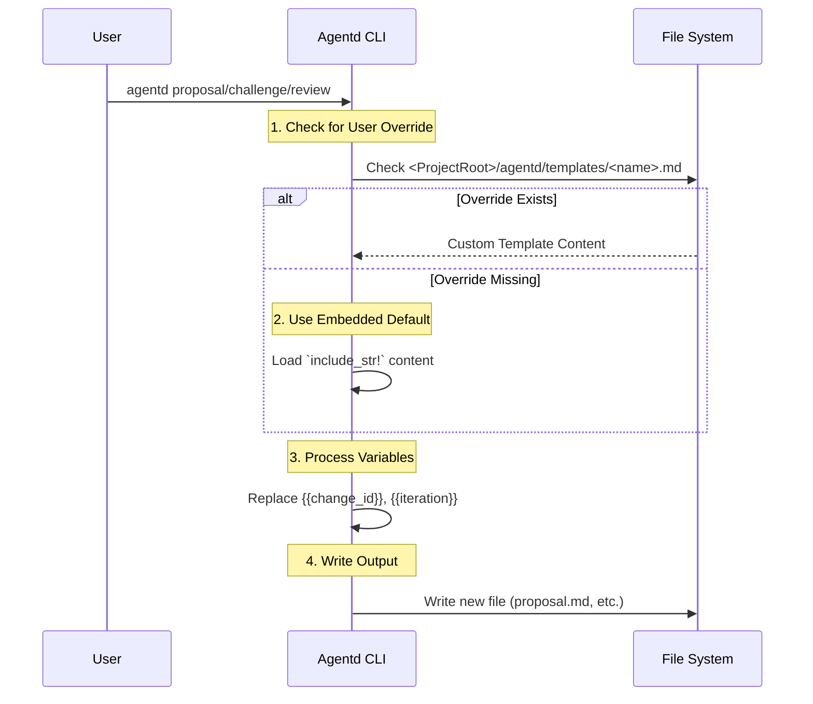

# Spec: Template Extraction & Path Fixes

## Overview
This spec covers the extraction of hardcoded templates from `src/context.rs` to external markdown files in `templates/skeletons/` (source) and the standardization of `scripts_dir` path resolution. It also introduces a template override mechanism for users.

## Flow
### Template Loading

## Data Model
### Source Template Structure (`templates/skeletons/`)
The following files will be created in `templates/skeletons/` and embedded into the binary:
- `proposal.md`: PRD template.
- `tasks.md`: Task breakdown template.
- `spec.md`: Technical spec template.
- `challenge.md`: Challenge report template.
- `review.md`: Review report template.

### Variable Syntax
Templates must use `{{variable_name}}` syntax. This prevents conflicts with Rust's formatting syntax and allows for simple string replacement.
- `{{change_id}}`: The ID of the change.
- `{{iteration}}`: The iteration number (for reviews).

## Interfaces
### `src/context.rs`
- **Helper**: `fn load_template(name: &str, project_root: &Path) -> Result<String>`
  - `name` includes the `.md` extension (e.g., `"proposal.md"`, `"challenge.md"`).
  - Tries to read `<project_root>/agentd/templates/<name>`.
  - If not found, returns the embedded static string for that name.
  - Replaces `{{key}}` placeholders with values.

### `src/models/change.rs` (Config)
- **Method**: `AgentdConfig::resolve_scripts_dir(&self, project_root: &Path) -> PathBuf`
  - If `self.scripts_dir` is absolute, returns it.
  - If `self.scripts_dir` is relative, joins it with `project_root`.

## Acceptance Criteria
- **AC1**: `templates/skeletons/` directory exists in source and contains all 5 template files using `{{variable}}` syntax.
- **AC2**: `agentd` uses embedded templates by default (no external file dependency for basic usage).
- **AC3**: Placing a file at `<project_root>/agentd/templates/proposal.md` overrides the generated proposal content.
- **AC4**: `scripts_dir` in `config.toml` can be relative (e.g., "scripts") or absolute, and both resolve correctly at runtime.
- **AC5**: `ScriptRunner` receives a fully resolved absolute path.