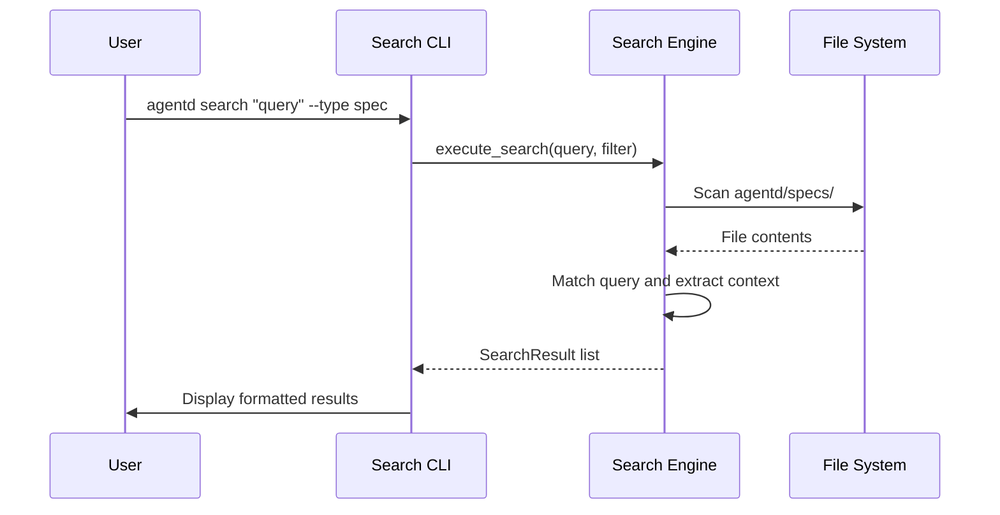

# Spec: Search Command

## Overview
The `search` command provides a unified interface for querying the Agentd knowledge base, including project specifications and active/archived changes. It supports full-text search and metadata filtering.

## Flow


## Data Model
```json
{
  "$schema": "http://json-schema.org/draft-07/schema#",
  "type": "object",
  "title": "SearchResult",
  "properties": {
    "file_path": { "type": "string" },
    "matches": {
      "type": "array",
      "items": {
        "type": "object",
        "properties": {
          "line_number": { "type": "integer" },
          "content": { "type": "string" },
          "context_before": { "type": "array", "items": { "type": "string" } },
          "context_after": { "type": "array", "items": { "type": "string" } }
        }
      }
    }
  }
}
```

## Interfaces
```
FUNCTION search_files(query: String, options: SearchOptions) -> Result<Vec<SearchResult>>
  INPUT: 
    - query: The text or regex to search for
    - options: Filters (paths, types, limits)
  OUTPUT: List of matches with context
  ERRORS: Invalid regex, IO errors

FUNCTION format_results(results: Vec<SearchResult>) -> String
  INPUT: Search results
  OUTPUT: Human-readable terminal output with colors and line numbers
```

## Acceptance Criteria
- **WHEN** the user runs `agentd search "UserRole"`
- **THEN** it should return all occurrences of "UserRole" in `agentd/specs/*.md`.
- **WHEN** the user runs `agentd search "config" --change "improve-prompt"`
- **THEN** it should only search within `agentd/changes/improve-prompt/`.
- **WHEN** no matches are found
- **THEN** it should display a "No results found" message and exit with code 0.
- **WHEN** an invalid regular expression is provided
- **THEN** it should display a clear error message and exit with a non-zero code.
