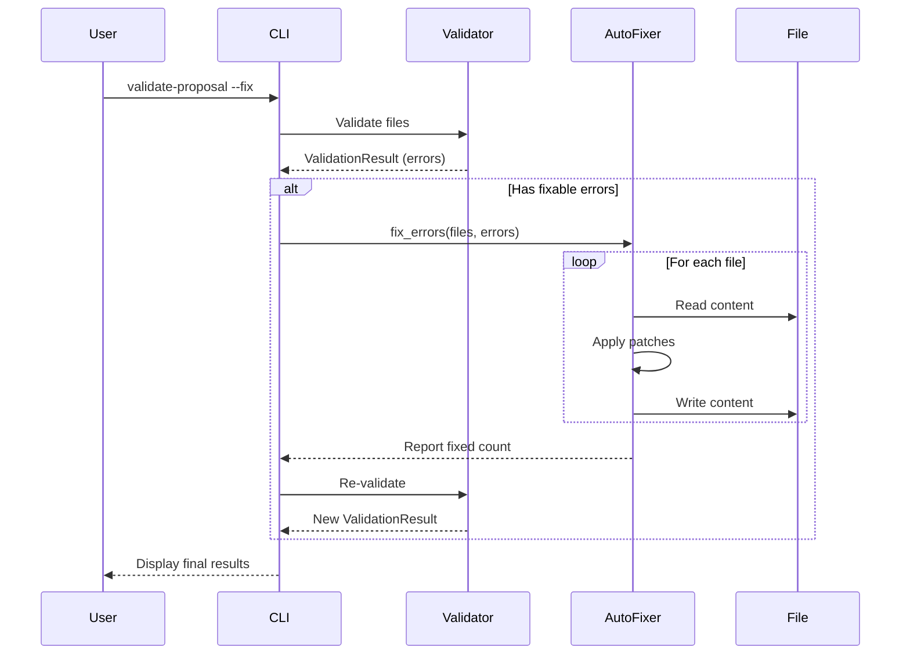

# Specification: Auto-Fixer for Validation

## Overview
The Auto-Fixer is a component that attempts to automatically resolve validation errors identified by the `SpecFormatValidator` and `SchemaValidator`. It is invoked when the user runs `validate-proposal` with the `--fix` flag.

## Flow


## Data Model

```json
{
  "$schema": "http://json-schema.org/draft-07/schema#",
  "title": "FixStrategy",
  "type": "string",
  "enum": ["AddFrontmatter", "AddHeading", "FixHeadingLevel"]
}
```

## Interfaces

```rust
// src/validator/fix.rs

pub struct AutoFixer {
    project_root: PathBuf,
}

impl AutoFixer {
    pub fn new(project_root: PathBuf) -> Self
    
    /// Attempt to fix errors in the given files
    /// Returns the number of files modified
    pub fn fix_errors(&self, errors: &[ValidationError]) -> Result<usize>
}
```

## Requirements

### R1: Frontmatter Injection
The system MUST detect files missing YAML frontmatter and inject a default skeleton based on the file type.

### R2: Heading Injection
The system MUST detect missing required headings (e.g. "Acceptance Criteria") and append them to the file.

### R3: CLI Integration
The system MUST support a `--fix` flag in the `validate-proposal` command to trigger the auto-fix logic.

## Acceptance Criteria

### Scenario: Fix Missing Frontmatter
- **WHEN** `validate-proposal --fix` is run AND a file is missing frontmatter
- **THEN** the fixer injects a default frontmatter block AND the file passes schema validation on re-run

### Scenario: Fix Missing Heading
- **WHEN** `validate-proposal --fix` is run AND a spec file is missing "Acceptance Criteria" heading
- **THEN** the fixer appends the heading at the end of the file

### Scenario: No Errors
- **WHEN** `validate-proposal --fix` is run AND there are no errors
- **THEN** the fixer does nothing and reports success

### Scenario: Unfixable Errors
- **WHEN** `validate-proposal --fix` is run AND there are unfixable errors
- **THEN** the fixer leaves them alone and they are reported in the final summary
