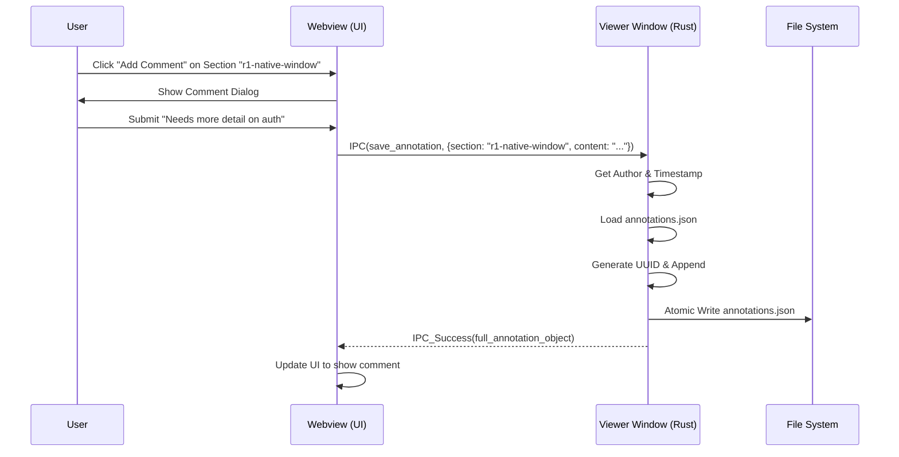

# Specification: Plan Annotations

## Overview

Annotations allow human reviewers to add comments and feedback to specific sections of an `agentd` plan. These annotations are persisted and can be used to guide subsequent AI-driven refinement (reproposals).

## Requirements

### A1: Section Targeting
Annotations must be associated with specific sections of the plan.
- For Requirements, Tasks, and Scenarios, the section ID should be a stable slug derived from the heading text (e.g., `R1: Native Window Rendering` -> `r1-native-window-rendering`).
- The rendering engine (backend) must inject these IDs into the HTML elements.
- Slugging algorithm: lowercase, replace non-alphanumeric with hyphens, trim hyphens.

### A2: Persistence
Annotations must be saved to a persistent `annotations.json` file in the change directory so they survive viewer restarts.
- If `annotations.json` is malformed or corrupt, the application should log a warning, backup the corrupt file (e.g., `annotations.json.bak`), and treat the current state as empty, allowing the user to continue working without crashing.
- Writes must be atomic to prevent data corruption.

### A3: Interactive Creation
The UI must provide a visual affordance (e.g., a "Comment" button or icon) near each section to open a text input dialog.
- The UI must capture the comment content.
- The backend must populate the `author` (from OS user or git config, defaulting to "unknown") and `created_at` (current UTC timestamp) fields automatically.

### A4: IPC Communication
The UI must use IPC to send new or updated annotations to the Rust backend for storage.
- File operations must be restricted to the specific change directory to prevent path traversal.
- The load_file IPC message must return both content and associated annotations.

### A5: Display of Existing Annotations
When a file is loaded, any existing annotations from `annotations.json` must be rendered in-place (e.g., in a sidebar or inline) next to the relevant section.
- Annotations must be filtered by file and section_id.
- Resolved annotations should be visually distinct (dimmed or collapsed).

## Data Model

```json
{
  "$schema": "http://json-schema.org/draft-07/schema#",
  "type": "object",
  "required": ["change_id", "annotations"],
  "properties": {
    "change_id": { "type": "string" },
    "annotations": {
      "type": "array",
      "items": {
        "type": "object",
        "required": ["id", "file", "section_id", "content", "author", "created_at"],
        "properties": {
          "id": { "type": "string", "format": "uuid" },
          "file": { "type": "string", "description": "e.g., proposal.md" },
          "section_id": { "type": "string", "description": "Slugified heading text" },
          "content": { "type": "string" },
          "author": { "type": "string", "description": "Auto-populated by backend" },
          "created_at": { "type": "string", "format": "date-time", "description": "Auto-populated by backend" },
          "resolved": { "type": "boolean", "default": false }
        }
      }
    }
  }
}
```

## Flow



## Acceptance Criteria

### Scenario: WHEN user adds annotation THEN it is persisted with metadata
- **WHEN** user clicks the comment icon next to "R1: Native Window Rendering" and enters "Use tao 0.30+"
- **THEN** the comment is saved to `annotations.json` with a UUID, author, and timestamp, and appears in the viewer's sidebar

### Scenario: WHEN viewer opens with existing annotations THEN they are displayed
- **WHEN** the viewer is opened for a change that already has `annotations.json`
- **THEN** the backend sends the annotations along with the file content, and they are displayed next to their respective sections

### Scenario: WHEN user resolves annotation THEN it is marked resolved
- **WHEN** user clicks "Resolve" on an annotation
- **THEN** its status is updated to `resolved: true` in `annotations.json` and it is visually dimmed in the UI

### Scenario: WHEN save fails THEN error is shown
- **WHEN** user attempts to save a comment but storage is unwritable
- **THEN** the UI remains in edit mode and displays an error message