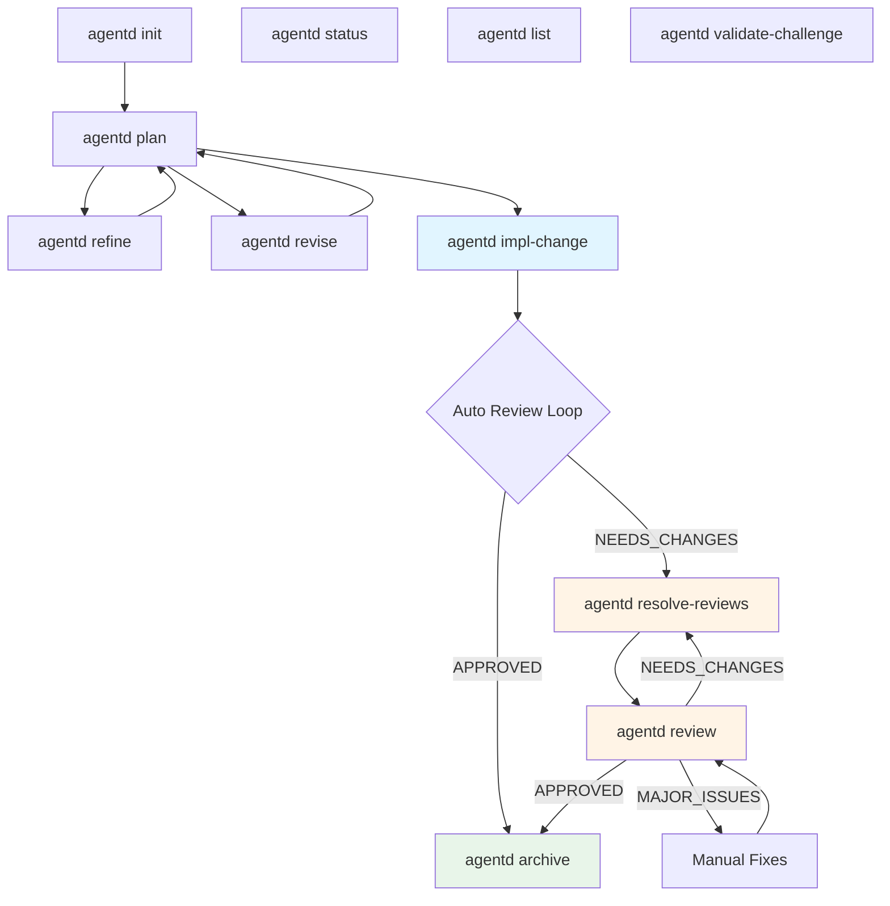

# Agentd Command Reference

Comprehensive specifications for all Agentd CLI commands, organized by category.

## Command Index

### Core Workflow Commands

High-priority commands for the main implementation workflow.

| Command | Purpose | Location |
|---------|---------|----------|
| `implement` | Automatic implementation with review loop | [core/implement.md](core/implement.md) |
| `review` | Automated code review with tests and security | [core/review.md](core/review.md) |
| `resolve-reviews` | Auto-fix issues found in review | [core/resolve-reviews.md](core/resolve-reviews.md) |
| `refine` | Add requirements to existing proposal | [core/refine.md](core/refine.md) |

### Planning Support Commands

Commands for the proposal and challenge phases.

| Command | Purpose | Location |
|---------|---------|----------|
| `revise` | Display annotations from plan viewer | [planning/revise.md](planning/revise.md) |
| `validate-challenge` | Local validation of challenge format | [planning/validate-challenge.md](planning/validate-challenge.md) |

### Utilities

Information and browsing commands.

| Command | Purpose | Location |
|---------|---------|----------|
| `status` | Show change status and LLM usage | [utilities/status.md](utilities/status.md) |
| `list` | List active or archived changes | [utilities/list.md](utilities/list.md) |

### Admin Commands

Project setup and maintenance.

| Command | Purpose | Location |
|---------|---------|----------|
| `init` | Initialize or update Agentd in project | [admin/init.md](admin/init.md) |
| `update` | Self-upgrade to latest version | [admin/update.md](admin/update.md) |
| `migrate-xml` | Migrate to new XML format | [admin/migrate-xml.md](admin/migrate-xml.md) |
| `mcp-server` | Start MCP server for Claude Desktop | [admin/mcp-server.md](admin/mcp-server.md) |

## Quick Reference

### Command by Use Case

**Starting a new project:**
```bash
agentd init                          # Initialize Agentd
agentd plan-change feat-auth "Add auth"     # Create proposal (documented separately)
```

**Implementing a change:**
```bash
agentd impl-change feat-auth           # Auto: implement + review + fix loop
# Or manually:
agentd review feat-auth              # Review code
agentd resolve-reviews feat-auth     # Fix issues
agentd review feat-auth              # Re-review
```

**Checking status:**
```bash
agentd status feat-auth              # Show phase, iteration, usage
agentd list                          # List all changes
agentd list --archived               # List archived changes
```

**Enhancing proposals:**
```bash
agentd revise feat-auth              # Show annotations from plan viewer
agentd refine feat-auth "Add OAuth"  # Add new requirements
```

**Validation and migration:**
```bash
agentd validate-challenge feat-auth  # Validate challenge format
agentd migrate-xml                   # Migrate to XML format
```

**Maintenance:**
```bash
agentd update --check                # Check for updates
agentd update                        # Upgrade to latest
agentd init --force                  # Update installation
```

## Workflow Diagram



## Command Categories

### Read-Only Commands

These commands never modify files:
- `status` - Read STATE.yaml
- `list` - Read directory listings
- `revise` - Read annotations.json

### Workflow Commands

These commands update STATE.yaml and modify implementation:
- `implement` - Write code, update STATE
- `review` - Write REVIEW.md, update STATE
- `resolve-reviews` - Fix code, update STATE

### Validation Commands

These commands validate format and structure:
- `validate-challenge` - Check CHALLENGE.md or review format

### Setup Commands

These commands initialize or update the project:
- `init` - Create directories, install skills, generate config
- `update` - Self-upgrade binary
- `migrate-xml` - Convert file formats

## Command Phases

Commands interact with different STATE phases:

| Phase | Commands That Create | Commands That Use |
|-------|---------------------|-------------------|
| Proposed | `plan` | `refine`, `revise`, `challenge` |
| Challenged | `challenge` | `validate-challenge`, `reproposal` |
| Implementing | `implement` | `review`, `resolve-reviews` |
| Complete | `review` (APPROVED) | `archive` |
| Archived | `archive` | `list --archived`, `archived` |

## File Operations Summary

### Commands That Read

| Command | Reads |
|---------|-------|
| `implement` | proposal.md, tasks.md, STATE.yaml, config.toml |
| `review` | Implementation files, STATE.yaml, config.toml |
| `resolve-reviews` | REVIEW.md, implementation files, config.toml |
| `status` | STATE.yaml |
| `list` | Directory listings |
| `revise` | annotations.json |
| `validate-challenge` | CHALLENGE.md or proposal.md, STATE.yaml |

### Commands That Write

| Command | Writes |
|---------|--------|
| `implement` | Implementation files, REVIEW.md, STATE.yaml, AGENTS.md |
| `review` | REVIEW.md, AGENTS.md, STATE.yaml |
| `resolve-reviews` | Implementation files, STATE.yaml |
| `refine` | proposal.md, tasks.md, STATE.yaml (when implemented) |
| `validate-challenge` | STATE.yaml, CHALLENGE.md (auto-fix mode) |
| `init` | All directories, config.toml, skills, project.md, CLAUDE.md |
| `migrate-xml` | proposal.md (XML format) |

## LLM Usage by Command

| Command | LLM Provider | Usage Type |
|---------|-------------|------------|
| `implement` | Claude | Code generation + fixes |
| `review` | Codex | Code review + security |
| `resolve-reviews` | Claude | Issue resolution |
| `refine` | Gemini | Proposal enhancement (not implemented) |

## Exit Codes

All commands follow this convention:

- `0`: Success (operation completed)
  - Note: Some commands exit 0 even when validation fails (e.g., validate-challenge)
  - Read-only commands always exit 0 unless file I/O error
- `1`: Error (operational failure)
  - File not found
  - Invalid format
  - API errors
  - Permission denied

## Notes on Command Design

### Idempotency

These commands are idempotent (safe to run multiple times):
- `status` - Always shows current state
- `list` - Always shows current directory contents
- `validate-challenge` - Re-validates without side effects
- `init` - Update mode preserves user data
- `migrate-xml` - Skips already migrated changes

### Automatic vs Manual

**Automatic workflows:**
- `implement` - Includes full review loop
- `review` - Part of implement loop or standalone

**Manual workflows:**
- `resolve-reviews` + `review` - Manual fix-review cycle
- Individual step-by-step execution for debugging

### JSON Output

Commands supporting `--json` flag:
- `status` - Minimal JSON (change_id, phase, iteration)
- `validate-challenge` - Full validation result

## Implementation Status

| Command | Status | Notes |
|---------|--------|-------|
| `implement` | ✅ Implemented | Full auto-review loop |
| `review` | ✅ Implemented | Tests + security scans |
| `resolve-reviews` | ✅ Implemented | Claude-powered fixes |
| `refine` | 🚧 Stub | Design complete, needs Gemini orchestrator |
| `revise` | ✅ Implemented | Annotation display |
| `validate-challenge` | ✅ Implemented | XML and old format support |
| `status` | ✅ Implemented | Full telemetry display |
| `list` | ✅ Implemented | Simple listing |
| `init` | ✅ Implemented | Fresh install + update modes |
| `update` | ✅ Implemented | Self-upgrade from GitHub |
| `migrate-xml` | ✅ Implemented | Format migration |
| `mcp-server` | ✅ Implemented | MCP protocol server |

## Related Documentation

- **Main workflow**: [agentd-plan-workflow.md](../../docs/agentd-plan-workflow.md)
- **Already documented commands**: See `agentd/specs/*.md` for plan, challenge, archive, etc.
- **Feature specs**: See `agentd/specs/features/` for detailed feature documentation
- **Skill documentation**: See `.claude/skills/agentd-*/` for high-level skill guides

## Maintenance

These specifications should be updated when:
- Command signatures change (new flags, arguments)
- Behavior changes (new validation rules, different output)
- New commands are added
- File I/O patterns change
- Exit codes change

To validate specs after updates:
```bash
# Verify examples work
agentd validate-proposal commands/core/implement
agentd validate-proposal commands/core/review
# etc.
```

---

**Last Updated:** 2026-01-19
**Total Commands Documented:** 12
**Specification Version:** 1.0
