# Specification: Init Command

## Overview

The `init` command initializes or updates the Agentd directory structure in a project. On first run, it creates the complete directory hierarchy, generates configuration files, installs Claude Code skills, and sets up the knowledge base. On subsequent runs (update mode), it preserves user data while updating system files, skills, and configuration to the latest version.

## Requirements

### R1: Directory Structure Creation (Fresh Install)

The command must create the following directory structure:
- `agentd/` - Root directory for all Agentd files
- `agentd/specs/` - Specification files
- `agentd/changes/` - Active changes
- `agentd/archive/` - Archived changes
- `agentd/scripts/` - Helper scripts (legacy)
- `agentd/knowledge/` - Project knowledge base
- `.claude/skills/` - Claude Code skill definitions

### R2: Configuration Generation

The command must create/update `agentd/config.toml`:
- Set project_name (from `--name` flag or directory name)
- Set default model configurations (Claude, Codex, Gemini)
- Set workflow parameters (implementation_iterations, etc.)
- Set scripts_dir as relative path for portability
- In update mode, overwrite config with latest defaults

### R3: System Files Installation

The command must install Claude Code skills:
- `/agentd:plan` - Planning workflow skill
- `/agentd:impl` - Implementation workflow skill
- `/agentd:archive` - Archive workflow skill
- Install Gemini command configurations
- Install Codex prompt templates

### R4: Project Context Files

The command must create project-specific files:
- `agentd/project.md` - Project context template
- `agentd/knowledge/index.md` - Knowledge base index
- `CLAUDE.md` - Project instructions for Claude (in project root)
- Attempt auto-generation of project.md using Gemini

### R5: Update Mode Detection

The command must detect existing installations:
- Check if `agentd/` directory exists
- Read `.version` file to determine current version
- Preserve user data: specs/, changes/, archive/, knowledge/
- Only update system files: config.toml, skills, prompts
- Display version upgrade message (old → new)

### R6: Version Tracking

The command must track installed version:
- Write `agentd/.version` file with current CARGO_PKG_VERSION
- Compare versions in update mode
- Display upgrade message with version numbers

## Command Signature

```bash
agentd init [OPTIONS]
```

**Arguments:**
- None

**Options:**
- `-n, --name <name>`: Set project name (default: directory name)
- `-f, --force`: Force upgrade mode (currently same as update)

## Exit Codes

- `0`: Success (fresh install or update completed)
- `1`: Error (directory creation failed, file I/O errors)

## Flow

```mermaid
sequenceDiagram
    participant U as User
    participant CLI as init.rs
    participant FS as File System
    participant Gemini as Gemini (optional)

    U->>CLI: agentd init
    CLI->>FS: Check if agentd/ exists
    alt Fresh Install
        FS-->>CLI: Not found
        CLI->>FS: Create directory structure
        CLI->>FS: Write project.md template
        CLI->>FS: Write knowledge/index.md
        CLI->>Gemini: Auto-generate project.md (optional)
        CLI->>FS: Create config.toml
        CLI->>FS: Install Claude skills
        CLI->>FS: Install Gemini commands
        CLI->>FS: Install Codex prompts
        CLI->>FS: Generate CLAUDE.md
        CLI->>FS: Write .version file
        CLI-->>U: Print success message
    else Update Mode
        FS-->>CLI: Found (already initialized)
        CLI->>FS: Read .version file
        CLI-->>U: Display upgrade message (old → new version)
        CLI->>CLI: Preserve user data
        CLI->>FS: Overwrite config.toml
        CLI->>FS: Create project.md if missing
        CLI->>FS: Create knowledge/index.md if missing
        CLI->>FS: Update Claude skills
        CLI->>FS: Update Gemini commands
        CLI->>FS: Update Codex prompts
        CLI->>FS: Regenerate CLAUDE.md
        CLI->>FS: Write new .version file
        CLI-->>U: Display success message
    end
```



## Examples

### Example 1: Fresh install

```bash
$ agentd init
🎭 Initializing Agentd v0.1.0...

📁 Creating directory structure...
   ✓ agentd/project.md
   ✓ agentd/knowledge/index.md

🤖 Updating Claude Code Skills...
   ✓ /agentd:plan
   ✓ /agentd:impl
   ✓ /agentd:archive

📝 Generated CLAUDE.md

✅ Agentd initialized successfully!
```

### Example 2: Update mode

```bash
$ agentd init
🔄 Updating Agentd 0.1.0 → 0.2.0...

📦 User data:
   ✓ agentd/specs/     (untouched)
   ✓ agentd/changes/   (untouched)
   ✓ agentd/archive/   (untouched)
   ✓ agentd/knowledge/ (untouched)
   ✓ agentd/config.toml (updated)
   ✓ agentd/project.md (preserved)

🤖 Updating Claude Code Skills...
   ✓ /agentd:plan
   ✓ /agentd:impl
   ✓ /agentd:archive

📝 Generated CLAUDE.md

✅ Update complete!
```

### Example 3: With custom project name

```bash
$ agentd init --name "My Project"
🎭 Initializing Agentd v0.1.0...
...
```

## Related Commands

- `agentd plan` - Create first change (requires init first)
- `agentd list` - List changes (shows "No changes found. Run 'agentd init' first.")
- `agentd update` - Explicit update command (separate from init)

## Notes

- First command to run in any project using Agentd
- Safe to run multiple times - preserves user data in update mode
- Auto-upgrade check runs before most commands
- Gemini auto-generation of project.md may fail gracefully if no API key configured
- CLAUDE.md is regenerated on each update to include latest instructions
- Skills are installed to `.claude/skills/` for Claude Code integration
- Config.toml uses opinionated defaults that can be customized manually
- Version file tracks Cargo package version for upgrade detection
