# Specification: Implement Command

## Overview

The `implement` command orchestrates the complete implementation workflow for an Agentd change, including automatic code generation, testing, and review loops. It uses Claude for implementation and Codex for automated review, iterating until the code is approved or manual intervention is required. This command transitions a change from the planning phase through to completion, handling the entire implementation-review-fix cycle automatically.

## Requirements

### R1: Automatic Implementation with Review Loop

The command must execute the following workflow:
1. Set STATE phase to `Implementing`
2. Run implementation step (Claude writes code and tests)
3. Run initial review step (Codex iteration 0)
4. Enter automatic review loop:
   - If verdict is `APPROVED`: Set STATE to `Complete` and exit successfully
   - If verdict is `NEEDS_CHANGES`: Run resolve step with Claude, re-review with Codex, increment iteration
   - If verdict is `MAJOR_ISSUES`: Display issues and exit
   - Continue loop until approved or max iterations reached

### R2: Task Filtering

The command must support optional task filtering via the `--tasks` flag. When specified:
- Only implement tasks matching the filter pattern (e.g., "1.1,1.2,2.1")
- Task filter is passed to the Claude orchestrator
- All other workflow steps remain unchanged

### R3: Iteration Limit Enforcement

The command must enforce a maximum number of automatic fix iterations:
- Read `workflow.implementation_iterations` from config (default: 3)
- Track current iteration count across resolve-review cycles
- When max iterations exceeded, display remaining issues and exit
- Provide guidance for manual intervention

### R4: Complexity Assessment

The command must dynamically assess change complexity to select appropriate LLM models:
- Assess complexity from change structure (file count, task count, etc.)
- Use complexity to select Claude model for implementation
- Use complexity to select Codex model for review
- Record model selection in STATE metadata

### R5: File Operations

The command must perform the following file I/O:
- **Read**:
  - `agentd/changes/{change_id}/STATE.yaml` - Load and update phase
  - `agentd/changes/{change_id}/proposal.md` - Validate structure
  - `agentd/changes/{change_id}/tasks.md` - Implementation tasks
  - `agentd/config.toml` - Configuration and model settings
  - Project files for code generation context
- **Write**:
  - `agentd/changes/{change_id}/STATE.yaml` - Update phase (Implementing → Complete)
  - `agentd/changes/{change_id}/REVIEW.md` - Review results for each iteration
  - `agentd/changes/{change_id}/AGENTS.md` - Regenerated context
  - Implementation files in project (code and tests)

### R6: Usage Tracking

The command must track LLM usage for cost analysis:
- Record tokens (input/output) for each LLM call
- Record duration in milliseconds
- Calculate cost based on model pricing from config
- Save usage data to STATE.yaml via StateManager
- Track separate usage for: implement, review, resolve steps

## Command Signature

```bash
agentd implement <change_id> [--tasks <task_filter>]
```

**Arguments:**
- `change_id` (required): The change identifier to implement

**Options:**
- `-t, --tasks <task_filter>`: Filter specific tasks (e.g., "1.1,1.2,2.1")

## Exit Codes

- `0`: Success
  - Implementation approved and STATE set to Complete
  - Or max iterations reached (requires manual intervention)
  - Or major issues found (requires manual intervention)
- `1`: Error
  - Change directory not found
  - STATE.yaml not found or invalid
  - Required files missing (proposal.md, tasks.md)
  - LLM API errors
  - File I/O errors

## Flow

```mermaid
sequenceDiagram
    participant U as User
    participant CLI as implement.rs
    participant SM as StateManager
    participant Claude as ClaudeOrchestrator
    participant Codex as CodexOrchestrator
    participant FS as File System

    U->>CLI: agentd implement feat-auth
    CLI->>SM: Load STATE.yaml
    SM-->>CLI: Current state
    CLI->>SM: Set phase = Implementing
    SM->>FS: Save STATE.yaml

    Note over CLI: Step 1: Implementation
    CLI->>Claude: run_implement(change_id, tasks, complexity)
    Claude->>FS: Read proposal.md, tasks.md, project files
    Claude->>FS: Write implementation files (code + tests)
    Claude-->>CLI: (output, usage)
    CLI->>SM: Record usage (implement step)

    Note over CLI: Step 2: First Review (iteration 0)
    CLI->>FS: Regenerate AGENTS.md context
    CLI->>FS: Create REVIEW.md skeleton
    CLI->>Codex: run_review(change_id, iteration=0, complexity)
    Codex->>FS: Read implementation, run tests, analyze
    Codex->>FS: Write REVIEW.md with verdict
    Codex-->>CLI: (output, usage)
    CLI->>SM: Record usage (review step)
    CLI->>FS: Parse verdict from REVIEW.md

    alt Verdict = APPROVED
        CLI->>SM: Set phase = Complete
        SM->>FS: Save STATE.yaml
        CLI-->>U: ✨ Implementation approved!
    else Verdict = NEEDS_CHANGES (iteration < max)
        loop Until approved or max iterations
            Note over CLI: Resolve Step
            CLI->>Claude: run_resolve(change_id, complexity)
            Claude->>FS: Read REVIEW.md issues
            Claude->>FS: Fix issues in code
            Claude-->>CLI: (output, usage)
            CLI->>SM: Record usage (resolve step)

            Note over CLI: Re-review Step
            CLI->>Codex: run_review(change_id, iteration++, complexity)
            Codex->>FS: Re-analyze implementation
            Codex->>FS: Update REVIEW.md
            Codex-->>CLI: (output, usage)
            CLI->>SM: Record usage (review step)
            CLI->>FS: Parse verdict from REVIEW.md

            alt New verdict = APPROVED
                CLI->>SM: Set phase = Complete
                SM->>FS: Save STATE.yaml
                CLI-->>U: ✨ Fixed and approved!
            end
        end
        CLI-->>U: ⚠️ Max iterations reached
        CLI-->>U: Display remaining issues
    else Verdict = MAJOR_ISSUES
        CLI-->>U: ❌ Major issues found
        CLI-->>U: Display issue summary
    end
```



## State Transitions


## Acceptance Criteria

### Scenario: Happy path - First review approves

- **WHEN** I run `agentd implement feat-auth` and Codex approves on iteration 0
- **THEN** STATE.yaml phase is set to `Complete`
- **THEN** I see "✨ Implementation approved!"
- **THEN** I see "⏭️ Next: agentd archive feat-auth"
- **THEN** Exit code is 0

### Scenario: Auto-fix cycle resolves issues

- **WHEN** I run `agentd implement feat-login` and Codex returns `NEEDS_CHANGES` on iteration 0
- **THEN** Claude automatically resolves issues
- **THEN** Codex re-reviews at iteration 1
- **THEN** If approved at iteration 1, STATE.yaml phase is set to `Complete`
- **THEN** I see "✨ Fixed and approved (iteration 1)!"
- **THEN** Exit code is 0

### Scenario: Task filtering - Implement specific tasks only

- **WHEN** I run `agentd implement feat-api --tasks 1.1,1.2`
- **THEN** Only tasks 1.1 and 1.2 are implemented
- **THEN** Review and auto-fix loop proceeds normally
- **THEN** Exit code is 0 when approved

### Scenario: Max iterations exceeded

- **WHEN** I run `agentd implement feat-complex` and review fails after 3 iterations
- **THEN** I see "⚠️ Automatic refinement limit reached (3 iterations)"
- **THEN** I see remaining issue counts (high and medium severity)
- **THEN** I see suggested next steps (manual review, manual fix, resolve-reviews command)
- **THEN** STATE.yaml phase remains `Implementing`
- **THEN** Exit code is 0 (manual intervention required)

### Scenario: Major issues found

- **WHEN** I run `agentd implement feat-broken` and Codex returns `MAJOR_ISSUES`
- **THEN** I see "❌ Major issues found"
- **THEN** I see issue summary with high/medium counts
- **THEN** I see suggested next steps for manual intervention
- **THEN** STATE.yaml phase remains `Implementing`
- **THEN** Exit code is 0 (manual intervention required)

### Scenario: Change not found

- **WHEN** I run `agentd implement nonexistent-change`
- **THEN** I see an error "Change directory not found" or similar
- **THEN** Exit code is 1

### Scenario: Invalid STATE phase

- **WHEN** I run `agentd implement feat-archived` and the change is already in `Complete` or `Archived` phase
- **THEN** The command should proceed (overwrites phase to Implementing)
- **THEN** Warning or info message may be displayed

## Examples

### Example 1: Basic usage

```bash
$ agentd implement feat-auth
🎨 Agentd Implementation Workflow
━━━━━━━━━━━━━━━━━━━━━━━━━━━━━━━━━━━━━━━━━━━━

🎨 [1/N] Implementing with Claude...
✅ Implementation complete (code + tests written)

🔍 [2/N] Reviewing with Codex (iteration 0)...

   Tests: ✅ PASS
   Issues: 0 high, 0 medium
   Verdict: APPROVED

━━━━━━━━━━━━━━━━━━━━━━━━━━━━━━━━━━━━━━━━━━━━
✨ Implementation approved!

⏭️  Next:
   agentd archive feat-auth
```

### Example 2: With task filtering

```bash
$ agentd implement feat-api --tasks 1.1,2.1
🎨 Agentd Implementation Workflow
━━━━━━━━━━━━━━━━━━━━━━━━━━━━━━━━━━━━━━━━━━━━

🎨 [1/N] Implementing with Claude...
   (Filtering tasks: 1.1, 2.1)
✅ Implementation complete (code + tests written)

🔍 [2/N] Reviewing with Codex (iteration 0)...
...
```

### Example 3: Auto-fix iteration

```bash
$ agentd implement feat-validation
🎨 Agentd Implementation Workflow
━━━━━━━━━━━━━━━━━━━━━━━━━━━━━━━━━━━━━━━━━━━━

🎨 [1/N] Implementing with Claude...
✅ Implementation complete (code + tests written)

🔍 [2/N] Reviewing with Codex (iteration 0)...

   Tests: ✅ PASS
   Issues: 2 high, 1 medium
   Verdict: NEEDS_CHANGES

⚠️  NEEDS_CHANGES - Auto-fixing (iteration 1)...

🔧 Resolving issues (iteration 1)...
✅ Issues resolved

🔍 Re-reviewing (iteration 1)...

   Tests: ✅ PASS
   Issues: 0 high, 0 medium
   Verdict: APPROVED

━━━━━━━━━━━━━━━━━━━━━━━━━━━━━━━━━━━━━━━━━━━━
✨ Fixed and approved (iteration 1)!

⏭️  Next:
   agentd archive feat-validation
```

### Example 4: Max iterations exceeded

```bash
$ agentd implement feat-complex
...
⚠️  NEEDS_CHANGES - Auto-fixing (iteration 3)...

🔧 Resolving issues (iteration 3)...
✅ Issues resolved

🔍 Re-reviewing (iteration 3)...

   Tests: ❌ FAIL
   Issues: 1 high, 2 medium
   Verdict: NEEDS_CHANGES

━━━━━━━━━━━━━━━━━━━━━━━━━━━━━━━━━━━━━━━━━━━━
⚠️  Automatic refinement limit reached (3 iterations)

📊 Remaining Issues:
   🔴 High:    1 issues
   🟡 Medium:  2 issues

⏭️  Next steps:
   1. Review full report:
      cat agentd/changes/feat-complex/REVIEW.md

   2. Fix issues manually and re-review:
      agentd review feat-complex

   3. Or resolve specific issues:
      agentd resolve-reviews feat-complex
```

### Example 5: Major issues

```bash
$ agentd implement feat-broken
...
🔍 [2/N] Reviewing with Codex (iteration 0)...

   Tests: ❌ FAIL
   Issues: 5 high, 8 medium
   Verdict: MAJOR_ISSUES

━━━━━━━━━━━━━━━━━━━━━━━━━━━━━━━━━━━━━━━━━━━━
❌ Major issues found

📊 Remaining Issues:
   🔴 High:    5 issues
   🟡 Medium:  8 issues

⏭️  Next steps:
   1. Review full report:
      cat agentd/changes/feat-broken/REVIEW.md

   2. Fix issues manually and re-review:
      agentd review feat-broken

   3. Or resolve specific issues:
      agentd resolve-reviews feat-broken
```

## Related Commands

**Previous in workflow:**
- `agentd plan` - Creates the proposal and tasks to be implemented
- `agentd refine` - Refines proposal before implementation

**Next in workflow:**
- `agentd archive` - Archives the completed change (when approved)

**Alternative/Supporting commands:**
- `agentd review` - Manually trigger review (if you fix code manually)
- `agentd resolve-reviews` - Manually trigger issue resolution
- `agentd status` - Check current phase and metadata

## Notes

- The `implement` command is the core workflow command that combines implementation, review, and resolution into a single automated flow
- The automatic review loop is a key differentiator - it reduces manual intervention by automatically attempting fixes
- Complexity assessment ensures appropriate model selection for cost and quality tradeoffs
- The iteration limit prevents infinite loops while still allowing multiple fix attempts
- Task filtering is useful for incremental development or debugging specific parts of a change
- All LLM usage is tracked for cost transparency and optimization
