# Specification: Refine Command

## Overview

The `refine` command enhances an existing proposal by incorporating additional requirements without starting from scratch. It uses the Gemini orchestrator to regenerate specific sections of the proposal while preserving the existing structure and context. This command is useful when requirements evolve during the planning phase or when feedback suggests the proposal needs enrichment rather than complete revision.

**Note:** This command is currently not fully implemented (stub placeholder exists). This specification defines the intended behavior for future implementation.

## Requirements

### R1: Requirement Integration

The command must incorporate additional requirements into an existing proposal:
1. Load current `proposal.md` from change directory
2. Parse existing requirements, tasks, and structure
3. Accept new requirements as string input
4. Use Gemini to merge new requirements with existing ones
5. Regenerate relevant sections (requirements, tasks, acceptance criteria)
6. Preserve proposal metadata and overview sections

### R2: Gemini Orchestration

The command must use Gemini for proposal enhancement:
- Call `GeminiOrchestrator.run_refine(change_id, requirements, complexity)`
- Gemini reads current proposal.md and tasks.md
- Gemini integrates new requirements into existing structure
- Gemini updates tasks if requirements affect implementation
- Gemini maintains consistency across all sections

### R3: Proposal Structure Preservation

The command must preserve existing proposal structure:
- Keep existing requirement IDs (R1, R2, etc.)
- Append new requirements with incremental IDs (R7, R8, etc.)
- Maintain existing acceptance criteria and flows
- Update sections affected by new requirements
- Do not remove or fundamentally change existing content

### R4: STATE Management

The command must update STATE.yaml appropriately:
- Keep phase as `Planning` (do not change to different phase)
- Update `last_modified` timestamp
- Record LLM usage (tokens, duration, cost)
- Optionally track refinement count or history

### R5: File Operations

The command must perform the following file I/O:
- **Read**:
  - `agentd/changes/{change_id}/proposal.md` - Current proposal (required)
  - `agentd/changes/{change_id}/tasks.md` - Current tasks (if exists)
  - `agentd/changes/{change_id}/STATE.yaml` - Current state
  - `agentd/config.toml` - Configuration and model settings
- **Write**:
  - `agentd/changes/{change_id}/proposal.md` - Enhanced proposal
  - `agentd/changes/{change_id}/tasks.md` - Updated tasks (if affected)
  - `agentd/changes/{change_id}/STATE.yaml` - Updated metadata and usage

### R6: Usage Tracking

The command must track Gemini LLM usage:
- Record tokens (input/output) for the refine call
- Record duration in milliseconds
- Calculate cost based on Gemini model pricing
- Save usage data to STATE.yaml via StateManager
- Step name: "refine"

## Command Signature

```bash
agentd refine <change_id> <requirements>
```

**Arguments:**
- `change_id` (required): The change identifier to refine
- `requirements` (required): Additional requirements to integrate (string)

**Options:**
- None

## Exit Codes

- `0`: Success
  - Proposal refined successfully with new requirements
  - proposal.md and tasks.md updated
- `1`: Error
  - Change directory not found
  - proposal.md not found (no proposal exists yet)
  - Invalid proposal format
  - LLM API errors
  - File I/O errors

## Flow

```mermaid
sequenceDiagram
    participant U as User
    participant CLI as refine.rs
    participant SM as StateManager
    participant Gemini as GeminiOrchestrator
    participant FS as File System

    U->>CLI: agentd refine feat-auth "Add OAuth support"
    CLI->>FS: Check proposal.md exists
    alt proposal.md not found
        FS-->>CLI: File not found
        CLI-->>U: Error: No proposal found. Run plan first.
        Note over CLI: Exit code 1
    else proposal.md found
        FS-->>CLI: proposal.md content
        CLI->>SM: Load STATE.yaml
        SM-->>CLI: Current state
        CLI->>CLI: Assess complexity

        Note over CLI: Refine Proposal
        CLI->>Gemini: run_refine(change_id, requirements, complexity)
        Gemini->>FS: Read proposal.md
        Gemini->>FS: Read tasks.md (if exists)
        Gemini->>Gemini: Parse existing requirements (R1-R6)
        Gemini->>Gemini: Integrate new requirement: "Add OAuth support"
        Gemini->>Gemini: Generate new requirement ID: R7
        Gemini->>Gemini: Update affected sections (tasks, acceptance)
        Gemini->>FS: Write updated proposal.md
        Gemini->>FS: Write updated tasks.md
        Gemini-->>CLI: (output, usage)

        CLI->>SM: Record usage (refine step)
        CLI->>SM: Update last_modified
        SM->>FS: Save STATE.yaml

        CLI-->>U: ✅ Proposal refined!
        CLI-->>U: Next steps: Review, implement, or challenge
        Note over CLI: Exit code 0
    end
```



## State Transitions


## Acceptance Criteria

### Scenario: Add single requirement to existing proposal

- **WHEN** I run `agentd refine feat-auth "Add OAuth support"` and proposal has R1-R5
- **THEN** Gemini integrates new requirement as R6
- **THEN** proposal.md is updated with R6 section
- **THEN** Acceptance criteria includes scenarios for OAuth
- **THEN** tasks.md includes OAuth implementation tasks
- **THEN** I see "✅ Proposal refined!"
- **THEN** Exit code is 0

### Scenario: Add multiple requirements

- **WHEN** I run `agentd refine feat-api "Add rate limiting. Add API versioning."`
- **THEN** Gemini integrates both requirements as separate R{n} sections
- **THEN** Both requirements have corresponding tasks and acceptance criteria
- **THEN** Exit code is 0

### Scenario: Refine affects existing tasks

- **WHEN** I run `agentd refine feat-db "Add migration rollback support"`
- **THEN** Existing database tasks are updated to include rollback logic
- **THEN** New tasks are added for rollback testing
- **THEN** proposal.md and tasks.md are both updated
- **THEN** Exit code is 0

### Scenario: Proposal not found

- **WHEN** I run `agentd refine nonexistent "Add something"`
- **THEN** I see "No proposal found for 'nonexistent'. Run 'agentd plan' first."
- **THEN** Exit code is 1

### Scenario: Multiple refinements

- **WHEN** I run `refine` twice with different requirements
- **THEN** First refine adds R6
- **THEN** Second refine adds R7
- **THEN** Both requirements coexist in proposal
- **THEN** STATE.yaml tracks both refinement calls
- **THEN** Exit code is 0 for both

### Scenario: Empty requirements

- **WHEN** I run `agentd refine feat-test ""`
- **THEN** I see an error "Requirements cannot be empty"
- **THEN** Exit code is 1

## Examples

### Example 1: Basic usage (when implemented)

```bash
$ agentd refine feat-auth "Add OAuth 2.0 support for Google and GitHub"
✨ Refining proposal: feat-auth
   Additional requirements: Add OAuth 2.0 support for Google and GitHub

🤖 Refining with Gemini...
   Reading existing proposal (requirements R1-R5)
   Integrating new requirement as R6
   Updating tasks.md
   Updating acceptance criteria

✅ Proposal refined!
   New requirement added: R6 (OAuth 2.0 Integration)
   Tasks updated: 2 new tasks added to layer 'integration'

⏭️  Next steps:
   1. Review updated proposal:
      agentd view feat-auth

   2. Challenge if needed:
      agentd challenge feat-auth

   3. Or proceed to implement:
      agentd implement feat-auth
```

### Example 2: Multiple requirements

```bash
$ agentd refine feat-api "Add rate limiting. Add API versioning. Add request logging."
✨ Refining proposal: feat-api
   Additional requirements: Add rate limiting. Add API versioning. Add request logging.

🤖 Refining with Gemini...
   Reading existing proposal (requirements R1-R4)
   Integrating 3 new requirements as R5, R6, R7
   Updating tasks.md
   Updating acceptance criteria

✅ Proposal refined!
   New requirements added:
     R5: Rate Limiting
     R6: API Versioning
     R7: Request Logging
   Tasks updated: 5 new tasks added

⏭️  Next steps:
   1. Review updated proposal:
      agentd view feat-api

   2. Proceed to implement:
      agentd implement feat-api
```

### Example 3: Proposal not found

```bash
$ agentd refine nonexistent "Add feature"
✨ Refining proposal: nonexistent
Error: No proposal found for 'nonexistent'. Run 'agentd plan nonexistent "description"' first.
$ echo $?
1
```

### Example 4: Current stub behavior

```bash
$ agentd refine feat-auth "Add OAuth"
✨ Refining proposal: feat-auth
   Additional requirements: Add OAuth

🚧 Not implemented yet
```

## Related Commands

**Previous in workflow:**
- `agentd plan` - Creates initial proposal (required before refine)
- `agentd challenge` - Challenges proposal for quality/completeness

**Next in workflow:**
- `agentd view` - View refined proposal
- `agentd challenge` - Challenge again if needed
- `agentd implement` - Implement refined proposal

**Alternative commands:**
- `agentd revise` - Revision based on annotations (different from refinement)
- `agentd reproposal` - Complete regeneration (not additive like refine)

## Notes

- **Current Status:** Command is not yet implemented (stub exists in `src/cli/refine.rs`)
- When implemented, this command will use GeminiOrchestrator (to be created)
- Refine is **additive** - it preserves existing content and adds to it
- Refine is different from `revise` which modifies existing sections based on annotations
- Refine is different from `reproposal` which completely regenerates the proposal
- Multiple refinements are allowed - requirements keep accumulating
- Refinement does not change the proposal phase (stays in Planning)
- The orchestrator should intelligently merge requirements without duplication
- If new requirements conflict with existing ones, Gemini should highlight conflicts
- Tasks affected by new requirements should be updated or new tasks added
- Acceptance criteria should be expanded to cover new requirements
- Cost tracking ensures refinement usage is visible for budget management
