# Specification: Resolve-Reviews Command

## Overview

The `resolve-reviews` command uses Claude to automatically fix issues identified in a code review. It reads the REVIEW.md file, parses issues by severity, and generates code fixes to address them. This command is used either manually after reviewing REVIEW.md or automatically as part of the `implement` command's review loop. After resolving issues, it prompts the user to re-review the changes.

## Requirements

### R1: Issue Resolution Workflow

The command must execute the following resolution workflow:
1. Load configuration
2. Validate that REVIEW.md exists for the specified change
3. Assess change complexity for model selection
4. Run Claude orchestrator with REVIEW.md as input
5. Claude reads issues and generates fixes
6. Record LLM usage to STATE.yaml
7. Display completion message and next steps

### R2: REVIEW.md Dependency

The command must require REVIEW.md to exist:
- Check for `agentd/changes/{change_id}/REVIEW.md`
- If not found, display error: "No review found for '{change_id}'. Run 'agentd review {change_id}' first."
- Exit with code 1 if REVIEW.md is missing

### R3: Complexity Assessment

The command must dynamically assess change complexity:
- Assess from change structure (file count, task count, etc.)
- Use complexity to select appropriate Claude model
- Pass complexity to orchestrator for model selection

### R4: Claude Orchestration

The command must delegate resolution to ClaudeOrchestrator:
- Call `orchestrator.run_resolve(change_id, complexity)`
- Claude reads REVIEW.md and parses issues
- Claude generates code fixes for identified issues
- Claude prioritizes high-severity issues first
- Claude applies fixes directly to implementation files

### R5: File Operations

The command must perform the following file I/O:
- **Read**:
  - `agentd/changes/{change_id}/REVIEW.md` - Issues to resolve (required)
  - `agentd/changes/{change_id}/proposal.md` - Context for fixes
  - `agentd/changes/{change_id}/tasks.md` - Implementation context
  - `agentd/config.toml` - Configuration and model settings
  - Implementation files - Code to fix
- **Write**:
  - Implementation files - Apply fixes
  - `agentd/changes/{change_id}/STATE.yaml` - LLM usage tracking

### R6: Usage Tracking

The command must track Claude LLM usage:
- Record tokens (input/output) for the resolve call
- Record duration in milliseconds
- Calculate cost based on Claude model pricing
- Save usage data to STATE.yaml via StateManager
- Step name: "resolve"

## Command Signature

```bash
agentd resolve-reviews <change_id>
```

**Arguments:**
- `change_id` (required): The change identifier to resolve issues for

**Options:**
- None

## Exit Codes

- `0`: Success
  - Issues resolved successfully
  - Fixes applied to implementation files
- `1`: Error
  - REVIEW.md not found (review not run yet)
  - Change directory not found
  - LLM API errors
  - File I/O errors

## Flow

```mermaid
sequenceDiagram
    participant U as User
    participant CLI as resolve_reviews.rs
    participant SM as StateManager
    participant Claude as ClaudeOrchestrator
    participant FS as File System

    U->>CLI: agentd resolve-reviews feat-bugs
    CLI->>FS: Check REVIEW.md exists
    alt REVIEW.md not found
        FS-->>CLI: File not found
        CLI-->>U: Error: No review found. Run review first.
        Note over CLI: Exit code 1
    else REVIEW.md found
        FS-->>CLI: REVIEW.md exists
        CLI->>CLI: Assess complexity

        Note over CLI: Resolve Issues
        CLI->>Claude: run_resolve(change_id, complexity)
        Claude->>FS: Read REVIEW.md
        FS-->>Claude: Issues list
        Claude->>FS: Read implementation files
        Claude->>Claude: Parse issues by severity
        Claude->>Claude: Generate fixes (prioritize high)
        Claude->>FS: Apply fixes to implementation files
        Claude-->>CLI: (output, usage)

        CLI->>SM: Record usage (resolve step)
        SM->>FS: Save STATE.yaml with usage data

        CLI-->>U: ✅ Issues resolved!
        CLI-->>U: Next steps: Re-review
        Note over CLI: Exit code 0
    end
```



## Acceptance Criteria

### Scenario: Successfully resolve issues

- **WHEN** I run `agentd resolve-reviews feat-bugs` and REVIEW.md has 2 medium issues
- **THEN** Claude reads REVIEW.md and generates fixes
- **THEN** Fixes are applied to implementation files
- **THEN** I see "✅ Issues resolved!"
- **THEN** Next steps suggest re-reviewing: `agentd review feat-bugs`
- **THEN** Exit code is 0

### Scenario: Resolve high-severity issues first

- **WHEN** I run `agentd resolve-reviews feat-critical` with 1 high and 3 medium issues
- **THEN** Claude prioritizes fixing the high-severity issue first
- **THEN** Claude attempts to fix medium issues as well
- **THEN** Fixes are applied in priority order
- **THEN** Exit code is 0

### Scenario: REVIEW.md not found

- **WHEN** I run `agentd resolve-reviews feat-new` without running review first
- **THEN** I see "No review found for 'feat-new'. Run 'agentd review feat-new' first."
- **THEN** No fixes are attempted
- **THEN** Exit code is 1

### Scenario: Change not found

- **WHEN** I run `agentd resolve-reviews nonexistent-change`
- **THEN** I see an error indicating the change doesn't exist
- **THEN** Exit code is 1

### Scenario: Usage tracking

- **WHEN** I run `agentd resolve-reviews feat-track`
- **THEN** LLM usage (tokens, duration, cost) is recorded in STATE.yaml
- **THEN** Step name is "resolve"
- **THEN** Model selection is based on complexity assessment

### Scenario: Iterative resolution

- **WHEN** I run `resolve-reviews`, then `review`, and issues remain
- **THEN** I can run `resolve-reviews` again to fix new/remaining issues
- **THEN** Each resolution attempt uses fresh REVIEW.md content
- **THEN** Exit code is 0 for each successful resolution

## Examples

### Example 1: Basic usage

```bash
$ agentd resolve-reviews feat-validation
🔧 Resolving reviews: feat-validation
🔧 Resolving review issues with Claude...

✅ Issues resolved!

⏭️  Next steps:
   1. Review the changes made
   2. Re-review: agentd review feat-validation
   3. Or test manually and archive if ready
```

### Example 2: REVIEW.md not found

```bash
$ agentd resolve-reviews feat-new
🔧 Resolving reviews: feat-new
Error: No review found for 'feat-new'. Run 'agentd review feat-new' first.
$ echo $?
1
```

### Example 3: After resolution, re-review

```bash
$ agentd resolve-reviews feat-bugs
🔧 Resolving reviews: feat-bugs
🔧 Resolving review issues with Claude...

✅ Issues resolved!

⏭️  Next steps:
   1. Review the changes made
   2. Re-review: agentd review feat-bugs
   3. Or test manually and archive if ready

$ agentd review feat-bugs
🔍 Reviewing: feat-bugs
🔍 Reviewing implementation with Codex...
   Running tests and security scans...

📊 Code Review Complete
   Location: agentd/changes/feat-bugs/REVIEW.md

📊 Summary:
   Tests:    ✅ PASS
   Security: ✅ CLEAN
   Verdict:  APPROVED

📝 Issues Found:
   ✅ No issues found!

⏭️  Next steps:
   ✅ Implementation approved!
   Ready to archive:
      agentd archive feat-bugs
```

### Example 4: Multiple resolution cycles

```bash
$ agentd review feat-complex
# ... verdict: NEEDS_CHANGES (5 issues) ...

$ agentd resolve-reviews feat-complex
✅ Issues resolved!

$ agentd review feat-complex
# ... verdict: NEEDS_CHANGES (2 issues remain) ...

$ agentd resolve-reviews feat-complex
✅ Issues resolved!

$ agentd review feat-complex
# ... verdict: APPROVED ...
```

### Example 5: Used in automatic loop (via implement command)

```bash
$ agentd implement feat-auto
🎨 Agentd Implementation Workflow
━━━━━━━━━━━━━━━━━━━━━━━━━━━━━━━━━━━━━━━━━━━━

🎨 [1/N] Implementing with Claude...
✅ Implementation complete (code + tests written)

🔍 [2/N] Reviewing with Codex (iteration 0)...
   Tests: ✅ PASS
   Issues: 1 high, 2 medium
   Verdict: NEEDS_CHANGES

⚠️  NEEDS_CHANGES - Auto-fixing (iteration 1)...

🔧 Resolving issues (iteration 1)...
   (resolve-reviews runs automatically here)
✅ Issues resolved

🔍 Re-reviewing (iteration 1)...
   Tests: ✅ PASS
   Issues: 0 high, 0 medium
   Verdict: APPROVED

━━━━━━━━━━━━━━━━━━━━━━━━━━━━━━━━━━━━━━━━━━━━
✨ Fixed and approved (iteration 1)!
```

## Related Commands

**Previous in workflow:**
- `agentd review` - Generates REVIEW.md with issues to resolve (required)

**Next in workflow:**
- `agentd review` - Re-run review after fixes to verify resolution
- `agentd archive` - Archive if re-review approves

**Integration points:**
- Called automatically by `agentd implement` in the review loop
- Can be called manually for fine-grained control over fix-review cycles
- Works iteratively with `review` command

## Notes

- This command does NOT automatically re-review after resolving - user must explicitly run `agentd review` again
- In the automatic `implement` loop, both resolve and re-review happen automatically
- Claude uses REVIEW.md content as the primary input for understanding what to fix
- The command is idempotent - can be run multiple times, each time reading current REVIEW.md
- High-severity issues are prioritized, but Claude attempts to fix all issues in one pass
- If Claude cannot fix all issues, remaining issues will show up in the next review
- The orchestrator has access to full change context (proposal, tasks, implementation)
- No manual intervention is required - fixes are applied directly to files
- Review the applied changes before archiving to ensure quality
- Complexity assessment ensures cost-effective model selection for resolution
