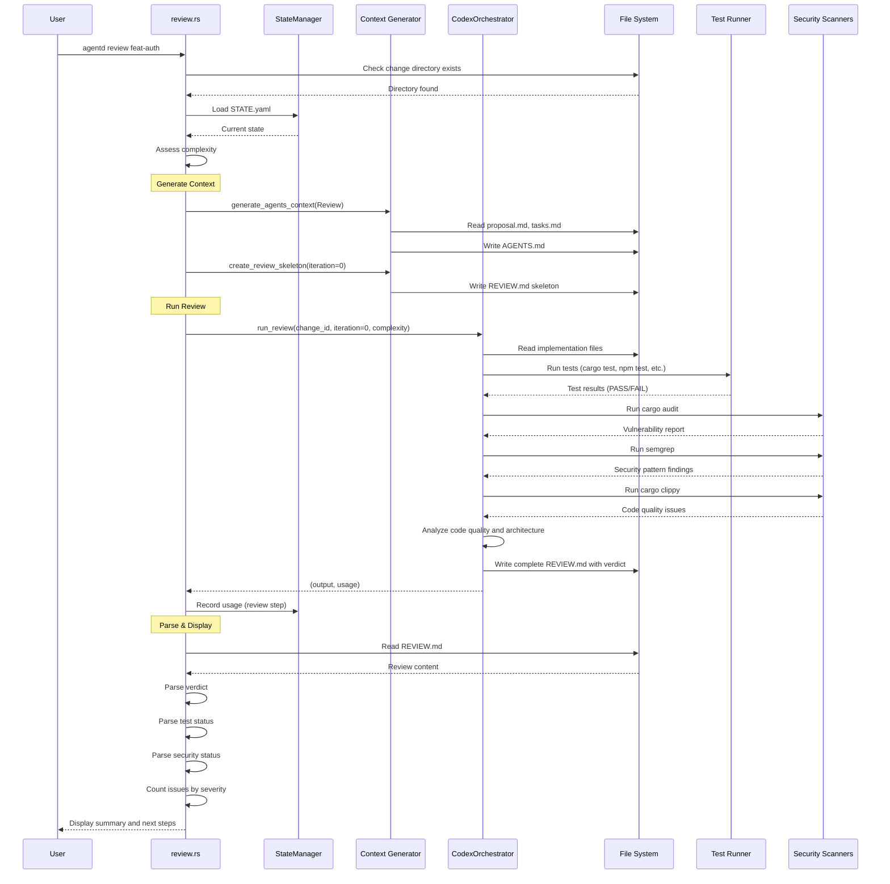

# Specification: Review Command

## Overview

The `review` command performs automated code review of an implemented change using the Codex orchestrator. It runs tests, executes security scans (cargo audit, semgrep, clippy), analyzes code quality, and generates a comprehensive REVIEW.md report with a verdict (APPROVED, NEEDS_CHANGES, or MAJOR_ISSUES). This command is used either standalone after manual code changes or as part of the automatic review loop in the `implement` command.

## Requirements

### R1: Automated Review Execution

The command must execute the following review workflow:
1. Load configuration and validate change existence
2. Assess complexity for model selection
3. Generate AGENTS.md context (refreshed for current review phase)
4. Create REVIEW.md skeleton structure
5. Run Codex orchestrator to perform review (tests + security + code analysis)
6. Parse verdict from generated REVIEW.md
7. Display summary with test status, security status, issue counts, and verdict
8. Show context-specific next steps based on verdict

### R2: Test Execution Integration

The command must integrate with the project's test infrastructure:
- Detect and run available test commands (cargo test, npm test, etc.)
- Capture test output (pass/fail status, failure details)
- Parse test results and include in REVIEW.md
- Mark overall test status as PASS, FAIL, or PARTIAL

### R3: Security Scanning

The command must execute security scans:
- Run `cargo audit` for dependency vulnerabilities (Rust projects)
- Run `semgrep` for security patterns (if available)
- Run `cargo clippy` for code quality issues (Rust projects)
- Aggregate scan results and categorize by severity
- Mark security status as CLEAN, WARNINGS, or VULNERABILITIES

### R4: Verdict Determination

The command must parse and validate the review verdict from REVIEW.md:
- **APPROVED**: Tests pass, no high-severity issues, ready for archival
- **NEEDS_CHANGES**: Tests may pass, but medium-high issues exist, auto-fixable
- **MAJOR_ISSUES**: Tests fail or critical issues, requires manual intervention
- **UNKNOWN**: Verdict parsing failed, requires manual review

### R5: File Operations

The command must perform the following file I/O:
- **Read**:
  - `agentd/changes/{change_id}/STATE.yaml` - Validate change exists
  - `agentd/changes/{change_id}/proposal.md` - Validate structure
  - `agentd/changes/{change_id}/tasks.md` - Review context
  - `agentd/config.toml` - Configuration and model settings
  - Implementation files in project - Code to review
- **Write**:
  - `agentd/changes/{change_id}/AGENTS.md` - Regenerated context
  - `agentd/changes/{change_id}/REVIEW.md` - Review report with verdict
  - `agentd/changes/{change_id}/STATE.yaml` - LLM usage tracking

### R6: Usage Tracking

The command must track Codex LLM usage:
- Record tokens (input/output) for the review call
- Record duration in milliseconds
- Calculate cost based on Codex model pricing
- Save usage data to STATE.yaml via StateManager

## Command Signature

```bash
agentd review <change_id>
```

**Arguments:**
- `change_id` (required): The change identifier to review

**Options:**
- None

## Exit Codes

- `0`: Success
  - Review completed successfully (regardless of verdict)
  - REVIEW.md generated with valid verdict
- `1`: Error
  - Change directory not found
  - STATE.yaml not found or invalid
  - Required files missing (proposal.md, tasks.md)
  - LLM API errors
  - File I/O errors

## Flow



## Acceptance Criteria

### Scenario: Review approves clean implementation

- **WHEN** I run `agentd review feat-clean` and tests pass with no issues
- **THEN** REVIEW.md is created with verdict `APPROVED`
- **THEN** Summary shows Tests: ✅ PASS, Security: ✅ CLEAN, Issues: 0
- **THEN** Next steps suggest archiving: `agentd archive feat-clean`
- **THEN** Exit code is 0

### Scenario: Review finds fixable issues

- **WHEN** I run `agentd review feat-minor-bugs` and tests pass but 2 medium issues are found
- **THEN** REVIEW.md is created with verdict `NEEDS_CHANGES`
- **THEN** Summary shows issue counts (🟡 Medium: 2 issues)
- **THEN** Next steps suggest either `resolve-reviews` or manual fix + re-review
- **THEN** Exit code is 0

### Scenario: Review finds major issues

- **WHEN** I run `agentd review feat-broken` and tests fail with 3 high-severity issues
- **THEN** REVIEW.md is created with verdict `MAJOR_ISSUES`
- **THEN** Summary shows Tests: ❌ FAIL and 🔴 High: 3 issues
- **THEN** First high-severity issue is displayed in preview
- **THEN** Next steps suggest manual review and fixing
- **THEN** Exit code is 0

### Scenario: Security vulnerabilities detected

- **WHEN** I run `agentd review feat-security` and cargo audit finds vulnerabilities
- **THEN** REVIEW.md includes Security Status: ❌ VULNERABILITIES
- **THEN** Vulnerability details are captured in REVIEW.md
- **THEN** Verdict is at least `NEEDS_CHANGES` or `MAJOR_ISSUES`
- **THEN** Exit code is 0

### Scenario: Change not found

- **WHEN** I run `agentd review nonexistent-change`
- **THEN** I see error "Change 'nonexistent-change' not found. Run 'agentd implement nonexistent-change' first."
- **THEN** Exit code is 1

### Scenario: Re-review after manual fixes

- **WHEN** I manually fix code and run `agentd review feat-fixed` again
- **THEN** Previous REVIEW.md is overwritten with new review
- **THEN** New verdict reflects current code state
- **THEN** Exit code is 0

### Scenario: Partial test results

- **WHEN** I run `agentd review feat-partial` and some tests pass, some fail
- **THEN** REVIEW.md shows Test Status: ⚠️ PARTIAL
- **THEN** Failed test details are captured
- **THEN** Verdict considers partial test status
- **THEN** Exit code is 0

## Examples

### Example 1: Clean approval

```bash
$ agentd review feat-auth
🔍 Reviewing: feat-auth
🔍 Reviewing implementation with Codex...
   Running tests and security scans...

📊 Code Review Complete
   Location: agentd/changes/feat-auth/REVIEW.md

📊 Summary:
   Tests:    ✅ PASS
   Security: ✅ CLEAN
   Verdict:  APPROVED

📝 Issues Found:
   ✅ No issues found!

⏭️  Next steps:
   ✅ Implementation approved!
   Ready to archive:
      agentd archive feat-auth
```

### Example 2: Needs changes

```bash
$ agentd review feat-validation
🔍 Reviewing: feat-validation
🔍 Reviewing implementation with Codex...
   Running tests and security scans...

📊 Code Review Complete
   Location: agentd/changes/feat-validation/REVIEW.md

📊 Summary:
   Tests:    ✅ PASS
   Security: ✅ CLEAN
   Verdict:  NEEDS_CHANGES

📝 Issues Found:
   🟡 Medium:  2 issues

⏭️  Next steps:
   1. Review full report:
      cat agentd/changes/feat-validation/REVIEW.md

   2. Address issues automatically:
      agentd resolve-reviews feat-validation

   3. Or fix manually and re-review:
      agentd review feat-validation
```

### Example 3: Major issues found

```bash
$ agentd review feat-broken
🔍 Reviewing: feat-broken
🔍 Reviewing implementation with Codex...
   Running tests and security scans...

📊 Code Review Complete
   Location: agentd/changes/feat-broken/REVIEW.md

📊 Summary:
   Tests:    ❌ FAIL
   Security: ⚠️ WARNINGS
   Verdict:  MAJOR_ISSUES

📝 Issues Found:
   🔴 High:    3 issues
   🟡 Medium:  5 issues
   🟢 Low:     2 issues

━━━━━━━━━━━━━━━━━━━━━━━━━━━━━━━━━━━━━━━━━━━━
🔴 HIGH SEVERITY ISSUE (first)
### Issue 1: Null Pointer Dereference in auth.rs:45
━━━━━━━━━━━━━━━━━━━━━━━━━━━━━━━━━━━━━━━━━━━━

⏭️  Next steps:
   ⚠️  Major issues found
   1. Review full report:
      cat agentd/changes/feat-broken/REVIEW.md

   2. Fix critical issues manually

   3. Re-review when fixed:
      agentd review feat-broken
```

### Example 4: Security vulnerabilities

```bash
$ agentd review feat-deps
🔍 Reviewing: feat-deps
🔍 Reviewing implementation with Codex...
   Running tests and security scans...

📊 Code Review Complete
   Location: agentd/changes/feat-deps/REVIEW.md

📊 Summary:
   Tests:    ✅ PASS
   Security: ❌ VULNERABILITIES
   Verdict:  NEEDS_CHANGES

📝 Issues Found:
   🔴 High:    1 issues (CVE-2024-12345 in tokio)
   🟡 Medium:  0 issues

━━━━━━━━━━━━━━━━━━━━━━━━━━━━━━━━━━━━━━━━━━━━
🔴 HIGH SEVERITY ISSUE (first)
### Issue 1: Dependency Vulnerability (cargo audit)
━━━━━━━━━━━━━━━━━━━━━━━━━━━━━━━━━━━━━━━━━━━━

⏭️  Next steps:
   1. Review full report:
      cat agentd/changes/feat-deps/REVIEW.md

   2. Address issues automatically:
      agentd resolve-reviews feat-deps

   3. Or fix manually and re-review:
      agentd review feat-deps
```

### Example 5: Change not found

```bash
$ agentd review nonexistent
Error: Change 'nonexistent' not found. Run 'agentd implement nonexistent' first.
$ echo $?
1
```

### Example 6: Re-review after manual fixes

```bash
$ # Made manual fixes to code
$ agentd review feat-fixed
🔍 Reviewing: feat-fixed
🔍 Reviewing implementation with Codex...
   Running tests and security scans...

📊 Code Review Complete
   Location: agentd/changes/feat-fixed/REVIEW.md
   (Previous review overwritten)

📊 Summary:
   Tests:    ✅ PASS
   Security: ✅ CLEAN
   Verdict:  APPROVED

📝 Issues Found:
   ✅ No issues found!

⏭️  Next steps:
   ✅ Implementation approved!
   Ready to archive:
      agentd archive feat-fixed
```

## Related Commands

**Previous in workflow:**
- `agentd implement` - Implements code and automatically calls review
- Manual code changes - When you fix code manually and want to verify

**Next in workflow:**
- `agentd archive` - Archives approved changes
- `agentd resolve-reviews` - Automatically fixes issues found in review
- `agentd review` - Re-run review after fixes (same command, iterative)

**Integration points:**
- Called automatically by `agentd implement` as part of review loop
- Can be called manually after any code changes
- Works with `resolve-reviews` command in fix-review-fix cycles

## Notes

- The `review` command is idempotent - it can be run multiple times, overwriting REVIEW.md
- Review iteration number is 0 for standalone reviews, incremented in automatic loops
- The command always exits with code 0 on successful review, regardless of verdict
- Only exits with code 1 on operational errors (change not found, API failures, etc.)
- Security scans are tool-specific (cargo audit for Rust, npm audit for Node, etc.)
- The Codex orchestrator handles tool detection and execution automatically
- AGENTS.md is regenerated on each review to ensure fresh context
- Review results are deterministic given the same code state
- The skeleton REVIEW.md structure guides Codex output format
- High-severity issues are previewed in CLI output for immediate visibility
