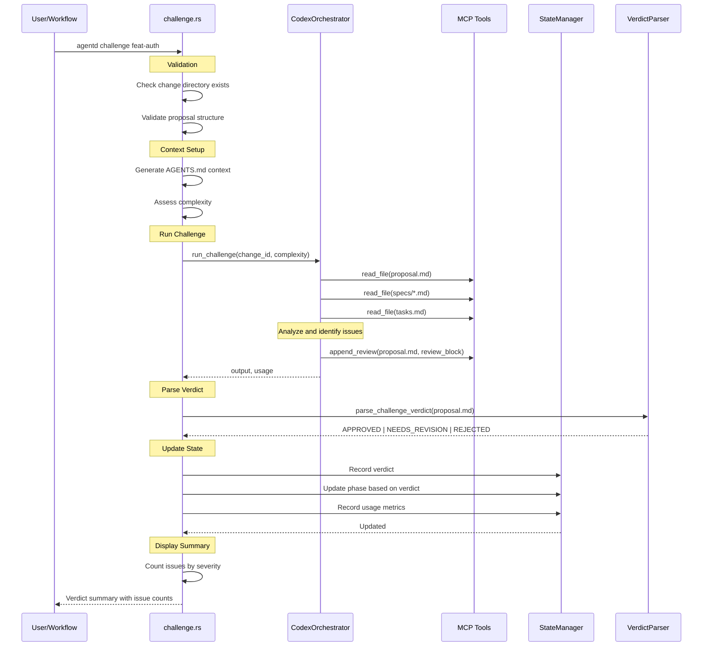

# Specification: Challenge Command

## Overview

The `challenge` command runs a Codex review of the proposal and appends the verdict as a review block to proposal.md. The review identifies issues by severity and provides a verdict that determines the next phase transition.

**Key Design Principle**: Reviews are stored inline in proposal.md (not separate CHALLENGE.md), enabling a single source of truth for proposal state.

## Requirements

### R1: MCP-Based Review Appending

The command MUST use Codex with MCP tools to append a review:
- Codex reads proposal.md, specs, and tasks.md via MCP `read_file`
- Codex uses `append_review` MCP tool to add review block to proposal.md
- Review block is XML-wrapped for clear parsing

### R2: Review Block Format

The review block MUST follow this XML-wrapped format:

```xml
<!-- review:start -->
## Review

**Verdict**: APPROVED | NEEDS_REVISION | REJECTED

### Issues

#### Issue 1
- **Severity**: High | Medium | Low
- **Description**: Clear description of the issue
- **Location**: File and section affected
- **Recommendation**: Suggested fix

...

### Summary
Brief summary of the review findings.

**Reviewed**: {timestamp}
<!-- review:end -->
```

### R3: Verdict Types and Phase Transitions

The command MUST update phase based on verdict:

| Verdict | New Phase | Behavior |
|---------|-----------|----------|
| `APPROVED` | `challenged` | Ready for implementation |
| `NEEDS_REVISION` | `proposed` | Stays in proposed for reproposal |
| `REJECTED` | `rejected` | Fundamental issues, needs manual intervention |

### R4: Issue Severity Levels

Issues MUST be categorized by severity:

| Severity | Criteria |
|----------|----------|
| **High** | Blocking issues that must be fixed before implementation |
| **Medium** | Significant issues that should be addressed |
| **Low** | Minor improvements or suggestions |

Verdict guidelines:
- `APPROVED`: No HIGH severity issues
- `NEEDS_REVISION`: Has HIGH or multiple MEDIUM issues that are fixable
- `REJECTED`: Fundamental design flaws requiring major rework

### R5: Context Generation

The command MUST generate context for Codex:
- Generate `AGENTS.md` file with change context
- Include proposal.md, specs, tasks.md in context
- Set `ContextPhase::Challenge` for context generation

### R6: Complexity-Based Model Selection

The command MUST select Codex model based on complexity:
- Use `Change::assess_complexity(project_root)` for complexity
- Use `config.codex.select_model(complexity)` for model

### R7: State Management

The command MUST update STATE.yaml:
- Record verdict
- Update phase based on verdict
- Record usage metrics (tokens, cost, duration)
- Set `last_action: challenge`

### R8: File Operations

The command performs the following file I/O:

**Read**:
- `agentd/changes/{change_id}/proposal.md` - Main proposal
- `agentd/changes/{change_id}/specs/*.md` - Spec files
- `agentd/changes/{change_id}/tasks.md` - Tasks
- `agentd/changes/{change_id}/STATE.yaml` - Current state

**Write**:
- `agentd/changes/{change_id}/proposal.md` - Appended review block
- `agentd/changes/{change_id}/AGENTS.md` - Context for Codex
- `agentd/changes/{change_id}/STATE.yaml` - Verdict, phase, usage

## Command Signature

```bash
agentd challenge <change_id>
```

**Arguments:**
- `change_id` (required): The change identifier to challenge

**Options:**
- None

## Exit Codes

- `0`: Success (challenge completed)
- `1`: Error
  - Change not found
  - Proposal validation failed
  - Codex API errors after retries

## Flow



## Acceptance Criteria

### Scenario: Challenge passes (APPROVED)

- **WHEN** `agentd challenge feat-auth` is run on a well-formed proposal
- **THEN** Codex appends review block to proposal.md
- **THEN** verdict is `APPROVED`
- **THEN** phase updates to `challenged`
- **THEN** displays "APPROVED - Ready for implementation!"
- **THEN** exit code is 0

### Scenario: Challenge finds issues (NEEDS_REVISION)

- **WHEN** `agentd challenge feat-auth` finds HIGH severity issues
- **THEN** Codex appends review block with issues documented
- **THEN** verdict is `NEEDS_REVISION`
- **THEN** phase stays at `proposed`
- **THEN** displays "NEEDS_REVISION - Found X HIGH, Y MEDIUM severity issues"
- **THEN** exit code is 0

### Scenario: Challenge rejects proposal

- **WHEN** `agentd challenge feat-auth` finds fundamental design flaws
- **THEN** Codex appends review block with verdict `REJECTED`
- **THEN** phase updates to `rejected`
- **THEN** displays "REJECTED - Fundamental problems"
- **THEN** exit code is 0

### Scenario: Change not found

- **WHEN** `agentd challenge nonexistent` is run
- **THEN** displays "Change 'nonexistent' not found"
- **THEN** exit code is 1

### Scenario: Proposal validation fails

- **WHEN** proposal.md is missing required sections
- **THEN** displays validation errors
- **THEN** suggests running `agentd proposal` first
- **THEN** exit code is 1

### Scenario: Re-challenge after reproposal

- **WHEN** `agentd challenge feat-auth` is run after reproposal
- **THEN** Codex reads the updated proposal
- **THEN** appends new review block (preserving previous reviews)
- **THEN** verdict reflects current state of proposal

## Related Commands

**Previous in workflow**:
- `agentd proposal` - Creates the proposal to challenge
- `agentd reproposal` - Fixes issues from previous challenge

**Next in workflow**:
- `agentd implement` - If APPROVED
- `agentd reproposal` - If NEEDS_REVISION
- Manual review - If REJECTED

**Related**:
- `agentd validate-challenge` - Local format validation of review

## MCP Tool Requirements

The challenge command requires these MCP tools for Codex:

| Tool | Purpose |
|------|---------|
| `read_file` | Read proposal, specs, tasks |
| `append_review` | Append review block to proposal.md |
| `list_directory` | List spec files |

## Configuration

```toml
[workflow]
script_retries = 2          # Retry count for Codex API failures
retry_delay_secs = 5        # Delay between retries

[codex]
# Model selection based on complexity
```

## Notes

- Review blocks are appended, not replaced (history preserved)
- Parser extracts latest review for verdict determination
- AGENTS.md context helps Codex understand the change scope
- Complexity assessment affects model selection
- Re-challenge (after reproposal) uses session resume for context
- Verdict parsing is case-insensitive and tolerant of formatting
- Issue severity counts displayed in summary for quick assessment
- STATE.yaml tracks all challenge attempts via usage metrics
