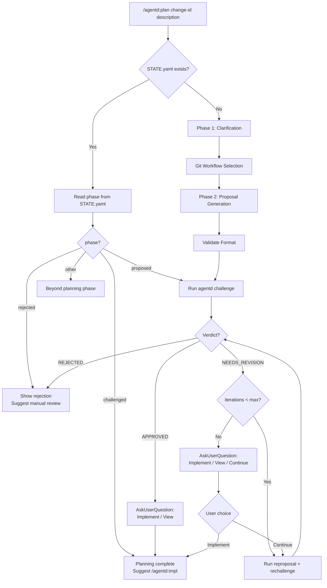
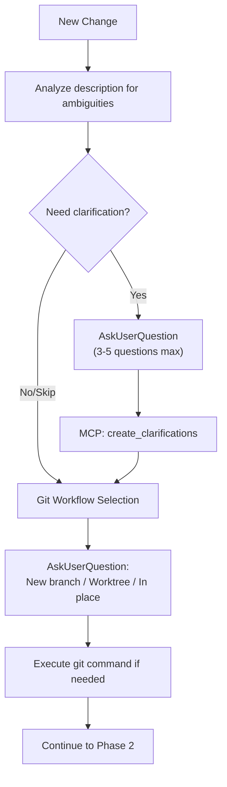
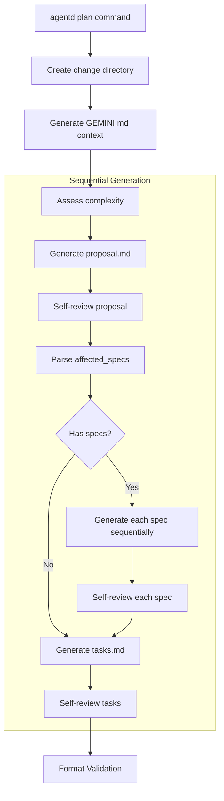
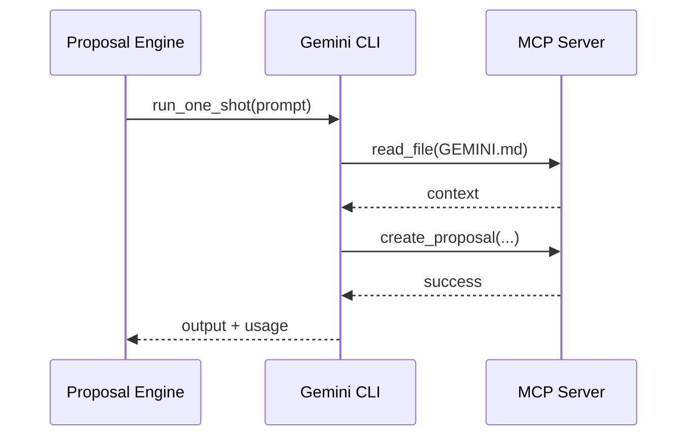
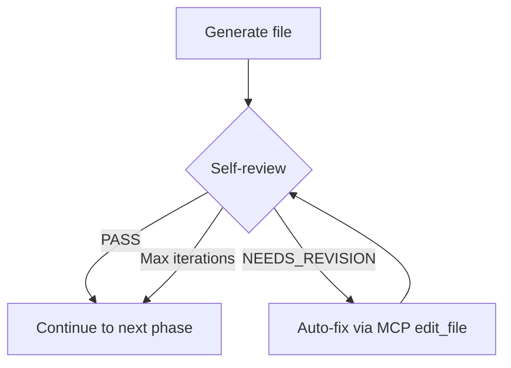
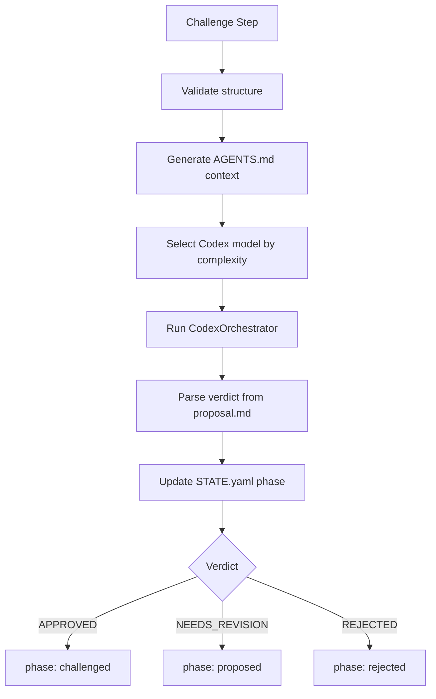
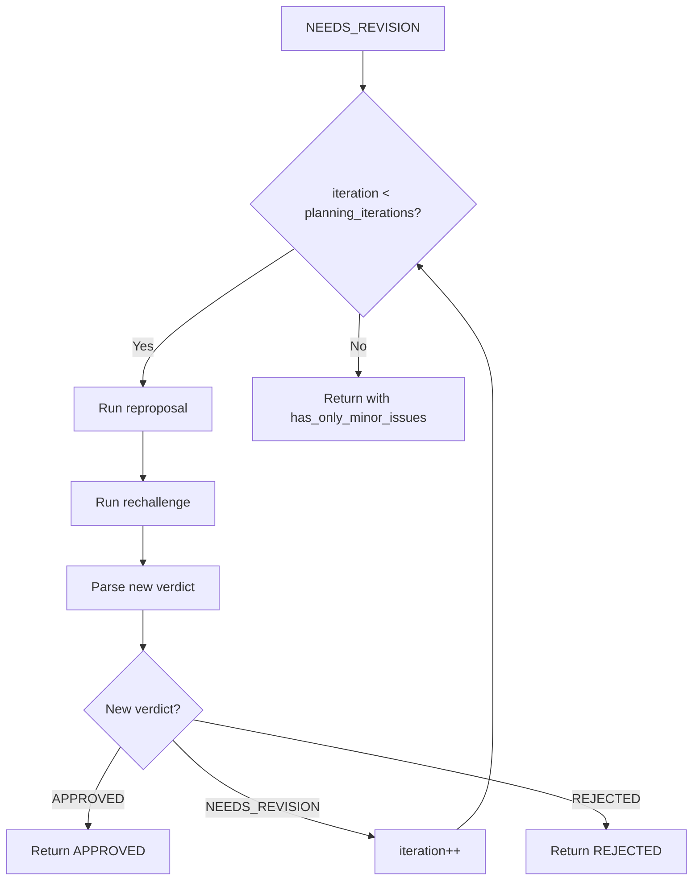

# Agentd Plan Workflow

## Overview

`agentd plan` is the core command for the Spec-Driven Development Planning Phase:
- Clarification (requirements gathering)
- Proposal Generation (sequential: proposal → specs → tasks)
- Challenge (code review with Codex)
- Reproposal Loop (auto-fix up to `planning_iterations` times)
- User Decision (via AskUserQuestion)

---

## High-Level Flow



---

## Phase 1: Clarification (New Changes Only)



### Clarification Questions

Use `AskUserQuestion` tool with:
- `question`: Clear question about ambiguity
- `header`: Short label (max 12 chars)
- `options`: 2-4 choices with descriptions
- `multiSelect`: false (usually)

### MCP Tool: create_clarifications

```json
{
  "change_id": "add-oauth",
  "questions": [
    {
      "topic": "Auth Method",
      "question": "Which authentication method?",
      "answer": "OAuth",
      "rationale": "Industry standard for third-party auth"
    }
  ]
}
```

Creates: `agentd/changes/<change-id>/clarifications.md`

---

## Phase 2: Proposal Generation



### Gemini Orchestration

Each generation phase uses a **fresh session** (no `--resume`):



### Self-Review Loop

For each generated file (proposal, specs, tasks):



- Max 1 iteration (Codex challenge catches remaining issues)
- Uses fresh session for each review

---

## Phase 3: Challenge



### Codex Review

Codex evaluates:
1. Technical feasibility
2. Architecture soundness
3. Security concerns
4. Performance implications
5. Completeness of requirements
6. Task breakdown quality

Each issue includes:
- **Severity**: High / Medium / Low
- **Description**: What's wrong
- **Suggestion**: How to fix
- **Spec Reference**: Which requirement

---

## Phase 4: Reproposal Loop



### Reproposal

- Resumes Gemini session by index (uses `session_id` from STATE.yaml)
- Reads review block feedback from proposal.md
- Fixes issues in same session context

### Rechallenge

- Resumes Codex session
- Re-reviews updated proposal
- Updates review block in proposal.md

---

## Phase 5: User Decision (AskUserQuestion)

After `run_proposal_loop` returns, the Skill uses `AskUserQuestion`:

### If APPROVED

```yaml
AskUserQuestion:
  question: "Proposal approved! What would you like to do?"
  header: "Next Action"
  options:
    - label: "Proceed to implementation (Recommended)"
      description: "Run /agentd:impl to start implementing"
    - label: "Open viewer"
      description: "Review the approved plan in UI"
```

### If NEEDS_REVISION (minor issues or iteration limit)

```yaml
AskUserQuestion:
  question: "Minor issues remain. Proceed to implementation?"
  header: "Next Action"
  options:
    - label: "Proceed to implementation (Recommended)"
      description: "Minor issues can be fixed during impl"
    - label: "Open viewer"
      description: "Review remaining issues"
    - label: "Continue fixing"
      description: "Run another reproposal cycle"
```

### If NEEDS_REVISION (significant issues)

```yaml
AskUserQuestion:
  question: "Issues found. How would you like to proceed?"
  header: "Next Action"
  options:
    - label: "Open viewer (Recommended)"
      description: "Review issues before deciding"
    - label: "Continue fixing"
      description: "Run another reproposal cycle"
    - label: "Proceed anyway"
      description: "Skip to implementation despite issues"
```

---

## File Structure

After completion:

```
agentd/changes/add-oauth/
├── STATE.yaml              # Change state and LLM usage tracking
├── clarifications.md       # User Q&A from AskUserQuestion
├── proposal.md             # Main proposal document (with review block)
├── specs/
│   ├── auth-flow.md        # Spec #1
│   ├── user-model.md       # Spec #2
│   └── api-endpoints.md    # Spec #3
├── tasks.md                # Implementation task breakdown
├── GEMINI.md               # Context for Gemini (auto-generated)
└── AGENTS.md               # Context for Codex (auto-generated)
```

### STATE.yaml Example

```yaml
change_id: add-oauth
phase: challenged
created_at: 2026-01-19T10:30:00Z
updated_at: 2026-01-19T10:45:00Z
session_id: "abc123-uuid-xyz"

llm_calls:
  - step: proposal-gen
    model: gemini-3-flash-preview
    tokens_in: 15234
    tokens_out: 892
    cost: 0.0019

  - step: challenge
    model: gpt-5.2-codex
    tokens_in: 24567
    tokens_out: 2345
    cost: 0.0678

total_cost: 0.1234
```

---

## Cost Analysis

### Typical Cost Breakdown

| Phase | Model | Tokens (in/out) | Cost |
|-------|-------|-----------------|------|
| Proposal Gen | gemini-flash | 15K / 1K | $0.002 |
| Proposal Review | gemini-flash | 8K / 0.5K | $0.001 |
| Spec Gen x3 | gemini-flash | 36K / 3K | $0.005 |
| Spec Review x3 | gemini-flash | 24K / 1.5K | $0.003 |
| Tasks Gen | gemini-flash | 18K / 1.5K | $0.002 |
| Tasks Review | gemini-flash | 8K / 0.5K | $0.001 |
| Challenge | codex-balanced | 25K / 2K | $0.066 |
| **Total (1 iteration)** | | **134K / 10K** | **$0.080** |
| Reproposal (if needed) | gemini-flash | +20K / +2K | +$0.003 |
| Rechallenge | codex-balanced | +25K / +2K | +$0.066 |
| **Total (2 iterations)** | | **179K / 14K** | **$0.149** |

---

## Error Handling

### MCP Tool Failure

```
Error: create_proposal MCP tool failed
Solution:
  - Check .gemini/mcp.json exists
  - Verify agentd MCP server is registered
```

### Session Not Found

```
Error: Session abc123-uuid-xyz not found
Solution:
  - Re-run proposal (fresh start)
  - Delete STATE.yaml and start over
```

### Format Validation Failed

```
Error: Format validation failed
Solution:
  - Manually edit proposal.md
  - Run: agentd validate <change-id>
  - Run: agentd challenge <change-id>
```

### Challenge Verdict Unknown

```
Error: Could not parse challenge verdict
Solution:
  - Manually read proposal.md review block
  - Update STATE.yaml phase manually if needed
```

---

## Configuration

```toml
[workflow]
planning_iterations = 3    # Max reproposal iterations
format_iterations = 2      # Max format fix iterations
script_retries = 3         # Retries on transient failures
retry_delay_secs = 5       # Delay between retries
```

---

## Summary

**agentd plan workflow**:
1. **Clarification** - AskUserQuestion (3-5 questions)
2. **Git Setup** - AskUserQuestion (branch/worktree/in-place)
3. **Sequential Generation** - Fresh sessions per phase
4. **Format Validation** - Local check
5. **Challenge** - Codex code review
6. **Reproposal Loop** - Auto-fix up to `planning_iterations` times
7. **User Decision** - AskUserQuestion for next action
