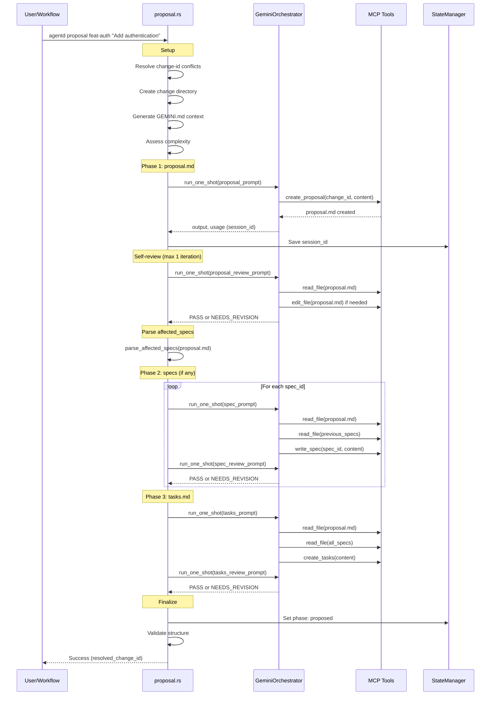

# Specification: Proposal Command

## Overview

The `proposal` command generates a complete change proposal using sequential MCP-based generation. It creates proposal.md, specs (if needed), and tasks.md in sequence, with self-review after each phase. The command saves the Gemini session ID for use by the `reproposal` command.

**Key Design Principle**: Sequential generation with MCP tools ensures each phase has access to previously generated content via file reads, avoiding context loss.

## Requirements

### R1: Sequential MCP Generation

The command MUST generate files in strict sequence using MCP tools:

1. **Phase 1: proposal.md** - Generate main proposal document
2. **Phase 2: specs** - Generate spec files (if `affected_specs` is non-empty)
3. **Phase 3: tasks.md** - Generate implementation tasks

Each phase uses a fresh Gemini session but reads previously generated files via MCP `read_file` tool.

### R2: Self-Review Per Phase

After each generation phase, the command MUST run self-review:
- Self-review uses a fresh session with MCP tools
- Maximum **1 iteration** per phase (reduced from 3 to minimize redundancy)
- Gemini reviews and fixes issues in the generated file
- Review result: `PASS` (no changes needed) or `NEEDS_REVISION` (file updated)
- If max iterations reached with issues, log warning and continue

### R3: Session Management

The command MUST capture and save the Gemini session ID:
- After proposal.md generation, capture `session_id` from usage metrics
- Save session_id to `STATE.yaml` via StateManager
- If session_id capture fails, exit with error (required for reproposal)
- Session index lookup via `find_session_index(session_id)` for resume

### R4: Affected Specs Parsing

The command MUST parse affected specs from proposal.md:
- Look for `## Affected Specs` or similar section
- Extract list of spec IDs (e.g., `auth-flow`, `api-endpoints`)
- If no affected specs, skip Phase 2
- Generate specs in order, each with access to previously generated specs

### R5: Complexity Assessment

The command MUST assess change complexity for model selection:
- Use `Change::assess_complexity(project_root)` to determine complexity
- Complexity affects model selection (via `config.gemini.select_model(complexity)`)
- Complexity levels: `Low`, `Medium`, `High`

### R6: Directory Setup

The command MUST set up the change directory:
- Create `agentd/changes/{change_id}/` if not exists
- Resolve change-id conflicts via `resolve_change_id_conflict()`
- Create `specs/` subdirectory if specs will be generated
- Generate `GEMINI.md` context file for MCP

### R7: Phase Transition

The command MUST update phase on completion:
- Set `phase: proposed` in STATE.yaml after successful generation
- Validate structure via `Change::validate_structure()`
- Log warnings if structure validation fails (don't block)

### R8: File Operations

The command performs the following file I/O:

**Write**:
- `agentd/changes/{change_id}/proposal.md` - Main proposal
- `agentd/changes/{change_id}/specs/{spec_id}.md` - Spec files (if any)
- `agentd/changes/{change_id}/tasks.md` - Task breakdown
- `agentd/changes/{change_id}/STATE.yaml` - Session ID, phase, usage
- `agentd/changes/{change_id}/GEMINI.md` - Context for MCP

**Read**:
- `agentd/config.toml` - Configuration
- Existing specs in `agentd/specs/` for reference

## Command Signature

```bash
agentd proposal <change_id> "<description>"
```

**Arguments:**
- `change_id` (required): Unique identifier for the change
- `description` (required): Human-readable description of the change

**Options:**
- `--skip-clarify`: Skip interactive clarification phase (if implemented)

## Exit Codes

- `0`: Success (proposal generated)
- `1`: Error
  - Session ID capture failed
  - Gemini API errors after retries
  - File I/O errors

## Flow



## Acceptance Criteria

### Scenario: New proposal with specs

- **WHEN** `agentd proposal feat-auth "Add authentication"` is run
- **THEN** creates `agentd/changes/feat-auth/proposal.md`
- **THEN** parses `affected_specs: [auth-flow, token-management]`
- **THEN** creates `agentd/changes/feat-auth/specs/auth-flow.md`
- **THEN** creates `agentd/changes/feat-auth/specs/token-management.md`
- **THEN** creates `agentd/changes/feat-auth/tasks.md`
- **THEN** saves session_id to STATE.yaml
- **THEN** sets `phase: proposed`
- **THEN** exit code is 0

### Scenario: Proposal without specs

- **WHEN** proposal.md has empty `affected_specs`
- **THEN** skips Phase 2 (spec generation)
- **THEN** proceeds directly to tasks.md generation
- **THEN** logs "No specs required for this change"

### Scenario: Self-review finds issues

- **WHEN** self-review detects issues in proposal.md
- **THEN** Gemini fixes the issues via MCP edit_file
- **THEN** logs "Review 1: NEEDS_REVISION (auto-fixed)"
- **THEN** continues to next phase

### Scenario: Self-review passes

- **WHEN** self-review finds no issues
- **THEN** logs "Review 1: PASS"
- **THEN** continues to next phase without changes

### Scenario: Session ID capture fails

- **WHEN** Gemini response doesn't include session_id
- **THEN** logs error: "Failed to capture session ID"
- **THEN** exits with code 1

### Scenario: Change ID conflict

- **WHEN** `feat-auth` already exists
- **THEN** resolves to `feat-auth-1` (or next available)
- **THEN** logs the resolved change-id
- **THEN** returns resolved change-id to caller

## Related Commands

**Triggered by**:
- `/agentd:plan` workflow (initial planning)

**Next in workflow**:
- `agentd challenge` - Review the proposal

**Related**:
- `agentd reproposal` - Resume and fix issues (uses saved session_id)
- `agentd validate-proposal` - Local format validation

## MCP Tool Requirements

The proposal command requires these MCP tools for Gemini:

| Tool | Purpose |
|------|---------|
| `create_proposal` | Create proposal.md with content |
| `write_spec` | Create spec file in specs/ directory |
| `create_tasks` | Create tasks.md with content |
| `read_file` | Read previously generated files |
| `edit_file` | Fix issues during self-review |
| `list_directory` | Browse existing specs |

## Configuration

```toml
[workflow]
self_review_iterations = 1  # Max self-review iterations per phase
script_retries = 2          # Retry count for Gemini API failures
retry_delay_secs = 5        # Delay between retries

[gemini]
# Model selection based on complexity
```

## Notes

- Sequential generation prevents context loss between phases
- Each phase uses fresh session but reads prior files
- Self-review reduced to 1 iteration (Codex challenge catches remaining issues)
- Session ID is critical for reproposal - fail fast if not captured
- Complexity assessment affects model selection and token limits
- Change ID conflict resolution ensures unique directories
- Structure validation is advisory (warnings only, doesn't block)
