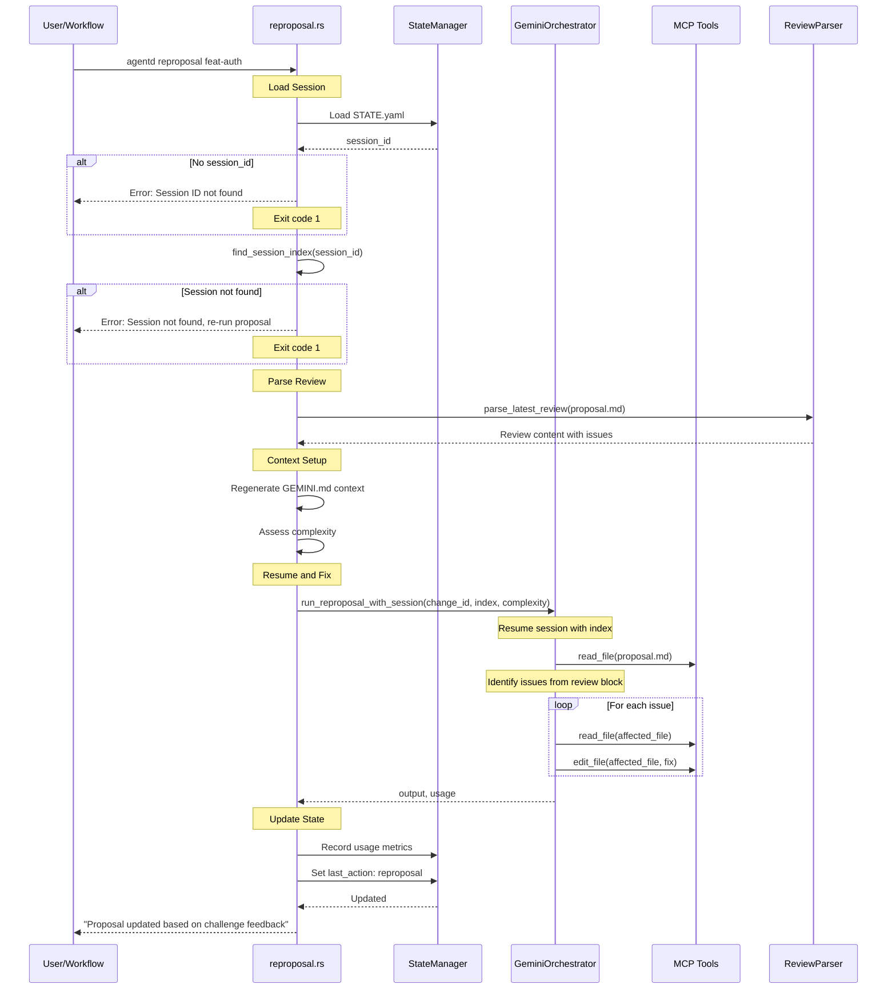

# Specification: Reproposal Command

## Overview

The `reproposal` command resumes the Gemini session used during initial proposal generation to fix issues identified in the challenge review. It reads the review block from proposal.md and addresses the documented issues using MCP tools.

**Key Design Principle**: Resume-by-index preserves Gemini context from the original proposal session, enabling efficient fixes without regenerating from scratch.

## Requirements

### R1: Session Resume

The command MUST resume the Gemini session by index:
- Load `session_id` from STATE.yaml
- Use `find_session_index(session_id)` to get the session index
- Resume with `--resume {index}` flag
- If session not found, exit with error (user must re-run proposal)

### R2: Review Block Reading

The command MUST read and parse the latest review block:
- Extract review content from proposal.md
- Identify issues by severity (HIGH, MEDIUM, LOW)
- Parse issue descriptions, locations, and recommendations
- Pass review context to Gemini via prompt

### R3: Issue Fixing via MCP

The command MUST use MCP tools to fix issues:
- Read affected files via `read_file`
- Apply fixes via `edit_file`
- For structural issues, may need to regenerate sections
- Update proposal.md, specs, or tasks.md as needed

### R4: Context Regeneration

The command MUST regenerate context before resume:
- Regenerate `GEMINI.md` with `ContextPhase::Proposal`
- Ensure Gemini has access to current state of all files

### R5: Complexity Assessment

The command MUST use consistent complexity for model selection:
- Use `Change::assess_complexity(project_root)`
- Must match complexity used in original proposal

### R6: State Management

The command MUST update STATE.yaml:
- Record usage metrics (tokens, cost, duration)
- Set `last_action: reproposal`
- Phase remains `proposed` (challenge determines phase transition)

### R7: File Operations

The command performs the following file I/O:

**Read**:
- `agentd/changes/{change_id}/proposal.md` - Review block for issues
- `agentd/changes/{change_id}/STATE.yaml` - Session ID
- `agentd/changes/{change_id}/specs/*.md` - Current specs
- `agentd/changes/{change_id}/tasks.md` - Current tasks

**Write**:
- `agentd/changes/{change_id}/proposal.md` - Fixed content
- `agentd/changes/{change_id}/specs/*.md` - Fixed specs
- `agentd/changes/{change_id}/tasks.md` - Fixed tasks
- `agentd/changes/{change_id}/GEMINI.md` - Updated context
- `agentd/changes/{change_id}/STATE.yaml` - Usage metrics

## Command Signature

```bash
agentd reproposal <change_id>
```

**Arguments:**
- `change_id` (required): The change identifier to repropose

**Options:**
- None

## Exit Codes

- `0`: Success (reproposal completed)
- `1`: Error
  - Session ID not found in STATE.yaml
  - Session index lookup failed
  - Gemini API errors after retries
  - File I/O errors

## Flow



## Acceptance Criteria

### Scenario: Successful reproposal

- **WHEN** `agentd reproposal feat-auth` is run with valid session
- **THEN** resumes Gemini session by index
- **THEN** reads review block from proposal.md
- **THEN** fixes documented issues via MCP tools
- **THEN** displays "Proposal updated based on challenge feedback"
- **THEN** exit code is 0

### Scenario: Session ID not found

- **WHEN** STATE.yaml has no session_id
- **THEN** displays "Failed to capture session ID"
- **THEN** exit code is 1

### Scenario: Session index lookup fails

- **WHEN** session_id exists but session is not found
- **THEN** displays "Session not found, please re-run proposal"
- **THEN** exit code is 1

### Scenario: Multiple issues fixed

- **WHEN** review has 3 HIGH severity issues
- **THEN** Gemini addresses each issue sequentially
- **THEN** updates affected files (proposal.md, specs, tasks.md as needed)
- **THEN** logs each fix applied

### Scenario: Spec file needs update

- **WHEN** review identifies issue in `specs/auth-flow.md`
- **THEN** Gemini reads the spec via MCP
- **THEN** applies fix via `edit_file` MCP tool
- **THEN** spec is updated with fix

## Related Commands

**Previous in workflow**:
- `agentd challenge` - Creates the review with issues

**Next in workflow**:
- `agentd challenge` - Re-challenge the fixed proposal

**Related**:
- `agentd proposal` - Initial proposal generation (creates session)
- `agentd validate-proposal` - Local format validation

## MCP Tool Requirements

The reproposal command requires these MCP tools for Gemini:

| Tool | Purpose |
|------|---------|
| `read_file` | Read files to understand current state |
| `edit_file` | Apply fixes to files |
| `write_spec` | Regenerate spec if major changes needed |
| `create_tasks` | Regenerate tasks if major changes needed |

## Configuration

```toml
[workflow]
script_retries = 2          # Retry count for Gemini API failures
retry_delay_secs = 5        # Delay between retries

[gemini]
# Model selection based on complexity
```

## Session Management Details

### Session ID Flow

1. **Proposal**: Gemini creates session, returns `session_id` in usage metrics
2. **Save**: Proposal command saves `session_id` to STATE.yaml
3. **Lookup**: Reproposal uses `find_session_index(session_id)` to get numeric index
4. **Resume**: Gemini CLI uses `--resume {index}` to continue session

### Why Resume-by-Index?

- Preserves full context from original proposal generation
- Gemini has knowledge of the codebase analysis done during proposal
- More efficient than starting fresh with MCP file reads
- Maintains consistency in generation style

### Failure Recovery

If session is lost (Gemini session expired, index invalid):
- User must re-run `agentd proposal` to create new session
- This is acceptable as proposal regeneration is relatively quick
- STATE.yaml session_id will be updated with new session

## Notes

- Session resume requires strict session_id → index lookup
- No fallback to `--resume latest` (could resume wrong session)
- Reproposal doesn't change phase (stays `proposed`)
- Challenge after reproposal determines phase transition
- Gemini applies fixes but doesn't self-review (challenge does that)
- Multiple reproposals are possible (each after a challenge)
- Usage metrics tracked per reproposal attempt
- Context regeneration ensures Gemini sees latest file states
