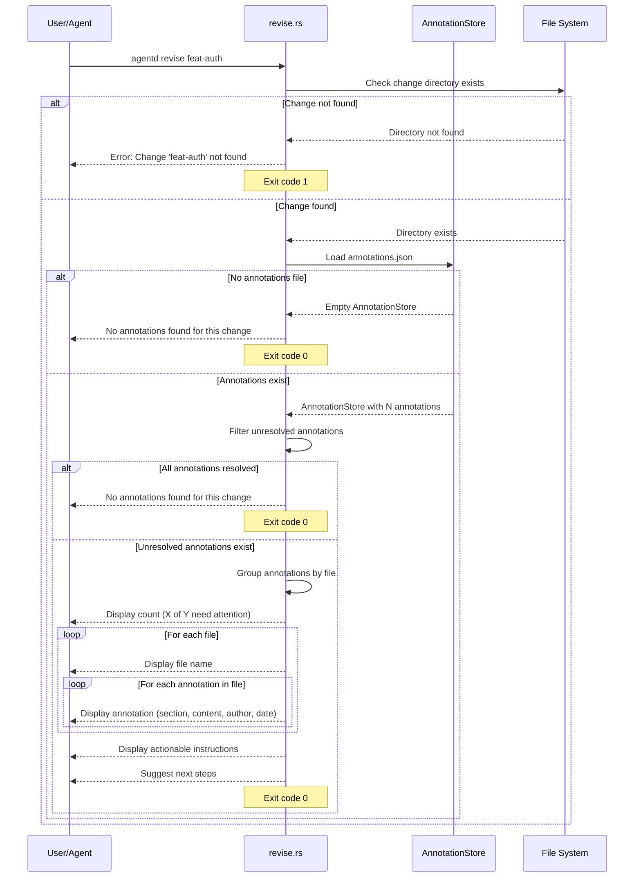

# Specification: Revise Command

## Overview

The `revise` command reads and displays annotations from the plan viewer, formatted for addressing by agents or humans. Annotations are review comments added via the plan viewer UI that highlight specific sections of the proposal needing attention. This command outputs unresolved annotations grouped by file and provides actionable instructions for updating the proposal, but does not automatically apply changes.

## Requirements

### R1: Annotation Loading

The command must load annotations from the change directory:
- Read `agentd/changes/{change_id}/annotations.json`
- Parse the AnnotationStore containing all annotations
- Filter for unresolved annotations only
- Handle missing or malformed annotations.json gracefully

### R2: Annotation Display

The command must display annotations in a structured format:
- Show count of unresolved vs total annotations
- Group annotations by file
- For each annotation, display:
  - Section ID it references
  - Annotation content (comment text)
  - Author who created it
  - Creation timestamp
- Use colored output for better readability

### R3: Empty State Handling

The command must handle the absence of annotations:
- If `annotations.json` doesn't exist, show "No annotations found"
- If all annotations are resolved, show "No annotations found"
- Exit successfully (code 0) in both cases

### R4: Actionable Output

The command must provide guidance for next steps:
- Display separator line
- Show instruction: "Please address these comments and update the proposal accordingly"
- Suggest running `agentd proposal {change_id} "<description>"` after changes

### R5: File Operations

The command must perform the following file I/O:
- **Read**:
  - `agentd/changes/{change_id}/annotations.json` - Annotation data (optional)
  - Change directory existence check
- **Write**:
  - None (read-only command)

### R6: Change Validation

The command must validate change existence:
- Check that `agentd/changes/{change_id}` directory exists
- If not found, display error: "Change '{change_id}' not found"
- Exit with code 1 on validation failure

## Command Signature

```bash
agentd revise <change_id>
```

**Arguments:**
- `change_id` (required): The change identifier to review annotations for

**Options:**
- None

## Exit Codes

- `0`: Success
  - Annotations displayed successfully (even if no annotations exist)
- `1`: Error
  - Change directory not found
  - annotations.json parse error (should be rare due to graceful handling)

## Flow



## Acceptance Criteria

### Scenario: Display unresolved annotations

- **WHEN** I run `agentd revise feat-auth` and annotations.json has 2 unresolved annotations
- **THEN** I see "📝 2 of 2 annotation(s) need attention"
- **THEN** Annotations are grouped by file (proposal.md, tasks.md, etc.)
- **THEN** Each annotation shows section ID, content, author, and timestamp
- **THEN** I see instructions to update the proposal
- **THEN** Exit code is 0

### Scenario: Some annotations resolved

- **WHEN** I run `agentd revise feat-review` with 5 total annotations, 2 resolved, 3 unresolved
- **THEN** I see "📝 3 of 5 annotation(s) need attention"
- **THEN** Only the 3 unresolved annotations are displayed
- **THEN** Exit code is 0

### Scenario: No annotations exist

- **WHEN** I run `agentd revise feat-new` and annotations.json doesn't exist
- **THEN** I see "No annotations found for this change."
- **THEN** Exit code is 0

### Scenario: All annotations resolved

- **WHEN** I run `agentd revise feat-done` and all 4 annotations are marked resolved
- **THEN** I see "No annotations found for this change."
- **THEN** Exit code is 0

### Scenario: Change not found

- **WHEN** I run `agentd revise nonexistent`
- **THEN** I see "Change 'nonexistent' not found"
- **THEN** Exit code is 1

### Scenario: Annotations grouped by file

- **WHEN** I run `agentd revise feat-multi` with annotations in proposal.md and tasks.md
- **THEN** Annotations are grouped under "## proposal.md" and "## tasks.md" headings
- **THEN** Each group shows only annotations for that file
- **THEN** Exit code is 0

## Examples

### Example 1: Basic usage with annotations

```bash
$ agentd revise feat-auth
📝 Reviewing annotations: feat-auth
📝 2 of 2 annotation(s) need attention:

## proposal.md

• (section: r1-authentication)
  Consider using JWT instead of session tokens for better scalability
  — by reviewer at 2026-01-15 10:30:00

• (section: r3-security)
  Add rate limiting to prevent brute force attacks
  — by security-team at 2026-01-15 14:20:00

────────────────────────────────────────────────────────────
Please address these comments and update the proposal accordingly.
After making changes, run: agentd proposal feat-auth "<description of changes>"
```

### Example 2: Multiple files

```bash
$ agentd revise feat-api
📝 Reviewing annotations: feat-api
📝 3 of 4 annotation(s) need attention:

## proposal.md

• (section: r2-api-design)
  API versioning strategy is unclear
  — by architect at 2026-01-16 09:00:00

## tasks.md

• (section: task-2.1)
  This task seems too large, consider breaking it down
  — by pm at 2026-01-16 11:30:00

• (section: task-3.2)
  Dependencies on external service need clarification
  — by architect at 2026-01-16 12:00:00

────────────────────────────────────────────────────────────
Please address these comments and update the proposal accordingly.
After making changes, run: agentd proposal feat-api "<description of changes>"
```

### Example 3: No annotations

```bash
$ agentd revise feat-clean
📝 Reviewing annotations: feat-clean
No annotations found for this change.
```

### Example 4: All annotations resolved

```bash
$ agentd revise feat-addressed
📝 Reviewing annotations: feat-addressed
No annotations found for this change.
```

### Example 5: Change not found

```bash
$ agentd revise nonexistent
📝 Reviewing annotations: nonexistent
Error: Change 'nonexistent' not found
$ echo $?
1
```

## Related Commands

**Previous in workflow:**
- `agentd view` - Opens plan viewer UI where annotations are created
- `agentd challenge` - Creates challenge feedback (different from annotations)

**Next in workflow:**
- Manual proposal updates - User/agent addresses annotations
- `agentd proposal` - Regenerate proposal after addressing annotations
- `agentd view` - Review updated proposal and mark annotations resolved

**Alternative commands:**
- `agentd refine` - Add new requirements (different from addressing annotations)
- `agentd reproposal` - Complete regeneration (may address annotations indirectly)

## Notes

- This command is **read-only** - it does not modify any files
- Annotations are created via the plan viewer UI (`agentd view`) or programmatically
- Annotations reference specific section IDs in proposal/tasks files
- The command is designed for both human and agent consumption
- Agent workflows can call `get_annotations_context()` to get formatted annotation text
- Resolved annotations are tracked via the `resolved` boolean field
- The `annotations.json` file uses graceful corruption handling (backs up malformed files)
- This command differs from `refine` which adds requirements vs addressing existing feedback
- This command differs from `challenge` which provides structured critique vs inline comments
- Typical workflow: view → annotate → revise → update → view → resolve annotations
- The output format is optimized for readability and agent parsing
- Section IDs should match the `id` attributes in proposal/tasks markdown files
