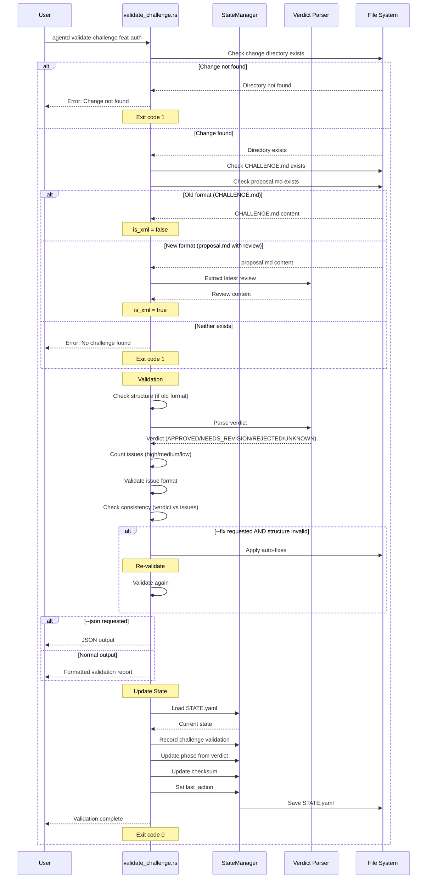

# Specification: Validate-Challenge Command

## Overview

The `validate-challenge` command performs local validation of a challenge review without calling AI services. It verifies the structure and format of CHALLENGE.md (old format) or the review section in proposal.md (new XML format), parses the verdict, counts issues by severity, and updates STATE.yaml with validation results. The command supports auto-fixing common structural issues and can output results in JSON format for integration with other tools.

## Requirements

### R1: Format Detection and Validation

The command must support both challenge formats:
- **Old format**: Standalone `CHALLENGE.md` file
- **New format**: XML-wrapped review block in `proposal.md`
- Automatically detect which format exists
- Parse content appropriately for each format
- Apply format-specific validation rules

### R2: Structure Validation (Old Format)

For CHALLENGE.md, the command must verify required sections:
- `# Challenge Report` - Main heading (required)
- `## Verdict` - Verdict section with status (required)
- `## Issues` or categorized issue sections (required)
- If any section is missing, mark validation as failed
- Record structural errors in result

### R3: Verdict Parsing

The command must parse and validate the verdict:
- Extract verdict from content: **APPROVED**, **NEEDS_REVISION**, or **REJECTED**
- If verdict cannot be parsed, set to UNKNOWN
- UNKNOWN verdict marks validation as failed
- Display parsed verdict with appropriate color coding

### R4: Issue Counting and Format Validation

The command must count and validate issues:
- Count issues by severity: `**Severity**: High`, `Medium`, `Low`
- Calculate total issue count
- Validate each issue has required fields:
  - `**Severity**:` (required)
  - `**Description**:` (required)
  - `**Location**:` (optional, warn if missing in verbose mode)
- Check consistency: NEEDS_REVISION verdict should have documented issues

### R5: Auto-Fix Mode

The command must support `--fix` flag to automatically repair structure:
- Add missing `# Challenge Report` heading
- Add missing `## Verdict` section with default NEEDS_REVISION status
- Add missing `## Issues` section placeholder
- Re-validate after applying fixes
- Display fixes applied before re-validation

### R6: Output Modes

The command must support multiple output modes:
- **Normal**: Colored, formatted output with section-by-section validation
- **Verbose** (`--verbose`): Include warnings for optional fields
- **JSON** (`--json`): Machine-readable JSON output with valid/verdict/counts/errors
- **Strict** (`--strict`): Treat medium/low severity issues as errors (future use)

### R7: STATE Management

The command must update STATE.yaml with validation results:
- Record verdict (APPROVED/NEEDS_REVISION/REJECTED/UNKNOWN)
- Record issue counts (total, high, medium, low)
- Update phase based on verdict:
  - APPROVED → ready for implementation
  - NEEDS_REVISION → needs reproposal
  - REJECTED → needs rework
- Update CHALLENGE.md checksum
- Set last_action to "validate-challenge"

### R8: File Operations

The command must perform the following file I/O:
- **Read**:
  - `agentd/changes/{change_id}/CHALLENGE.md` - Challenge review (old format, optional)
  - `agentd/changes/{change_id}/proposal.md` - Proposal with review (new format, optional)
  - `agentd/changes/{change_id}/STATE.yaml` - Current state
  - `agentd/config.toml` - Configuration
- **Write**:
  - `agentd/changes/{change_id}/CHALLENGE.md` - Auto-fixes (if --fix used)
  - `agentd/changes/{change_id}/STATE.yaml` - Validation results

## Command Signature

```bash
agentd validate-challenge <change_id> [OPTIONS]
```

**Arguments:**
- `change_id` (required): The change identifier to validate

**Options:**
- `-s, --strict`: Treat warnings (MEDIUM/LOW) as errors (currently informational)
- `-v, --verbose`: Show verbose output with additional details (e.g., missing optional fields)
- `-j, --json`: Output results as JSON for machine consumption
- `-f, --fix`: Automatically fix common structural issues

## Exit Codes

- `0`: Success (validation completed, regardless of pass/fail result)
- `1`: Error
  - Change directory not found
  - Neither CHALLENGE.md nor proposal.md exists
  - File I/O errors

## Flow



## Acceptance Criteria

### Scenario: Valid challenge passes validation

- **WHEN** I run `agentd validate-challenge feat-auth` and CHALLENGE.md has all required sections
- **THEN** I see "✅ Challenge format validation passed!"
- **THEN** Verdict is displayed (e.g., APPROVED)
- **THEN** Issue counts are shown (X HIGH, Y MEDIUM, Z LOW)
- **THEN** STATE.yaml is updated with validation results
- **THEN** Exit code is 0

### Scenario: Missing required sections fails validation

- **WHEN** I run `agentd validate-challenge feat-broken` and CHALLENGE.md lacks `## Verdict`
- **THEN** I see "❌ Challenge format validation failed!"
- **THEN** Errors list includes "Missing required section: ## Verdict"
- **THEN** Suggested next step: "agentd challenge feat-broken"
- **THEN** Exit code is 0 (validation completed, even though it failed)

### Scenario: Auto-fix repairs structure

- **WHEN** I run `agentd validate-challenge feat-fixme --fix` and sections are missing
- **THEN** Auto-fixes are applied (e.g., "Added '## Verdict' section")
- **THEN** CHALLENGE.md is updated with fixes
- **THEN** Re-validation is performed
- **THEN** I see "Re-validating..." followed by new validation results
- **THEN** Exit code is 0

### Scenario: JSON output mode

- **WHEN** I run `agentd validate-challenge feat-api --json`
- **THEN** Output is valid JSON with keys: valid, verdict, counts, issue_count, errors
- **THEN** No colored or formatted text is output
- **THEN** Exit code is 0

### Scenario: NEEDS_REVISION with issues

- **WHEN** I run `agentd validate-challenge feat-issues` with verdict NEEDS_REVISION and 3 issues
- **THEN** Validation passes
- **THEN** Verdict shows "NEEDS_REVISION"
- **THEN** Issue counts show 3 total with severity breakdown
- **THEN** Next step suggests "agentd reproposal feat-issues"
- **THEN** Exit code is 0

### Scenario: NEEDS_REVISION without issues (inconsistency)

- **WHEN** I run `agentd validate-challenge feat-inconsistent` with NEEDS_REVISION but no issues
- **THEN** Validation detects inconsistency
- **THEN** Error: "NEEDS_REVISION verdict but no issues documented"
- **THEN** Exit code is 0

### Scenario: New XML format validation

- **WHEN** I run `agentd validate-challenge feat-new` and review is in proposal.md (XML)
- **THEN** Command detects XML format and extracts review
- **THEN** Validation proceeds (structure checks skipped for XML)
- **THEN** Verdict is parsed from proposal.md
- **THEN** Issue counts are accurate
- **THEN** Exit code is 0

### Scenario: Change not found

- **WHEN** I run `agentd validate-challenge nonexistent`
- **THEN** I see "Change 'nonexistent' not found. Run 'agentd proposal nonexistent' first."
- **THEN** Exit code is 1

### Scenario: Verbose mode shows warnings

- **WHEN** I run `agentd validate-challenge feat-test --verbose` and an issue lacks Location field
- **THEN** I see "LOW: Issue 1 missing optional: Location"
- **THEN** Validation still passes
- **THEN** Exit code is 0

## Examples

### Example 1: Valid challenge

```bash
$ agentd validate-challenge feat-auth
🔍 Validating challenge: feat-auth
━━━━━━━━━━━━━━━━━━━━━━━━━━━━━━━━━━━━━━━━━━━━
   Checking CHALLENGE.md structure...
   Checking verdict...
      ✓ Verdict: Approved
   Checking issue format...
      ✓ OK

   💾 STATE.yaml updated

📊 Summary:
✅ Challenge format validation passed!

   Verdict: APPROVED
   Issues: 0 total (0 HIGH, 0 MEDIUM, 0 LOW)

⏭️  Next steps:
   agentd implement feat-auth
```

### Example 2: NEEDS_REVISION with issues

```bash
$ agentd validate-challenge feat-validation
🔍 Validating challenge: feat-validation
━━━━━━━━━━━━━━━━━━━━━━━━━━━━━━━━━━━━━━━━━━━━
   Checking CHALLENGE.md structure...
   Checking verdict...
      ✓ Verdict: NeedsRevision
   Checking issue format...
      ✓ OK

   💾 STATE.yaml updated

📊 Summary:
✅ Challenge format validation passed!

   Verdict: NEEDS_REVISION
   Issues: 3 total (1 HIGH, 2 MEDIUM, 0 LOW)

⏭️  Next steps:
   agentd reproposal feat-validation
```

### Example 3: Validation fails with missing sections

```bash
$ agentd validate-challenge feat-broken
🔍 Validating challenge: feat-broken
━━━━━━━━━━━━━━━━━━━━━━━━━━━━━━━━━━━━━━━━━━━━
   Checking CHALLENGE.md structure...
      HIGH: Missing: ## Verdict
      HIGH: Missing: issues section
   Checking verdict...
      HIGH: Could not parse verdict
   Checking issue format...

   💾 STATE.yaml updated

📊 Summary:
❌ Challenge format validation failed!

📝 Errors:
   • Missing required section: ## Verdict
   • Missing issues section (## Issues or categorized sections)
   • Could not parse verdict. Expected: APPROVED, NEEDS_REVISION, or REJECTED

   Re-run challenge to regenerate CHALLENGE.md:
   agentd challenge feat-broken
```

### Example 4: Auto-fix repairs and re-validates

```bash
$ agentd validate-challenge feat-fixme --fix
🔍 Validating challenge: feat-fixme
━━━━━━━━━━━━━━━━━━━━━━━━━━━━━━━━━━━━━━━━━━━━
   Checking CHALLENGE.md structure...
      HIGH: Missing: # Challenge Report
      HIGH: Missing: ## Verdict

🔧 Auto-fixes applied:
   ✓ Added '# Challenge Report' heading
   ✓ Added '## Verdict' section

Re-validating...
━━━━━━━━━━━━━━━━━━━━━━━━━━━━━━━━━━━━━━━━━━━━
   Checking CHALLENGE.md structure...
   Checking verdict...
      ✓ Verdict: NeedsRevision
   Checking issue format...
      ✓ OK

   💾 STATE.yaml updated

📊 Summary:
✅ Challenge format validation passed!

   Verdict: NEEDS_REVISION
   Issues: 2 total (0 HIGH, 2 MEDIUM, 0 LOW)

⏭️  Next steps:
   agentd reproposal feat-fixme
```

### Example 5: JSON output

```bash
$ agentd validate-challenge feat-api --json
{
  "valid": true,
  "verdict": "APPROVED",
  "counts": {
    "high": 0,
    "medium": 0,
    "low": 0
  },
  "issue_count": 0
}
```

### Example 6: Verbose mode

```bash
$ agentd validate-challenge feat-test --verbose
🔍 Validating challenge: feat-test
━━━━━━━━━━━━━━━━━━━━━━━━━━━━━━━━━━━━━━━━━━━━
   Checking CHALLENGE.md structure...
   Checking verdict...
      ✓ Verdict: NeedsRevision
   Checking issue format...
      LOW: Issue 1 missing optional: Location
      LOW: Issue 2 missing optional: Location
      ✓ OK

   💾 STATE.yaml updated

📊 Summary:
✅ Challenge format validation passed!

   Verdict: NEEDS_REVISION
   Issues: 2 total (0 HIGH, 2 MEDIUM, 0 LOW)

⏭️  Next steps:
   agentd reproposal feat-test
```

### Example 7: New XML format

```bash
$ agentd validate-challenge feat-xml
🔍 Validating challenge: feat-xml
━━━━━━━━━━━━━━━━━━━━━━━━━━━━━━━━━━━━━━━━━━━━
   Checking review in proposal.md...
   Checking verdict...
      ✓ Verdict: Approved
   Checking issue format...
      ✓ OK

   💾 STATE.yaml updated

📊 Summary:
✅ Challenge format validation passed!

   Verdict: APPROVED
   Issues: 0 total (0 HIGH, 0 MEDIUM, 0 LOW)

⏭️  Next steps:
   agentd implement feat-xml
```

## Related Commands

**Previous in workflow:**
- `agentd challenge` - Generates CHALLENGE.md or review in proposal.md

**Next in workflow (based on verdict):**
- `agentd implement` - If APPROVED
- `agentd reproposal` - If NEEDS_REVISION
- `agentd challenge` - Re-run if validation fails or REJECTED

**Integration points:**
- Called manually to verify challenge format
- Can be integrated into CI/CD pipelines via JSON output
- STATE.yaml updates affect downstream commands

## Notes

- This command performs **local validation only** - no AI calls
- Always exits with code 0 on successful validation execution (even if validation fails)
- Only exits with code 1 on operational errors (change not found, file I/O errors)
- Supports both old (CHALLENGE.md) and new (XML in proposal.md) formats
- Auto-fix mode is safe - it only adds missing structural elements, doesn't modify content
- JSON output is suitable for parsing in scripts and automation tools
- The `--strict` flag is defined but currently not enforced (reserved for future use)
- Issue format validation uses regex to handle both old (`#### Issue \d+`) and new (`### Issue:`) formats
- Verdict parsing is case-insensitive and flexible with spacing
- STATE.yaml updates include: verdict, counts, phase, checksum, last_action
- The command is idempotent - can be run multiple times safely
- Verbose mode helps identify issues with incomplete challenge documentation
- Location field is optional because some issues (e.g., architectural concerns) don't have specific file locations
