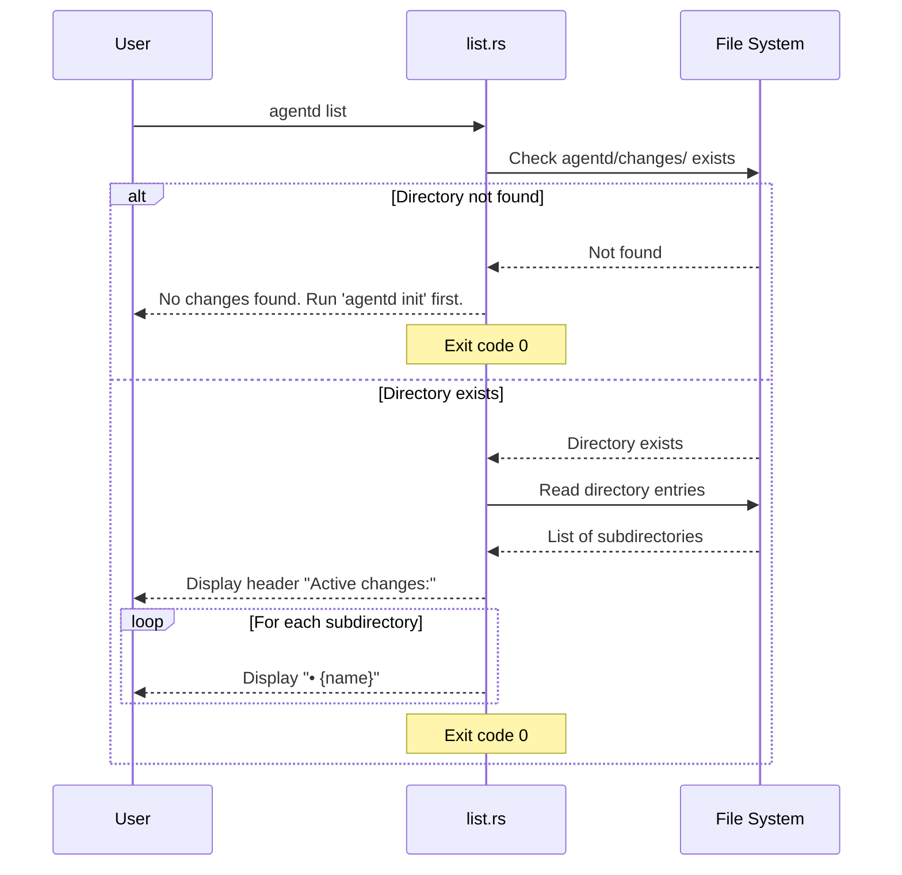
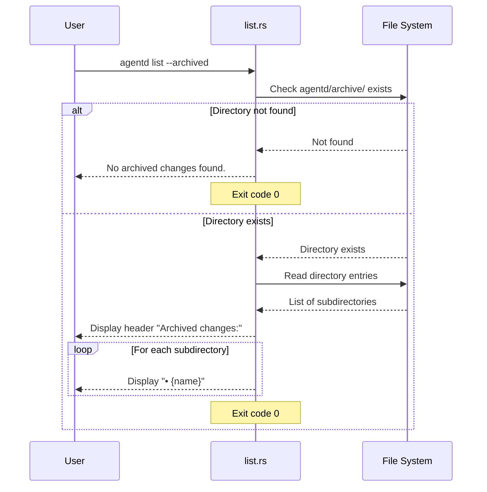

# Specification: List Command

## Overview

The `list` command provides a quick overview of all changes in an Agentd project by scanning the `agentd/changes/` directory (for active changes) or `agentd/archive/` directory (for archived changes). It displays change IDs as a simple bullet-point list without additional metadata. For detailed archived change information with dates and summaries, use the `agentd archived` command instead.

## Requirements

### R1: Active Changes Listing

The command must list active changes by default:
- Scan `agentd/changes/` directory for subdirectories
- Display each subdirectory name as a bullet point
- Show header "Active changes:"
- If directory doesn't exist, show "No changes found. Run 'agentd init' first."

### R2: Archived Changes Listing

The command must support `--archived` flag for archived changes:
- Scan `agentd/archive/` directory for subdirectories
- Display each subdirectory name as a bullet point
- Show header "Archived changes:"
- If archive directory doesn't exist, show "No archived changes found."

### R3: Directory Validation

The command must handle missing directories gracefully:
- Check if `agentd/changes/` exists before listing active changes
- Check if `agentd/archive/` exists before listing archived changes
- Display appropriate message when directory is missing
- Exit successfully (code 0) even when no changes found

### R4: Simple Output Format

The command must use a simple, uncluttered format:
- Header with colored text (green bold)
- Bullet point list (• prefix) for each change
- No additional metadata (dates, summaries, phases)
- Minimal output for quick scanning

### R5: File Operations

The command must perform the following file I/O:
- **Read**:
  - `agentd/changes/` - Directory listing (optional)
  - `agentd/archive/` - Directory listing (optional)
- **Write**:
  - None (read-only command)

## Command Signature

```bash
agentd list [OPTIONS]
```

**Arguments:**
- None

**Options:**
- `-a, --archived`: Show archived changes instead of active changes

## Exit Codes

- `0`: Success (always, even when no changes found)
- `1`: Error (rare - directory read errors, permission issues)

## Flow





## Acceptance Criteria

### Scenario: List active changes

- **WHEN** I run `agentd list` and agentd/changes/ has 3 subdirectories
- **THEN** I see "📋 Listing changes..."
- **THEN** I see "Active changes:" header in green bold
- **THEN** Each change is displayed as "• {change_id}"
- **THEN** Exit code is 0

### Scenario: List archived changes

- **WHEN** I run `agentd list --archived` and agentd/archive/ has 2 subdirectories
- **THEN** I see "📋 Listing changes..."
- **THEN** I see "Archived changes:" header in green bold
- **THEN** Each archived folder is displayed as "• {folder_name}"
- **THEN** Exit code is 0

### Scenario: No active changes found

- **WHEN** I run `agentd list` and agentd/changes/ doesn't exist
- **THEN** I see "No changes found. Run 'agentd init' first."
- **THEN** Exit code is 0

### Scenario: No archived changes found

- **WHEN** I run `agentd list --archived` and agentd/archive/ doesn't exist
- **THEN** I see "No archived changes found."
- **THEN** Exit code is 0

### Scenario: Empty active changes directory

- **WHEN** I run `agentd list` and agentd/changes/ exists but is empty
- **THEN** I see "Active changes:" header
- **THEN** No bullet points are displayed (empty list)
- **THEN** Exit code is 0

### Scenario: Mixed content in changes directory

- **WHEN** agentd/changes/ contains both subdirectories and files
- **THEN** Only subdirectories are listed
- **THEN** Files are ignored
- **THEN** Exit code is 0

## Examples

### Example 1: List active changes

```bash
$ agentd list
📋 Listing changes...

Active changes:
   • feat-auth
   • feat-api
   • fix-validation
```

### Example 2: List archived changes

```bash
$ agentd list --archived
📋 Listing changes...

Archived changes:
   • 20260116-feat-login
   • 20260115-fix-bug
   • 20260114-refactor-db
```

### Example 3: No changes found

```bash
$ agentd list
📋 Listing changes...
No changes found. Run 'agentd init' first.
```

### Example 4: No archived changes

```bash
$ agentd list --archived
📋 Listing changes...
No archived changes found.
```

### Example 5: Empty changes directory

```bash
$ agentd list
📋 Listing changes...

Active changes:
```

## Related Commands

**Detailed information commands:**
- `agentd archived` - Show archived changes with date, ID, and summary in table format
- `agentd status <change_id>` - Show detailed status for a specific change

**Directory creation:**
- `agentd init` - Initialize agentd directory structure
- `agentd plan` - Create a new change (creates subdirectory in agentd/changes/)
- `agentd archive` - Archive a change (moves to agentd/archive/)

**Use cases:**
- Quick check of all active changes before starting work
- See what's been archived
- Verify changes directory exists and has content
- Simple overview for shell scripts

## Notes

- This command is **read-only** - never modifies any files
- Always exits with code 0, even when no changes found
- Only exits with code 1 on operational errors (directory read failures)
- The simple list format is intentional - for detailed info, use `agentd archived` or `agentd status`
- Archived folder names follow the pattern `{YYYYMMDD}-{change_id}` but this command displays the full folder name
- For archived changes, use `agentd archived` to get a formatted table with dates and summaries
- This command does NOT read STATE.yaml or proposal.md - it's purely a directory listing
- Fast execution - no file parsing or metadata extraction
- Useful for shell scripts and automation to get list of change IDs
- The `--archived` flag is mutually exclusive with active mode (only one or the other)
- Files in the changes/archive directories are ignored - only subdirectories are listed
- The command does not sort the output - order depends on file system ordering
- For detailed archived view with sorting by date, use `agentd archived` instead
