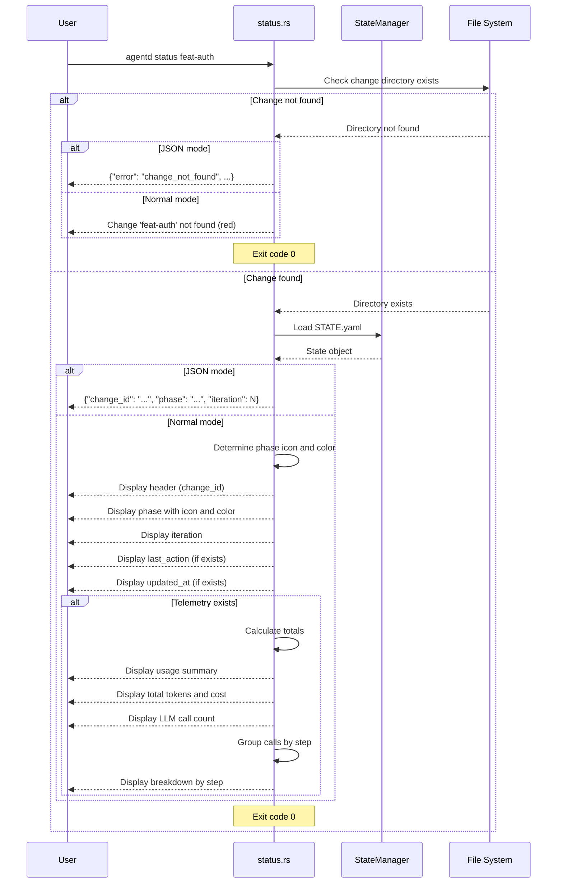

# Specification: Status Command

## Overview

The `status` command displays the current state and metadata of an Agentd change by reading STATE.yaml. It shows the phase, iteration count, last action, update timestamp, and LLM usage summary with cost breakdown. The command is read-only and can output results in either human-readable format or JSON for machine consumption.

## Requirements

### R1: State Display

The command must display change state information:
- **Phase**: Current phase with icon and color-coded status
- **Iteration**: Current iteration number
- **Last Action**: Most recent command executed (if available)
- **Updated**: Last update timestamp in YYYY-MM-DD HH:MM:SS format (if available)
- Use colored output with appropriate phase-specific formatting

### R2: Phase Icons and Colors

The command must use consistent phase representation:
- **Proposed** (📝, yellow): Initial planning phase
- **Challenged** (🔍, cyan): Under review/challenge
- **Rejected** (⛔, red): Proposal rejected
- **Implementing** (🔨, blue): Implementation in progress
- **Complete** (✅, green): Implementation complete, ready for archive
- **Archived** (📦, bright_black): Archived and historical

### R3: Usage Summary Display

The command must display LLM usage telemetry if available:
- **Total tokens**: Input and output tokens with thousands separators
- **Total cost**: Total cost in USD (if pricing data available)
- **LLM calls**: Total number of LLM calls
- **Breakdown by step**: Group usage by step name (e.g., plan, implement, review, resolve)
- Show tokens and cost per step
- Format numbers with comma separators for readability

### R4: JSON Output Mode

The command must support `--json` flag for machine-readable output:
- Output minimal JSON with: change_id, phase, iteration
- No colored or formatted text in JSON mode
- JSON error format for change not found
- Single-line JSON output

### R5: File Operations

The command must perform the following file I/O:
- **Read**:
  - `agentd/changes/{change_id}/STATE.yaml` - State and metadata (required)
- **Write**:
  - None (read-only command)

### R6: Change Validation

The command must validate change existence:
- Check that `agentd/changes/{change_id}` directory exists
- If not found:
  - JSON mode: Output {"error": "change_not_found", "change_id": "{id}"}
  - Normal mode: Display "Change '{change_id}' not found" in red
- Exit with code 0 in both cases (graceful handling)

## Command Signature

```bash
agentd status <change_id> [OPTIONS]
```

**Arguments:**
- `change_id` (required): The change identifier to show status for

**Options:**
- `-j, --json`: Output in JSON format

## Exit Codes

- `0`: Success (always, even when change not found)
- `1`: Error (rare - file I/O errors, STATE.yaml parse errors)

## Flow



## Acceptance Criteria

### Scenario: Display status for active change

- **WHEN** I run `agentd status feat-auth` and the change is in Implementing phase
- **THEN** I see "Status for: feat-auth" as header
- **THEN** Phase shows "🔨 Implementing" in blue
- **THEN** Iteration number is displayed
- **THEN** Last action and updated timestamp are shown (if available)
- **THEN** Exit code is 0

### Scenario: Display usage summary

- **WHEN** I run `agentd status feat-usage` and LLM calls have been made
- **THEN** I see "💰 Usage Summary:" section
- **THEN** Total tokens show input and output with comma separators (e.g., "12,345 in / 6,789 out")
- **THEN** Total cost is displayed (e.g., "$0.1234")
- **THEN** LLM calls count is shown
- **THEN** Breakdown by step shows tokens and cost per step (e.g., "implement", "review")
- **THEN** Exit code is 0

### Scenario: JSON output mode

- **WHEN** I run `agentd status feat-api --json`
- **THEN** Output is valid JSON: {"change_id": "feat-api", "phase": "Complete", "iteration": 0}
- **THEN** No colored or formatted text is output
- **THEN** Exit code is 0

### Scenario: Change not found (normal mode)

- **WHEN** I run `agentd status nonexistent`
- **THEN** I see "Change 'nonexistent' not found" in red
- **THEN** No state information is displayed
- **THEN** Exit code is 0

### Scenario: Change not found (JSON mode)

- **WHEN** I run `agentd status nonexistent --json`
- **THEN** Output is {"error": "change_not_found", "change_id": "nonexistent"}
- **THEN** Exit code is 0

### Scenario: Phase-specific icons and colors

- **WHEN** I run `status` for changes in different phases
- **THEN** Proposed shows 📝 in yellow
- **THEN** Challenged shows 🔍 in cyan
- **THEN** Rejected shows ⛔ in red
- **THEN** Implementing shows 🔨 in blue
- **THEN** Complete shows ✅ in green
- **THEN** Archived shows 📦 in bright black
- **THEN** Exit code is 0 for all

### Scenario: No telemetry data

- **WHEN** I run `agentd status feat-new` and no LLM calls have been made yet
- **THEN** Phase and metadata are displayed
- **THEN** Usage summary section is not displayed
- **THEN** Exit code is 0

## Examples

### Example 1: Basic usage with minimal state

```bash
$ agentd status feat-auth
Status for: feat-auth

   Phase:     📝 Proposed
   Iteration: 0
   Last:      plan
   Updated:   2026-01-19 10:30:00
```

### Example 2: With usage summary

```bash
$ agentd status feat-api
Status for: feat-api

   Phase:     🔨 Implementing
   Iteration: 1
   Last:      implement
   Updated:   2026-01-19 14:20:00

💰 Usage Summary:
   Total tokens:  45,678 in / 23,456 out
   Total cost:    $0.3421
   LLM calls:     5

   Breakdown by step:
     plan         12,345 in / 6,789 out  ($0.0956)
     implement    28,901 in / 14,234 out ($0.2156)
     review       4,432 in / 2,433 out  ($0.0309)
```

### Example 3: Complete phase

```bash
$ agentd status feat-login
Status for: feat-login

   Phase:     ✅ Complete
   Iteration: 2
   Last:      review
   Updated:   2026-01-19 16:45:00

💰 Usage Summary:
   Total tokens:  78,923 in / 42,156 out
   Total cost:    $0.5678
   LLM calls:     8

   Breakdown by step:
     plan         10,000 in / 5,000 out  ($0.0750)
     implement    35,000 in / 18,000 out ($0.2650)
     review       15,000 in / 8,000 out  ($0.1150)
     resolve      18,923 in / 11,156 out ($0.1128)
```

### Example 4: Rejected phase

```bash
$ agentd status feat-broken
Status for: feat-broken

   Phase:     ⛔ Rejected
   Iteration: 0
   Last:      challenge
   Updated:   2026-01-18 09:00:00

💰 Usage Summary:
   Total tokens:  8,456 in / 4,231 out
   Total cost:    $0.0634
   LLM calls:     2

   Breakdown by step:
     plan         5,123 in / 2,678 out  ($0.0390)
     challenge    3,333 in / 1,553 out  ($0.0244)
```

### Example 5: JSON output

```bash
$ agentd status feat-data --json
{"change_id": "feat-data", "phase": "Implementing", "iteration": 0}
```

### Example 6: Change not found (normal mode)

```bash
$ agentd status nonexistent
Change 'nonexistent' not found
```

### Example 7: Change not found (JSON mode)

```bash
$ agentd status nonexistent --json
{"error": "change_not_found", "change_id": "nonexistent"}
```

### Example 8: Archived change

```bash
$ agentd status feat-old
Status for: feat-old

   Phase:     📦 Archived
   Iteration: 0
   Last:      archive
   Updated:   2026-01-15 12:00:00

💰 Usage Summary:
   Total tokens:  52,000 in / 28,000 out
   Total cost:    $0.4000
   LLM calls:     6

   Breakdown by step:
     plan         8,000 in / 4,000 out  ($0.0600)
     implement    30,000 in / 16,000 out ($0.2300)
     review       14,000 in / 8,000 out  ($0.1100)
```

## Related Commands

**Information commands (similar purpose):**
- `agentd list` - List all changes
- `agentd archived` - List archived changes with summaries

**Commands that update status:**
- All workflow commands update STATE.yaml (plan, implement, review, etc.)
- `status` reads the results of these updates

**Integration points:**
- Used to check current phase before running workflow commands
- JSON output useful for scripts and automation
- Can be called at any time - fully read-only

## Notes

- This command is **read-only** - never modifies any files
- Always exits with code 0, even when change not found (graceful error handling)
- Only exits with code 1 on rare operational errors (STATE.yaml parse failures)
- Phase icons and colors are consistent across the CLI interface
- Usage summary only appears if telemetry data exists (LLM calls recorded)
- Number formatting uses comma thousands separators for readability (e.g., 12,345)
- Timestamp format is YYYY-MM-DD HH:MM:SS (24-hour format)
- JSON mode provides minimal output (change_id, phase, iteration only)
- Full telemetry details are in normal mode only, not exposed in JSON (keep JSON lightweight)
- The `last_action` field shows the most recent command name (e.g., "plan", "implement")
- Cost calculation depends on pricing data in config.toml
- If no pricing data, cost is shown as $0.0000 or omitted
- The command is useful for debugging phase transitions and LLM usage
- Breakdown by step helps identify which operations consume the most tokens/cost
- Can be used before running commands to verify current phase
