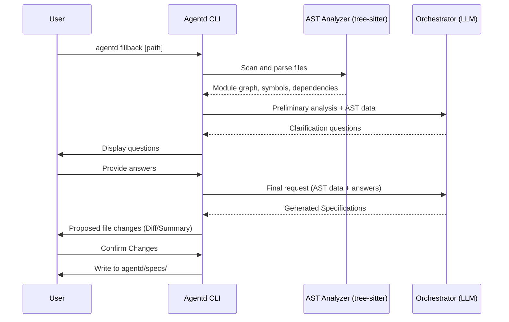

# Specification: Enhanced Fillback Process

## Overview

The enhanced `fillback` process transitions from a simple file-scanning tool to a sophisticated code analysis and specification generation engine. It leverages local AST parsing to provide rich context to the LLM and interacts with the user to refine its understanding.

## Requirements

### R1: AST-Based Local Analysis
The system MUST use `tree-sitter` to parse source files and extract:
- Module hierarchies
- Function/Method signatures and docstrings
- Data structures (structs, classes, enums)
- Import/Dependency relationships

### R2: Interactive Clarification
Before generating full specifications, the system MUST:
1. Summarize its initial understanding.
2. Present a list of questions to the user to clarify ambiguities (e.g., "Is this module intended to be a public API?").
3. Wait for user input and incorporate it into the generation prompt.

### R3: Language-Agnostic Output
Specifications MUST be generated using:
- **Mermaid**: For sequence diagrams, state machines, and class relationships.
- **JSON Schema**: For data models and API request/response structures.
- **OpenAPI/AsyncAPI**: For REST or event-driven interface definitions.
- **Pseudo code**: For core logic and algorithm descriptions.

### R4: Direct and Incremental Updates
- The system MUST write generated specs to `agentd/specs/`.
- If a spec file already exists, the system MUST show a summary of proposed changes and ask for confirmation before overwriting or merging.

### R5: Multi-Language Support
The system SHOULD support at least Rust, TypeScript/JavaScript, Python, and Go initially.

### R6: CLI Interface Change
The `fillback` command MUST change from:
```bash
# Old (remove)
agentd fillback <change-id> [--path] [--strategy]

# New
agentd fillback [--path <path>] [--module <name>] [--force]
```
- Remove `change-id` parameter (no longer creates a change)
- `--path`: Directory to analyze (default: current directory)
- `--module`: Only generate spec for specific module
- `--force`: Overwrite existing specs without confirmation

### R7: Dependency Graph Output
The system MUST output the module dependency graph as:
- **Console**: Mermaid flowchart syntax for quick review
- **File**: `agentd/specs/_dependency-graph.md` with full Mermaid diagram

### R8: Error Handling
- If tree-sitter fails to parse a file, log warning and continue with other files
- If no parseable files found, exit with clear error message
- If LLM fails, show partial results and allow retry

## Flow



## Data Model

### Analysis Context
```json
{
  "$schema": "http://json-schema.org/draft-07/schema#",
  "type": "object",
  "required": ["modules", "dependencies"],
  "properties": {
    "modules": {
      "type": "array",
      "items": {
        "type": "object",
        "properties": {
          "name": { "type": "string" },
          "path": { "type": "string" },
          "symbols": {
            "type": "array",
            "items": {
              "type": "object",
              "properties": {
                "name": { "type": "string" },
                "kind": { "type": "string", "enum": ["function", "struct", "enum", "interface", "class"] },
                "signature": { "type": "string" },
                "doc": { "type": "string" }
              }
            }
          }
        }
      }
    },
    "dependencies": {
      "type": "array",
      "items": {
        "type": "object",
        "properties": {
          "from": { "type": "string" },
          "to": { "type": "string" },
          "type": { "type": "string", "enum": ["import", "call", "inheritance"] }
        }
      }
    }
  }
}
```

## Interfaces

```
FUNCTION analyze_codebase(path: Path) -> AnalysisContext
  INPUT: Root path of the project to analyze
  OUTPUT: Structured context containing AST data and module relationships
  SIDE_EFFECTS: Reads files from disk

FUNCTION get_clarifications(context: AnalysisContext) -> List<Question>
  INPUT: Structured analysis context
  OUTPUT: List of questions for the user to answer

FUNCTION generate_agnostic_specs(context: AnalysisContext, answers: Map<String, String>) -> List<SpecFile>
  INPUT: AST context and user answers
  OUTPUT: List of markdown files with Mermaid, JSON Schema, etc.
```

## Acceptance Criteria

### Scenario: Initial Fillback of a Rust project
- **WHEN** I run `agentd fillback .` on a new Rust project
- **THEN** it should parse `Cargo.toml` and `src/*.rs` using tree-sitter
- **AND** it should ask questions about the main entry point and public API
- **AND** it should generate `agentd/specs/main.md` with Mermaid diagrams

### Scenario: Updating existing specs
- **WHEN** I run `agentd fillback` and some specs already exist in `agentd/specs/`
- **THEN** it should show a summary of what's new or changed
- **AND** it should only write to disk after I confirm

### Scenario: Unsupported Language
- **WHEN** I run `agentd fillback` on a project with an unsupported extension
- **THEN** it should skip those files but still process the supported ones
- **AND** warn me about the skipped files

### Scenario: Dependency Graph Generation
- **WHEN** I run `agentd fillback` on a multi-module project
- **THEN** it should output a Mermaid flowchart to console showing module dependencies
- **AND** it should create `agentd/specs/_dependency-graph.md` with the full diagram

### Scenario: Parse Error Handling
- **WHEN** tree-sitter fails to parse a file (syntax error, binary file, etc.)
- **THEN** it should log a warning with the file path
- **AND** continue processing other files
- **AND** include the skipped files in the final summary

### Scenario: New CLI Interface
- **WHEN** I run `agentd fillback` without any arguments
- **THEN** it should analyze the current directory
- **AND** write specs directly to `agentd/specs/`
- **AND** NOT create a `changes/` directory
