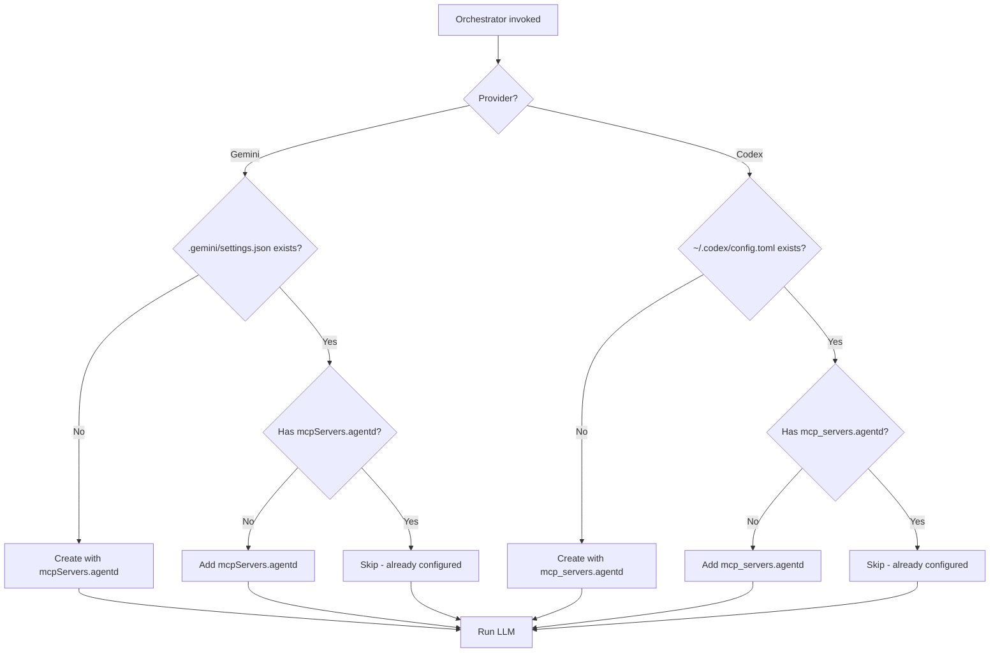

# Specification: MCP Auto-Config

## Overview

This specification defines the automatic MCP configuration behavior that ensures LLM providers can use agentd MCP tools without manual setup. The system auto-injects MCP server configuration before each orchestrator invocation.

## Requirements

### R1: Gemini MCP Config Auto-Injection

Before running Gemini orchestrator, the system MUST ensure `.gemini/settings.json` contains the agentd MCP server config:

```json
{
  "mcpServers": {
    "agentd": {
      "command": "agentd",
      "args": ["mcp-server"]
    }
  }
}
```

### R2: Codex MCP Config Auto-Injection

Before running Codex orchestrator, the system MUST ensure `~/.codex/config.toml` contains the agentd MCP server config:

```toml
[mcp_servers.agentd]
command = "agentd"
args = ["mcp-server"]
```

### R3: Config Preservation

When adding MCP config to existing files:
- MUST preserve all existing settings
- MUST NOT overwrite existing `agentd` config if present
- MUST only add the agentd entry if missing

### R4: Config Creation

When config file doesn't exist:
- MUST create parent directories if needed
- MUST create minimal config with just the MCP server entry

## Config Locations

| Provider | Config Path | Scope |
|----------|-------------|-------|
| Gemini | `.gemini/settings.json` | Project-level |
| Codex | `~/.codex/config.toml` | User-level (global) |

## Flow



## Interfaces

```
FUNCTION ensure_gemini_mcp_config(project_root: Path) -> Result<()>
  INPUT: Project root directory
  OUTPUT: Ok if config ensured
  ERRORS: IO errors, JSON parse errors

  Ensures .gemini/settings.json has mcpServers.agentd

FUNCTION ensure_codex_mcp_config() -> Result<()>
  INPUT: None (uses HOME environment variable)
  OUTPUT: Ok if config ensured
  ERRORS: IO errors, TOML parse errors, HOME not found

  Ensures ~/.codex/config.toml has mcp_servers.agentd
```

## Integration Points

| Orchestrator Method | Ensure Function Called |
|---------------------|------------------------|
| `GeminiOrchestrator::run_proposal` | `ensure_gemini_mcp_config` |
| `CodexOrchestrator::run_challenge` | `ensure_codex_mcp_config` |

## Acceptance Criteria

### Scenario: Gemini Config Creation
- **GIVEN** no `.gemini/settings.json` exists
- **WHEN** `GeminiOrchestrator::run_proposal` is called
- **THEN** `.gemini/settings.json` is created with `mcpServers.agentd`

### Scenario: Gemini Config Addition
- **GIVEN** `.gemini/settings.json` exists without `mcpServers.agentd`
- **WHEN** `GeminiOrchestrator::run_proposal` is called
- **THEN** `mcpServers.agentd` is added while preserving existing settings

### Scenario: Gemini Config Preservation
- **GIVEN** `.gemini/settings.json` exists with custom `mcpServers.agentd`
- **WHEN** `GeminiOrchestrator::run_proposal` is called
- **THEN** existing config is preserved unchanged

### Scenario: Codex Config Creation
- **GIVEN** no `~/.codex/config.toml` exists
- **WHEN** `CodexOrchestrator::run_challenge` is called
- **THEN** `~/.codex/config.toml` is created with `[mcp_servers.agentd]`

### Scenario: Codex Config Addition
- **GIVEN** `~/.codex/config.toml` exists without `[mcp_servers.agentd]`
- **WHEN** `CodexOrchestrator::run_challenge` is called
- **THEN** `[mcp_servers.agentd]` is added while preserving existing settings

### Scenario: Codex Config Preservation
- **GIVEN** `~/.codex/config.toml` exists with custom `[mcp_servers.agentd]`
- **WHEN** `CodexOrchestrator::run_challenge` is called
- **THEN** existing config is preserved unchanged
