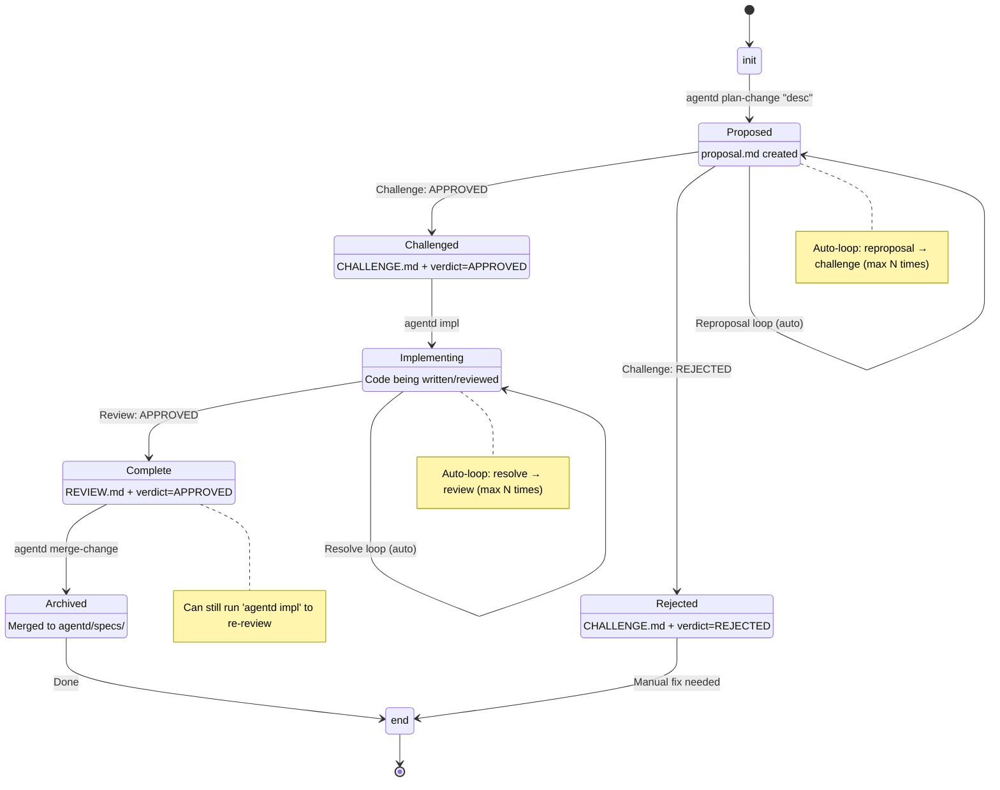
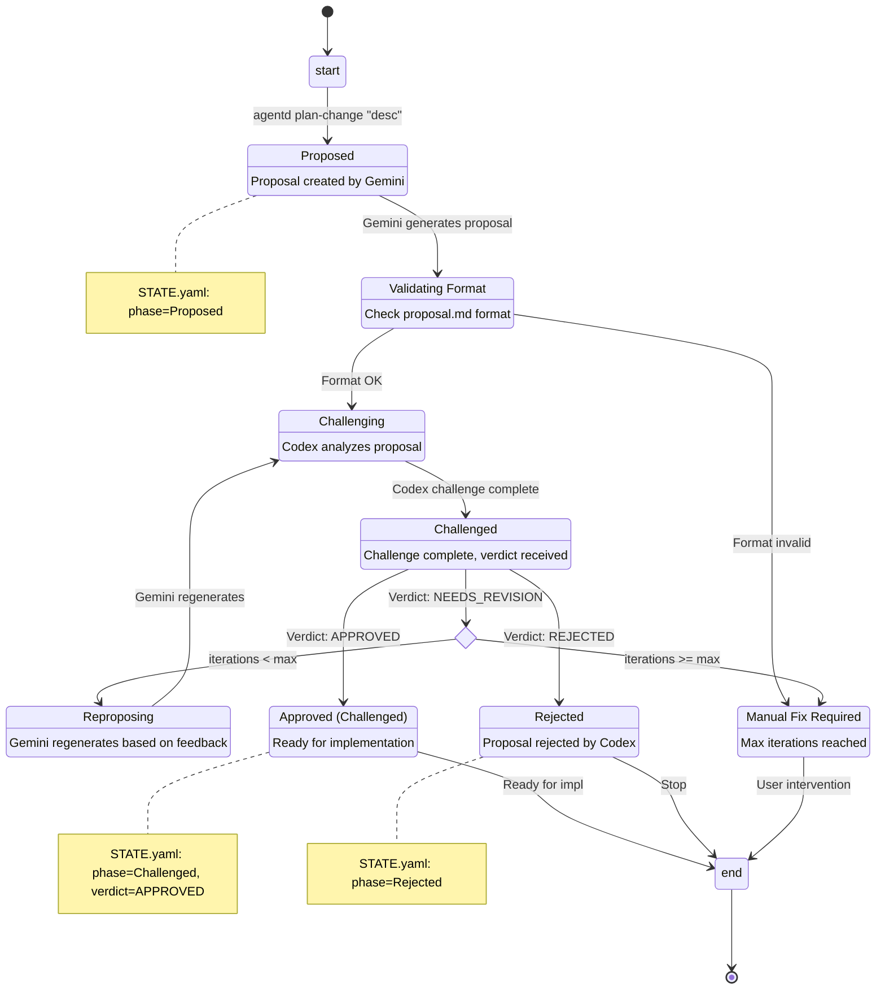
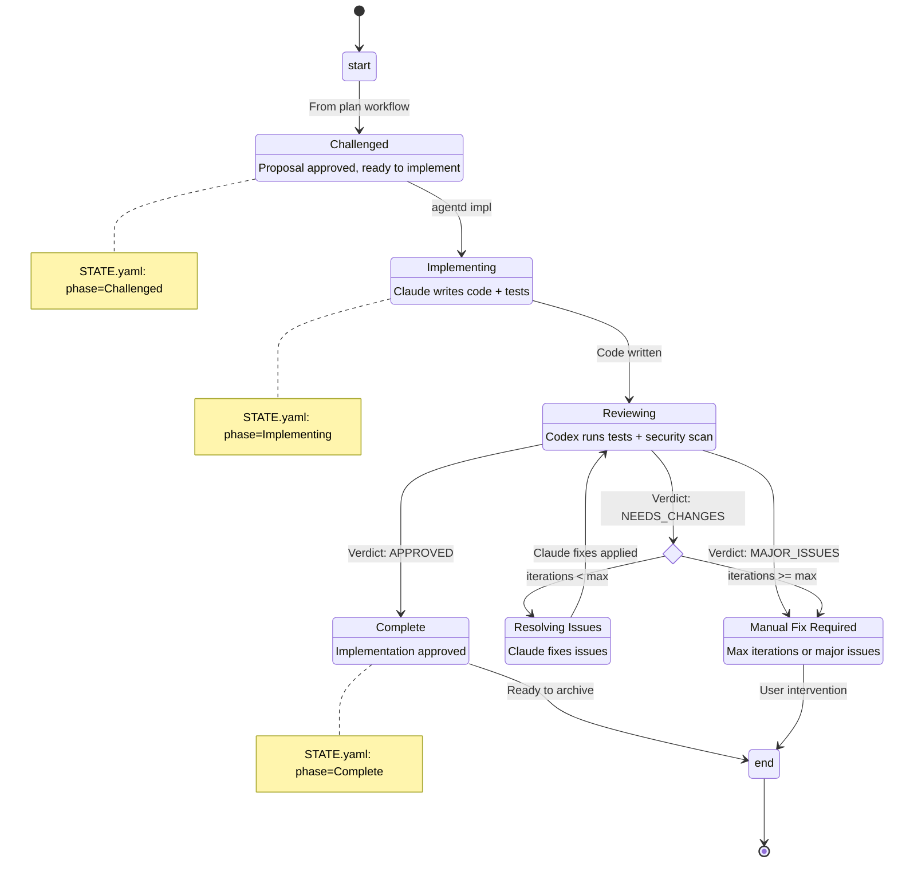

# Agentd Workflow State Machine

This document describes the complete state machine for Agentd's spec-driven development workflow.

## Overview

Agentd has **3 user-facing commands** that orchestrate the full workflow:

1. `agentd plan` - Planning workflow (proposal → challenge → auto-reproposal loop)
2. `agentd impl` - Implementation workflow (implement → review → auto-resolve loop)  
3. `agentd archive` - Archive completed change to specs/

Each command is **state-aware** and resumes from the current phase automatically.

## StatePhase Enum

```rust
pub enum StatePhase {
    Proposed,      // Proposal created, needs challenge
    Challenged,    // Challenge approved, ready for implementation
    Rejected,      // Challenge rejected proposal
    Implementing,  // Implementation in progress or under review
    Complete,      // Implementation approved, ready to archive
    Archived,      // Change archived to agentd/specs/
}
```

## Complete State Machine



## Plan Workflow (agentd plan)

**Purpose**: Generate and validate a proposal through automated challenge-response loop.



### Plan Workflow Steps

1. **Proposal Generation** (Gemini 2.0 Flash Thinking)
   - Reads clarifications.md (if exists)
   - Generates proposal.md, specs/*.md, tasks.md sequentially via MCP
   - Updates STATE.yaml: `phase=Proposed`

2. **Format Validation** (Local)
   - Validates proposal.md structure
   - Checks for required sections
   - Auto-fix minor issues if possible

3. **Challenge** (Codex)
   - Analyzes proposal against codebase
   - Identifies gaps, conflicts, edge cases
   - Writes CHALLENGE.md with verdict (APPROVED/NEEDS_REVISION/REJECTED)
   - Updates STATE.yaml: `phase=Challenged` or `phase=Rejected`

4. **Reproposal Loop** (if NEEDS_REVISION)
   - Gemini regenerates proposal based on feedback
   - Re-challenge with Codex
   - Repeat up to `planning_iterations` times (default: 2)
   - If max iterations reached → manual intervention required

### Plan Workflow Outputs

- ✅ **Success**: `phase=Challenged`, proposal approved
- ⚠️ **Needs Work**: `phase=Proposed`, manual fixes needed
- ❌ **Rejected**: `phase=Rejected`, fundamental issues

## Implementation Workflow (agentd impl)

**Purpose**: Implement the proposal and validate through automated review-resolve loop.



### Implementation Workflow Steps

1. **Implementation** (Claude Sonnet 3.5)
   - Reads proposal.md, specs/*.md, tasks.md
   - Writes code + tests
   - Updates STATE.yaml: `phase=Implementing`

2. **Review** (Codex)
   - Runs tests (cargo test, npm test, etc.)
   - Security scan (cargo audit, npm audit)
   - Code review (logic, edge cases, best practices)
   - Writes REVIEW.md with verdict (APPROVED/NEEDS_CHANGES/MAJOR_ISSUES)

3. **Resolve Loop** (if NEEDS_CHANGES)
   - Claude fixes issues from REVIEW.md
   - Re-review with Codex
   - Repeat up to `implementation_iterations` times (default: 2)
   - If max iterations reached → manual intervention required

4. **Completion**
   - Updates STATE.yaml: `phase=Complete`
   - Ready for archival

### Implementation Workflow Outputs

- ✅ **Success**: `phase=Complete`, ready to archive
- ⚠️ **Needs Work**: `phase=Implementing`, manual fixes needed
- ❌ **Major Issues**: `phase=Implementing`, significant problems found

### State-Aware Resumption

The `agentd impl` command checks current state and resumes appropriately:

- **Challenged**: Start full workflow (implement → review → resolve loop)
- **Implementing** + no REVIEW.md: Run review step
- **Implementing** + REVIEW.md exists:
  - If APPROVED → mark Complete
  - If NEEDS_CHANGES/MAJOR_ISSUES → run resolve step
- **Complete**: Display success message, suggest archive

## Archive Workflow (agentd archive)

**Purpose**: Merge completed change to permanent spec archive.

**Prerequisites**: `phase=Complete`

**Steps**:
1. Copy specs/*.md to agentd/specs/
2. Update frontmatter with archive date
3. Move agentd/changes/<id>/ to agentd/archive/<id>/
4. Update STATE.yaml: `phase=Archived`

## Removed Commands (v2.0 Simplification)

The following phase commands were removed in favor of state-aware workflow commands:

| Removed Command | Replacement |
|----------------|-------------|
| `agentd proposal` | `agentd plan` (auto-runs proposal) |
| `agentd challenge` | `agentd plan` (auto-runs challenge) |
| `agentd reproposal` | `agentd plan` (auto-runs reproposal) |
| `agentd review` | `agentd impl` (auto-runs review) |
| `agentd resolve-reviews` | `agentd impl` (auto-runs resolve) |

**Rationale**: Users should only interact with workflow commands. Phase commands were internal implementation details that confused the UX.

## Configuration

Workflow behavior is controlled by `agentd/config.toml`:

```toml
[workflow]
# Max reproposal iterations in plan workflow
planning_iterations = 2

# Max resolve iterations in impl workflow
implementation_iterations = 2

# Sequential spec-by-spec implementation (vs all-at-once)
sequential_implementation = true
```

## Debugging

### Check Current State

```bash
agentd status <change-id>
```

### View STATE.yaml

```bash
cat agentd/changes/<change-id>/STATE.yaml
```

### Console Output

Both `agentd plan` and `agentd impl` show state transitions:

```
📊 Current state: phase=Challenged
▶️  Starting implementation workflow...
```

## Skills Integration

Claude Code skills use these workflow commands:

- `/agentd:plan` → calls `agentd plan`
- `/agentd:impl` → calls `agentd impl`
- `/agentd:archive` → calls `agentd archive`

Skills handle HITL (human-in-the-loop) decisions when workflows fail or need user input.
