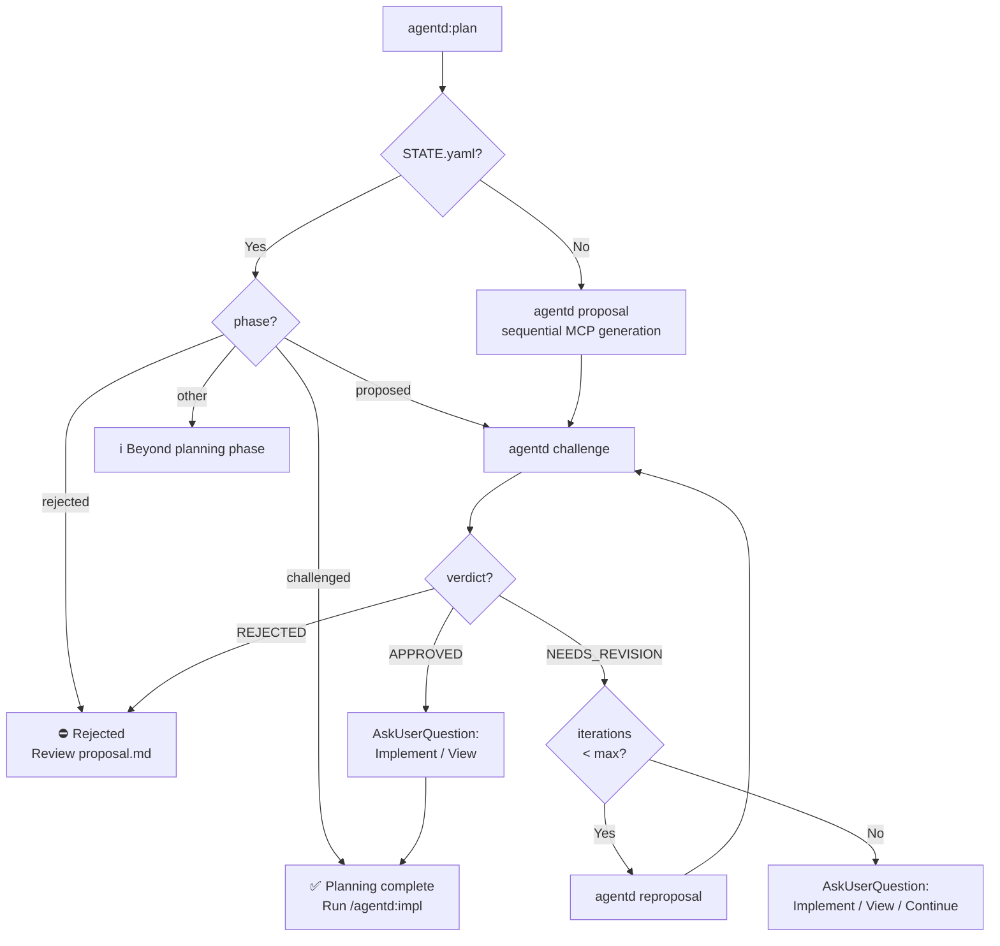
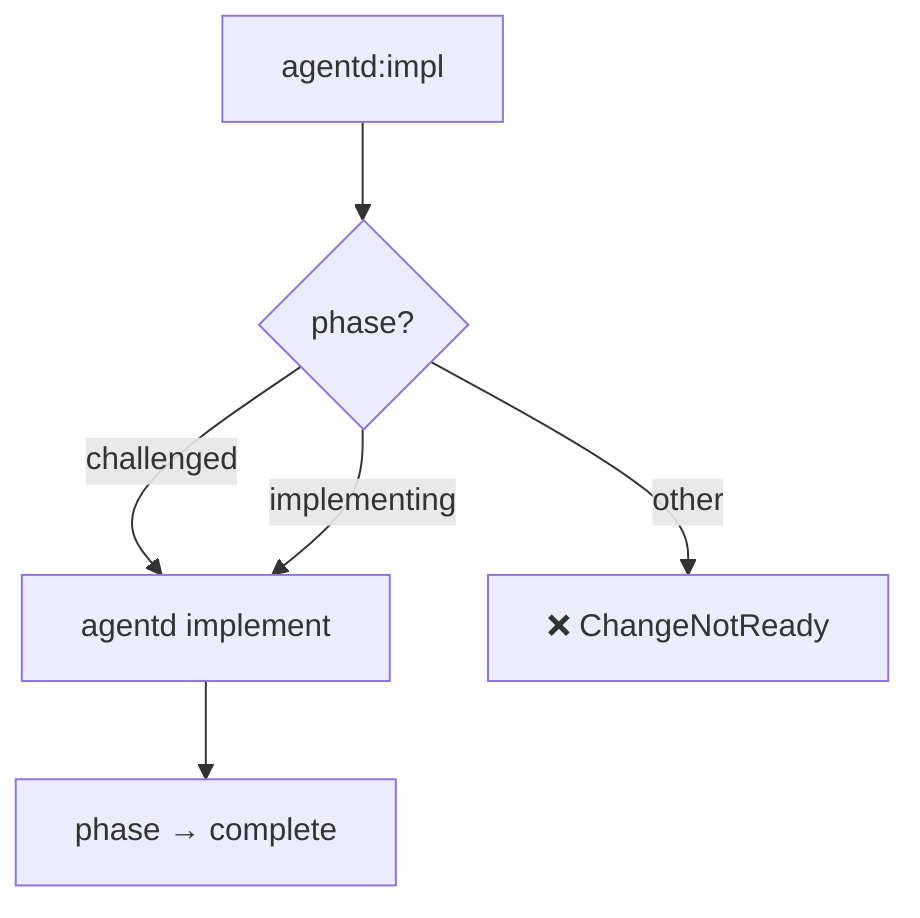
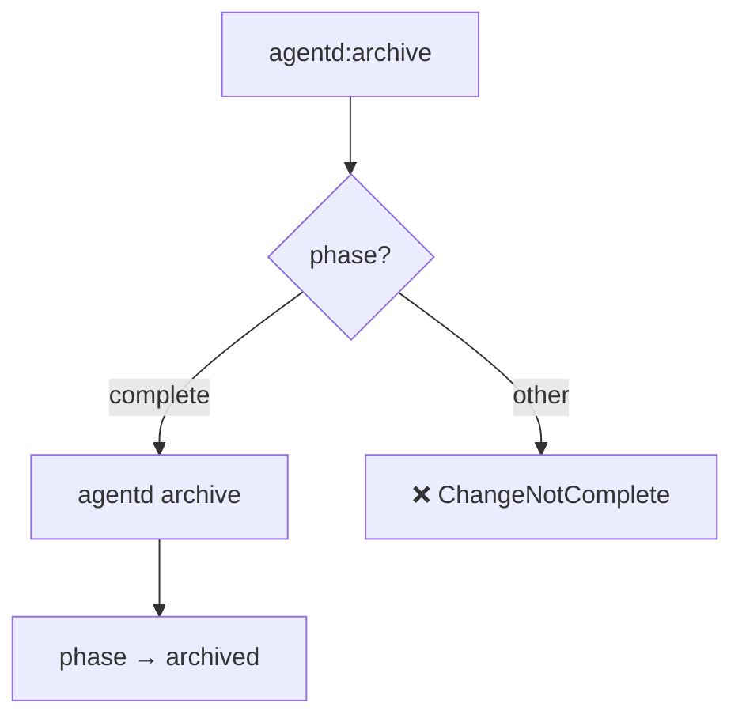

# Specification: High-Level Workflows

## Overview

This specification defines the behavior of the consolidated high-level Agentd workflows: `plan`, `impl`, and `archive`. These workflows automate transitions by inspecting only the `phase` field in `STATE.yaml`.

**Key Design Principle**: Workflow commands only check `phase`. The `challenge` command is responsible for updating `phase` based on verdict.

## Terminology

| Term | Definition | Examples |
|------|------------|----------|
| **workflow** | High-level orchestration | `plan`, `impl`, `archive` |
| **command** | CLI commands called by workflows | `proposal`, `challenge`, `reproposal`, `implement`, `review` |
| **phase** | State in STATE.yaml | `proposed`, `challenged`, `implementing`, `complete` |

## Requirements

### R1: Phase-Only State Machine

All workflow commands MUST determine their action solely based on the `phase` field in `STATE.yaml`. Valid phases are:

| Phase | Description |
|-------|-------------|
| `proposed` | Proposal exists, not yet challenged or needs revision |
| `challenged` | Challenge passed (APPROVED), ready for implementation |
| `rejected` | Challenge rejected, requires manual intervention |
| `implementing` | Implementation in progress |
| `complete` | Implementation finished, ready for archive |
| `archived` | Change archived |

### R2: Challenge Updates Phase

The `agentd challenge` command MUST update `STATE.yaml` phase based on verdict:

| Verdict | New Phase | Rationale |
|---------|-----------|-----------|
| `APPROVED` | `challenged` | Ready for implementation |
| `NEEDS_REVISION` | `proposed` | Stays in proposed, triggers reproposal |
| `REJECTED` | `rejected` | Fundamental issues, manual intervention needed |

**Note**: Review content is stored as a review block in `proposal.md` (not separate CHALLENGE.md).

### R3: Plan Workflow Orchestration

The `plan` workflow MUST orchestrate these commands in sequence:

1. **`proposal` command**: Sequential MCP generation (proposal.md → specs → tasks.md)
2. **`challenge` command**: Codex reviews and appends verdict to proposal.md
3. **`reproposal` command**: If NEEDS_REVISION, resume Gemini session to fix issues
4. Loop steps 2-3 up to `planning_iterations` times (default: 3)
5. Return result to Skill for user interaction via `AskUserQuestion`

**After Workflow Completion**: The Skill uses `AskUserQuestion` to let user choose:
- Open viewer (for manual review)
- Proceed to implementation (`/agentd:impl`)
- Continue fixing (for additional reproposal cycles)

**Phase-Based Entry Points**:
- If no STATE.yaml exists → run `agentd proposal` (requires description)
- If `phase: proposed` → run `agentd challenge` to continue the planning cycle
- If `phase: challenged` → inform user planning is complete, suggest `/agentd:impl`
- If `phase: rejected` → inform user of rejection, suggest manual review
- If `phase: implementing/complete/archived` → inform user change is beyond planning

### R4: Implementation Workflow Orchestration

The `impl` workflow MUST:
- If `phase: challenged` → run `agentd implement`
- If `phase: implementing` → continue with `agentd implement`
- Otherwise → return `ChangeNotReady` error with guidance

### R5: Archive Workflow Orchestration

The `archive` workflow MUST:
- If `phase: complete` → run `agentd archive`
- Otherwise → return `ChangeNotComplete` error

## Flow

### Phase State Machine


### Plan Workflow Logic



### Implementation Workflow Logic



### Archive Workflow Logic



## Interfaces

```
FUNCTION plan_workflow(change_id: String, description: Option<String>) -> Result<WorkflowAction, Error>
  INPUT: Change ID and optional description for initial proposal
  OUTPUT: Action taken (Proposed, Challenged, AlreadyComplete, etc.)
  ERRORS: ChangeNotFound, Rejected, MissingDescription (if no STATE.yaml and no description provided)

  Usage: /agentd:plan <change-id> ["<description>"]
  - Description is required for new changes (no STATE.yaml)
  - Description is ignored for existing changes

FUNCTION impl_workflow(change_id: String) -> Result<WorkflowAction, Error>
  INPUT: Change ID
  OUTPUT: Implementation status
  ERRORS: ChangeNotReady (if phase not in [challenged, implementing])

FUNCTION archive_workflow(change_id: String) -> Result<WorkflowAction, Error>
  INPUT: Change ID
  OUTPUT: Archival confirmation
  ERRORS: ChangeNotComplete (if phase != complete)
```

## Acceptance Criteria

### Scenario: Initial Planning
- **WHEN** `agentd:plan` is called for a new change-id with description
- **THEN** runs `agentd proposal` (sequential MCP: proposal.md → specs → tasks.md)
- **THEN** runs `agentd challenge` to get verdict
- **THEN** if NEEDS_REVISION, runs `agentd reproposal` and loops back to challenge (up to `planning_iterations`)
- **THEN** uses `AskUserQuestion` to let user choose next action

### Scenario: Planning with Reproposal Loop
- **WHEN** challenge verdict is NEEDS_REVISION
- **THEN** auto-runs `agentd reproposal` followed by `agentd challenge`
- **THEN** continues loop until APPROVED, REJECTED, or `planning_iterations` reached
- **THEN** uses `AskUserQuestion` with context-aware options:
  - If APPROVED or only minor issues remain: recommend implementation
  - If significant issues remain: recommend reviewing in viewer

### Scenario: Planning Complete
- **WHEN** `agentd:plan` is called with `phase: challenged`
- **THEN** informs user planning is complete, suggest `/agentd:impl`

### Scenario: Rejected Proposal
- **WHEN** `agentd:plan` is called with `phase: rejected`
- **THEN** informs user of rejection and suggests reviewing review block in proposal.md

### Scenario: Start Implementation
- **WHEN** `agentd:impl` is called with `phase: challenged`
- **THEN** runs `agentd implement` and sets `phase: implementing`

### Scenario: Continue Implementation
- **WHEN** `agentd:impl` is called with `phase: implementing`
- **THEN** continues `agentd implement`

### Scenario: Implementation Not Ready
- **WHEN** `agentd:impl` is called with `phase: proposed`
- **THEN** returns ChangeNotReady error

### Scenario: Archive Complete Change
- **WHEN** `agentd:archive` is called with `phase: complete`
- **THEN** runs `agentd archive` and sets `phase: archived`

### Scenario: Archive Not Ready
- **WHEN** `agentd:archive` is called with `phase: implementing`
- **THEN** returns ChangeNotComplete error
