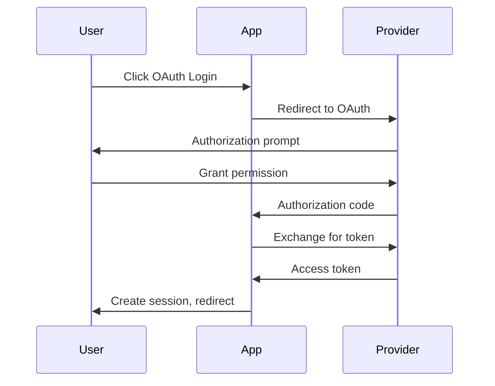

# RFC-001: Validation Enhancement for Document Pipeline

## Status

| Field | Value |
|-------|-------|
| RFC | 001 |
| Title | Validation Enhancement for Document Pipeline |
| Status | ✅ Approved |
| Created | 2024-01-14 |
| Updated | 2024-01-14 |
| Reviewers | Gemini (Architect) ✅, Codex (Code Reviewer) ✅ |

## Background

Agentd 的提案階段工作流程目前有以下問題：

1. **ValidationRules 沒有區分檔案類型** - proposal.md/tasks.md/specs/*.md 使用相同規則
2. **驗證結果沒有持久化** - 只有 console output，無法追蹤歷史
3. **Issue 解析太脆弱** - 字串比對容易因格式微小差異失敗
4. **缺少交叉驗證** - tasks.md 引用的 spec 可能不存在
5. **純 Markdown 自然語言難以機器解析** - 沒有結構化的 metadata 區塊

## Design Principles

### 混合格式策略

```
┌─────────────────────────────────────────┐
│  YAML Frontmatter (機器解析)            │  ← Schema 可驗證、serde_yaml 直接 deserialize
│  - metadata (id, version, timestamps)   │
│  - 結構化資料 (status, checksums)       │
│  - 摘要資訊 (counts, summaries)         │
├─────────────────────────────────────────┤
│  Inline YAML Blocks (混合解析)          │  ← 在 Markdown 中嵌入結構化資料
│  - Task definitions                     │
│  - Issue definitions                    │
│  - Requirement metadata                 │
├─────────────────────────────────────────┤
│  Markdown Body (人類閱讀)               │  ← 自然語言描述、圖表、範例
│  - 詳細說明                             │
│  - Mermaid diagrams                     │
│  - Code examples                        │
└─────────────────────────────────────────┘
```

### 驗證策略

| 區塊 | 驗證方式 | 工具 |
|------|----------|------|
| YAML Frontmatter | JSON Schema validation | `serde_yaml` + `jsonschema` |
| Inline YAML blocks | JSON Schema validation | 同上 |
| Markdown Body | AST + Regex | `pulldown-cmark` |
| Cross-references | Path existence check | `std::fs::exists` |
| Staleness | Checksum comparison | `sha256` |

---

## Proposed Changes

### 1. YAML Frontmatter for All Documents

#### 1.1 proposal.md

```yaml
---
# === Metadata ===
id: add-oauth-login
type: proposal
version: 2
created_at: 2024-01-14T10:00:00Z
updated_at: 2024-01-14T15:30:00Z
author: gemini

# === Status ===
status: challenged  # proposed | challenged | approved | rejected
iteration: 1

# === Summary (機器可讀摘要) ===
summary: "Add OAuth 2.0 login support for Google and GitHub"

impact:
  scope: major  # patch | minor | major
  affected_files: 12
  new_files: 4

# === Cross-references ===
affected_specs:
  - id: auth-spec
    path: specs/auth.md
  - id: user-session-spec
    path: specs/user-session.md

dependencies:
  external:
    - name: oauth2
      version: "^4.0"
    - name: reqwest
      version: "^0.11"
  internal:
    - user-service
    - session-manager

# === Risk Assessment ===
risks:
  - severity: medium
    category: complexity
    description: "Token refresh logic complexity"
  - severity: low
    category: testing
    description: "OAuth provider mocking for tests"
---

## Why

(自然語言描述為什麼需要這個改動...)

## What Changes

(自然語言描述改動內容...)

## Impact Analysis

(自然語言描述影響範圍...)
```

#### 1.2 tasks.md

```yaml
---
# === Metadata ===
id: add-oauth-login
type: tasks
version: 2
created_at: 2024-01-14T10:00:00Z
updated_at: 2024-01-14T15:30:00Z
proposal_ref: proposal.md

# === Summary ===
summary:
  total: 8
  completed: 0
  in_progress: 0
  blocked: 0
  pending: 8

# === Layer Breakdown ===
layers:
  data:
    task_count: 2
    estimated_files: 3
  logic:
    task_count: 4
    estimated_files: 6
  testing:
    task_count: 2
    estimated_files: 4
---

## Data Layer Tasks

### Task 1.1: Create OAuth Token Model

```yaml
task:
  id: "1.1"
  action: CREATE
  status: pending  # pending | in_progress | completed | blocked
  file: src/models/oauth_token.rs
  spec_ref: specs/auth.md#R1
  depends_on: []
  estimated_lines: 50
```

Create a new model to store OAuth tokens with the following fields...

### Task 1.2: Extend User Model

```yaml
task:
  id: "1.2"
  action: MODIFY
  status: pending
  file: src/models/user.rs
  spec_ref: specs/auth.md#R2
  depends_on: ["1.1"]
  estimated_lines: 20
```

Add OAuth provider fields to the existing User model...

## Logic Layer Tasks

### Task 2.1: Implement OAuth Flow

```yaml
task:
  id: "2.1"
  action: CREATE
  status: pending
  file: src/services/oauth.rs
  spec_ref: specs/auth.md#R3
  depends_on: ["1.1", "1.2"]
  estimated_lines: 200
```

(自然語言描述...)
```

#### 1.3 specs/*.md

```yaml
---
# === Metadata ===
id: auth-spec
type: spec
title: "Authentication Specification"
version: 3
created_at: 2024-01-14T10:00:00Z
updated_at: 2024-01-14T15:30:00Z

# === Hierarchy ===
parent_spec: null
child_specs: []
related_specs:
  - id: user-session-spec
    path: user-session.md

# === Requirements Summary ===
requirements:
  total: 5
  ids: ["R1", "R2", "R3", "R4", "R5"]
  by_priority:
    high: 2
    medium: 2
    low: 1

# === Technical Design Elements ===
design_elements:
  has_mermaid: true
  has_json_schema: true
  has_pseudo_code: false
  has_api_spec: true
---

## Overview

(自然語言描述...)

## Requirements

### R1: OAuth Provider Support

```yaml
requirement:
  id: R1
  priority: high
  status: draft  # draft | reviewed | approved
  scenarios: 3
  acceptance_criteria: 2
```

The system SHALL support OAuth 2.0 authentication...

#### Scenario: Successful Google Login

- **WHEN** user clicks "Login with Google"
- **AND** user authorizes the application
- **THEN** system creates a new session
- **AND** redirects to dashboard

## Technical Design

### Sequence Diagram



### Data Schema

```json
{
  "$schema": "http://json-schema.org/draft-07/schema#",
  "type": "object",
  "properties": {
    "provider": { "enum": ["google", "github"] },
    "access_token": { "type": "string" },
    "refresh_token": { "type": "string" },
    "expires_at": { "type": "string", "format": "date-time" }
  },
  "required": ["provider", "access_token"]
}
```
```

#### 1.4 CHALLENGE.md

```yaml
---
# === Metadata ===
id: add-oauth-login-challenge
type: challenge
version: 1
created_at: 2024-01-14T12:00:00Z
challenger: codex
change_ref: add-oauth-login

# === Verdict (機器必讀) ===
verdict: NEEDS_REVISION  # APPROVED | NEEDS_REVISION | REJECTED
verdict_reason: "Security concerns in token handling"

# === Issue Summary ===
issues:
  total: 4
  high: 1
  medium: 2
  low: 1
  by_category:
    security: 1
    consistency: 2
    performance: 0
    missing: 1

# === Source Checksums (Staleness Detection) ===
source_checksums:
  proposal.md: "sha256:a1b2c3d4e5f6..."
  tasks.md: "sha256:b2c3d4e5f6a1..."
  specs/auth.md: "sha256:c3d4e5f6a1b2..."
---

## Summary

This challenge reviewed the OAuth login proposal and identified 4 issues...

## Issues

### Issue 1: Missing Token Expiration Handling

```yaml
issue:
  id: 1
  severity: high
  category: security
  location:
    file: specs/auth.md
    line: 45
    section: "R3"
  affects_requirements: ["R2", "R3"]
  auto_fixable: false
```

**Description**: The specification does not address token expiration and refresh logic...

**Suggestion**: Add a new requirement R6 for token lifecycle management...

**Example Fix**:
```rust
// Add to oauth.rs
fn refresh_token_if_expired(token: &OAuthToken) -> Result<OAuthToken> {
    if token.is_expired() {
        return self.refresh(token);
    }
    Ok(token.clone())
}
```

### Issue 2: Inconsistent Error Handling

```yaml
issue:
  id: 2
  severity: medium
  category: consistency
  location:
    file: tasks.md
    line: 23
    section: "Task 2.1"
  affects_requirements: ["R1"]
  auto_fixable: true
```

**Description**: Task 2.1 doesn't specify error handling approach...

**Suggestion**: Reference the project's standard error handling pattern...
```

#### 1.5 STATE.yaml

```yaml
---
# === Metadata ===
change_id: add-oauth-login
schema_version: "1.0"
created_at: 2024-01-14T10:00:00Z
updated_at: 2024-01-14T15:30:00Z

# === Current State ===
phase: challenged  # proposed | challenged | implementing | testing | complete | archived
iteration: 1
last_action: validate-challenge

# === File Checksums (Staleness Detection) ===
checksums:
  proposal.md:
    hash: "sha256:a1b2c3d4e5f6..."
    validated_at: 2024-01-14T10:05:00Z
  tasks.md:
    hash: "sha256:b2c3d4e5f6a1..."
    validated_at: 2024-01-14T10:05:00Z
  specs/auth.md:
    hash: "sha256:c3d4e5f6a1b2..."
    validated_at: 2024-01-14T10:05:00Z
  CHALLENGE.md:
    hash: "sha256:d4e5f6a1b2c3..."
    validated_at: 2024-01-14T12:30:00Z

# === Validation History ===
validations:
  - step: validate-proposal
    timestamp: 2024-01-14T10:05:00Z
    rules_version: "1.0"
    rules_hash: "abc123"
    mode: normal  # normal | strict
    result:
      valid: true
      high: 0
      medium: 2
      low: 1
    errors: []
    warnings:
      - "Missing risk assessment for external dependencies"
      - "Estimated lines not specified for Task 1.2"

  - step: validate-challenge
    timestamp: 2024-01-14T12:30:00Z
    rules_version: "1.0"
    rules_hash: "abc123"
    mode: normal
    result:
      valid: true
      verdict: NEEDS_REVISION
      issues_parsed: 4
    errors: []

# === LLM Telemetry (Optional) ===
telemetry:
  proposal:
    model: gemini-2.0-flash
    tokens_in: 45000
    tokens_out: 3200
    duration_ms: 12500
  challenge:
    model: codex
    tokens_in: 28000
    tokens_out: 1800
    duration_ms: 8200
```

---

### 2. File-Type Specific Validation Schema

```toml
# agentd/config.toml

[validation]
schema_version = "2.0"  # v2 format with file-type specific sections
strict_mode = false

[validation.proposal]
# Frontmatter required fields
required_frontmatter = ["id", "type", "version", "status", "summary", "affected_specs"]
# Markdown required sections
required_sections = ["Why", "What Changes"]
# Constraints
min_summary_length = 20
max_risks_without_mitigation = 2

[validation.tasks]
required_frontmatter = ["id", "type", "version", "summary", "layers"]
required_sections = ["Data Layer Tasks", "Logic Layer Tasks", "Testing Tasks"]
# Task block validation
task_required_fields = ["id", "action", "status", "file", "spec_ref"]
valid_actions = ["CREATE", "MODIFY", "DELETE", "RENAME"]
valid_statuses = ["pending", "in_progress", "completed", "blocked"]

[validation.specs]
required_frontmatter = ["id", "type", "title", "version", "requirements"]
required_sections = ["Overview", "Requirements"]
# Requirement ID pattern (matches "R1", "R2", etc. in headings like "### R1: Title")
requirement_pattern = "^R\\d+$"  # ID only, without trailing colon
requirement_required_fields = ["id", "priority", "status"]
require_scenarios = true
min_scenarios_per_requirement = 1

[validation.challenge]
required_frontmatter = ["id", "type", "version", "verdict", "issues", "source_checksums"]
required_sections = ["Issues"]
# Issue block validation
issue_required_fields = ["id", "severity", "category", "location"]
valid_severities = ["high", "medium", "low"]
valid_categories = ["security", "performance", "consistency", "missing", "unclear"]
# Verdict validation
valid_verdicts = ["APPROVED", "NEEDS_REVISION", "REJECTED"]
```

---

### 3. JSON Schema Definitions

為每種文件定義 JSON Schema，用於驗證 frontmatter：

```
agentd/
├── schemas/
│   ├── proposal.schema.json
│   ├── tasks.schema.json
│   ├── spec.schema.json
│   ├── challenge.schema.json
│   └── state.schema.json
```

#### Example: challenge.schema.json

```json
{
  "$schema": "http://json-schema.org/draft-07/schema#",
  "$id": "https://agentd.dev/schemas/challenge.schema.json",
  "title": "Challenge Document",
  "type": "object",
  "required": ["id", "type", "version", "verdict", "issues", "source_checksums"],
  "properties": {
    "id": {
      "type": "string",
      "pattern": "^[a-z0-9-]+-challenge$"
    },
    "type": {
      "const": "challenge"
    },
    "version": {
      "type": "integer",
      "minimum": 1
    },
    "verdict": {
      "enum": ["APPROVED", "NEEDS_REVISION", "REJECTED"]
    },
    "issues": {
      "type": "object",
      "required": ["total", "high", "medium", "low"],
      "properties": {
        "total": { "type": "integer", "minimum": 0 },
        "high": { "type": "integer", "minimum": 0 },
        "medium": { "type": "integer", "minimum": 0 },
        "low": { "type": "integer", "minimum": 0 }
      }
    },
    "source_checksums": {
      "type": "object",
      "additionalProperties": {
        "type": "string",
        "pattern": "^sha256:[a-f0-9]{64}$"
      }
    }
  }
}
```

---

### 4. Structured Parsing Implementation

#### 4.1 Frontmatter Parser

**Requirements** (addressing Codex review):
- Handle BOM (Byte Order Mark) at file start
- Normalize line endings (CRLF → LF)
- Handle YAML multiline strings containing `---`
- Require closing `---` at line start (column 0)

```rust
// src/parser/frontmatter.rs

use serde::de::DeserializeOwned;
use serde_yaml;
use regex::Regex;

pub struct ParsedDocument<T> {
    pub frontmatter: T,
    pub body: String,
    pub raw_frontmatter: String,
}

pub fn parse_document<T: DeserializeOwned>(content: &str) -> Result<ParsedDocument<T>> {
    // Step 1: Normalize content
    let normalized = normalize_content(content);

    // Step 2: Split frontmatter from body
    let (frontmatter_str, body) = split_frontmatter(&normalized)?;

    // Step 3: Parse YAML
    let frontmatter: T = serde_yaml::from_str(&frontmatter_str)
        .context("Failed to parse YAML frontmatter")?;

    Ok(ParsedDocument {
        frontmatter,
        body: body.to_string(),
        raw_frontmatter: frontmatter_str.to_string(),
    })
}

/// Normalize content: strip BOM, normalize line endings
fn normalize_content(content: &str) -> String {
    let mut s = content.to_string();

    // Strip UTF-8 BOM if present
    if s.starts_with('\u{FEFF}') {
        s = s[3..].to_string();
    }

    // Normalize line endings: CRLF -> LF, CR -> LF
    s = s.replace("\r\n", "\n").replace("\r", "\n");

    s
}

/// Split frontmatter from body
/// Frontmatter must:
/// - Start with `---` at line 1, column 0
/// - End with `---` at column 0 (not inside YAML multiline string)
fn split_frontmatter(content: &str) -> Result<(String, String)> {
    if !content.starts_with("---\n") && !content.starts_with("---\r") {
        bail!("Document must start with YAML frontmatter (---)")
    }

    // Find closing --- that is at the start of a line
    // Use regex to find \n--- followed by \n or EOF
    let re = Regex::new(r"\n---[ \t]*\n|\n---[ \t]*$")?;

    let search_start = 4; // Skip opening ---\n
    if let Some(m) = re.find(&content[search_start..]) {
        let frontmatter_end = search_start + m.start();
        let body_start = search_start + m.end();

        let frontmatter = content[4..frontmatter_end].to_string();
        let body = if body_start < content.len() {
            content[body_start..].to_string()
        } else {
            String::new()
        };

        Ok((frontmatter, body))
    } else {
        bail!("Frontmatter not properly closed (--- must be at line start)")
    }
}
```

#### 4.2 Inline YAML Block Parser (AST-based)

**Requirements** (addressing Codex review):
- Use `pulldown-cmark` AST instead of regex
- Support both `yaml` and `yml` info strings
- Support info strings with attributes (`yaml {.task}`)
- Handle nested code blocks gracefully

```rust
// src/parser/inline_yaml.rs

use pulldown_cmark::{Parser, Event, Tag, CodeBlockKind, Options};
use serde::de::DeserializeOwned;

/// Extracted YAML block with context
pub struct YamlBlock {
    pub content: String,
    pub info_string: String,
    pub line_number: Option<usize>,
}

/// Extract all YAML/YML fenced code blocks using markdown AST
pub fn extract_yaml_blocks_ast(content: &str) -> Vec<YamlBlock> {
    let mut options = Options::empty();
    options.insert(Options::ENABLE_STRIKETHROUGH);

    let parser = Parser::new_ext(content, options);
    let mut blocks = Vec::new();
    let mut current_block: Option<(String, String)> = None; // (info_string, content)

    for event in parser {
        match event {
            Event::Start(Tag::CodeBlock(CodeBlockKind::Fenced(info))) => {
                let info_str = info.to_string();
                // Match yaml, yml, yaml {attrs}, yml {attrs}
                if info_str.starts_with("yaml") || info_str.starts_with("yml") {
                    current_block = Some((info_str, String::new()));
                }
            }
            Event::Text(text) => {
                if let Some((_, ref mut content)) = current_block {
                    content.push_str(&text);
                }
            }
            Event::End(Tag::CodeBlock(CodeBlockKind::Fenced(_))) => {
                if let Some((info_string, content)) = current_block.take() {
                    blocks.push(YamlBlock {
                        content,
                        info_string,
                        line_number: None, // Can be enhanced with offset tracking
                    });
                }
            }
            _ => {}
        }
    }

    blocks
}

/// Parse typed YAML blocks (task, issue, requirement)
pub fn parse_typed_yaml_blocks<T: DeserializeOwned>(
    content: &str,
    block_type: &str,  // "task", "issue", "requirement"
) -> Result<Vec<(T, Option<usize>)>> {
    let blocks = extract_yaml_blocks_ast(content);
    let mut results = Vec::new();

    for block in blocks {
        // Parse YAML first, then check if it contains the expected type key
        // This handles blocks with leading comments, whitespace, or document markers (---)
        match serde_yaml::from_str::<serde_yaml::Value>(&block.content) {
            Ok(value) => {
                // Check if the parsed YAML has the expected type key at root level
                if let Some(typed_value) = value.get(block_type) {
                    match serde_yaml::from_value::<T>(typed_value.clone()) {
                        Ok(parsed) => results.push((parsed, block.line_number)),
                        Err(e) => {
                            // Log warning but continue parsing other blocks
                            eprintln!("Warning: Failed to parse {} block: {}", block_type, e);
                        }
                    }
                }
                // If block doesn't have the type key, silently skip (not an error)
            }
            Err(e) => {
                // Only warn if the block looks like it should be our type
                // (contains the type key somewhere in the raw content)
                if block.content.contains(&format!("{}:", block_type)) {
                    eprintln!("Warning: Invalid YAML in potential {} block: {}", block_type, e);
                }
                // Otherwise silently skip - it's just a different kind of YAML block
            }
        }
    }

    Ok(results)
}
```

#### 4.3 Checksum Calculation (with Normalization)

**Requirements** (addressing Codex & Gemini review):
- Normalize content before hashing to avoid false positives
- Trim trailing whitespace per line
- Normalize line endings
- Optionally ignore frontmatter-only changes

```rust
// src/parser/checksum.rs

use sha2::{Sha256, Digest};

/// Normalize content for checksum calculation
/// This prevents false "stale" detection from whitespace-only changes
fn normalize_for_checksum(content: &str) -> String {
    content
        // Normalize line endings
        .replace("\r\n", "\n")
        .replace("\r", "\n")
        // Split into lines, trim trailing whitespace, rejoin
        .lines()
        .map(|line| line.trim_end())
        .collect::<Vec<_>>()
        .join("\n")
        // Remove trailing newlines
        .trim_end()
        .to_string()
}

/// Calculate checksum of normalized content
pub fn calculate_checksum(content: &str) -> String {
    let normalized = normalize_for_checksum(content);
    let mut hasher = Sha256::new();
    hasher.update(normalized.as_bytes());
    format!("sha256:{:x}", hasher.finalize())
}

/// Check if content has changed since last validation
pub fn is_stale(recorded_checksum: &str, current_content: &str) -> bool {
    let current_checksum = calculate_checksum(current_content);
    recorded_checksum != current_checksum
}

/// Calculate checksum of body only (excluding frontmatter)
/// Useful when frontmatter metadata changes shouldn't trigger re-validation
pub fn calculate_body_checksum(content: &str) -> Result<String> {
    // Step 1: Normalize content BEFORE splitting frontmatter
    // This ensures BOM/CRLF are handled before split_frontmatter
    let normalized = normalize_for_checksum(content);

    // Step 2: Split frontmatter from normalized content
    let (_, body) = crate::parser::frontmatter::split_frontmatter(&normalized)?;

    // Step 3: Calculate checksum (normalize_for_checksum is idempotent)
    Ok(calculate_checksum(&body))
}

#[cfg(test)]
mod tests {
    use super::*;

    #[test]
    fn test_whitespace_normalization() {
        let content1 = "line1\nline2  \nline3\n\n";
        let content2 = "line1\nline2\nline3";
        assert_eq!(calculate_checksum(content1), calculate_checksum(content2));
    }

    #[test]
    fn test_crlf_normalization() {
        let content1 = "line1\r\nline2\r\n";
        let content2 = "line1\nline2\n";
        assert_eq!(calculate_checksum(content1), calculate_checksum(content2));
    }
}
```

---

### 5. Cross-File Validation

#### 5.1 Validation Timing

| Phase | Validator | Mode | Behavior |
|-------|-----------|------|----------|
| After Proposal | `validate_frontmatter` | Hard | Block if invalid schema |
| After Proposal | `validate_task_spec_refs` | Soft | Warn if specs not yet created |
| Pre-Challenge | `validate_consistency` | Hard | Block if HIGH errors |
| Post-Reproposal | `validate_all` | Hard | Full validation |
| Pre-Implement | `validate_checksums` | Hard | Block if stale |

#### 5.2 ConsistencyValidator

**Requirements** (addressing Codex review):
- Validate both file existence AND anchor existence
- Support both heading-based anchors (`#R1`) and inline YAML requirement IDs
- Normalize paths for cross-platform compatibility

```rust
pub struct ConsistencyValidator;

/// Parsed spec reference
struct SpecRef {
    file_path: String,      // e.g., "specs/auth.md"
    anchor: Option<String>, // e.g., "R1" (without #)
}

impl SpecRef {
    fn parse(spec_ref: &str) -> Self {
        if let Some((path, anchor)) = spec_ref.split_once('#') {
            SpecRef {
                file_path: path.to_string(),
                anchor: Some(anchor.to_string()),
            }
        } else {
            SpecRef {
                file_path: spec_ref.to_string(),
                anchor: None,
            }
        }
    }
}

impl ConsistencyValidator {
    /// 驗證 tasks.md 引用的 spec 檔案和 anchor 都存在
    pub fn validate_task_spec_refs(&self, change_dir: &Path) -> Result<Vec<ValidationError>> {
        let tasks = parse_tasks(change_dir)?;
        let mut errors = Vec::new();

        for task in tasks.inline_tasks {
            if let Some(spec_ref_str) = &task.spec_ref {
                let spec_ref = SpecRef::parse(spec_ref_str);

                // Normalize path (handle ../, case sensitivity)
                let spec_path = normalize_path(&change_dir.join(&spec_ref.file_path));

                // Check 1: File exists
                if !spec_path.exists() {
                    errors.push(ValidationError::new(
                        format!("Task {} references non-existent spec file: {}", task.id, spec_ref.file_path),
                        Severity::High,
                        ErrorCategory::BrokenReference,
                    ));
                    continue;
                }

                // Check 2: Anchor exists (if specified)
                if let Some(anchor) = &spec_ref.anchor {
                    if !self.anchor_exists(&spec_path, anchor)? {
                        errors.push(ValidationError::new(
                            format!(
                                "Task {} references non-existent anchor #{} in {}",
                                task.id, anchor, spec_ref.file_path
                            ),
                            Severity::High,
                            ErrorCategory::BrokenReference,
                        ));
                    }
                }
            }
        }

        Ok(errors)
    }

    /// Check if anchor exists in spec file
    /// Anchors can be:
    /// 1. Markdown headings: `# R1`, `## R1`, `### R1: Title` → anchor "R1"
    /// 2. Inline YAML requirement blocks: `requirement.id: R1` → anchor "R1"
    fn anchor_exists(&self, spec_path: &Path, anchor: &str) -> Result<bool> {
        let content = std::fs::read_to_string(spec_path)?;

        // Method 1: Check markdown headings (any level 1-6)
        // Pattern: ^#{1,6}\s+R1[:\s] or ^#{1,6}\s+R1$ (end of line)
        // Note: (?m) enables multiline mode so ^ matches line start, not just string start
        let heading_pattern = format!(r"(?m)^#{{1,6}}\s+{}[:\s]|(?m)^#{{1,6}}\s+{}$",
            regex::escape(anchor), regex::escape(anchor));
        let heading_re = Regex::new(&heading_pattern)?;
        if heading_re.is_match(&content) {
            return Ok(true);
        }

        // Method 2: Check inline YAML requirement blocks
        let requirements = parse_typed_yaml_blocks::<RequirementBlock>(&content, "requirement")?;
        for (req, _) in requirements {
            if req.id == anchor {
                return Ok(true);
            }
        }

        Ok(false)
    }

    /// 驗證 proposal 的 affected_specs 與實際 specs/ 目錄一致
    pub fn validate_proposal_spec_alignment(&self, change_dir: &Path) -> Result<Vec<ValidationError>> {
        let proposal_path = change_dir.join("proposal.md");
        let proposal = parse_document::<ProposalFrontmatter>(&std::fs::read_to_string(&proposal_path)?)?;

        let mut errors = Vec::new();

        // Check each affected_spec exists
        for spec in &proposal.frontmatter.affected_specs {
            let spec_path = change_dir.join(&spec.path);
            if !spec_path.exists() {
                errors.push(ValidationError::new(
                    format!("Proposal references non-existent spec: {}", spec.path),
                    Severity::Medium,
                    ErrorCategory::BrokenReference,
                ));
            }
        }

        // Check for orphan specs (files in specs/ not listed in affected_specs)
        let specs_dir = change_dir.join("specs");
        if specs_dir.exists() {
            for entry in walkdir::WalkDir::new(&specs_dir)
                .into_iter()
                .filter_map(|e| e.ok())
                .filter(|e| e.path().extension().map_or(false, |ext| ext == "md"))
            {
                let rel_path = entry.path().strip_prefix(change_dir)?.to_string_lossy();
                let is_listed = proposal.frontmatter.affected_specs
                    .iter()
                    .any(|s| s.path == rel_path);

                if !is_listed {
                    errors.push(ValidationError::new(
                        format!("Spec file {} not listed in proposal.affected_specs", rel_path),
                        Severity::Low,
                        ErrorCategory::Inconsistency,
                    ));
                }
            }
        }

        Ok(errors)
    }

    /// 驗證 task dependencies 無循環
    pub fn validate_task_dependencies(&self, change_dir: &Path) -> Result<Vec<ValidationError>>;

    /// 驗證 checksums 確保文件未被修改
    pub fn validate_checksums(&self, state: &State, change_dir: &Path) -> Result<Vec<ValidationError>>;
}

/// Normalize path for cross-platform compatibility
fn normalize_path(path: &Path) -> PathBuf {
    // Resolve ../ and ./
    // Convert to lowercase on case-insensitive systems (optional)
    path.canonicalize().unwrap_or_else(|_| path.to_path_buf())
}
```

---

### 6. CLI Flag Support

```bash
# 正常模式 (Medium/Low 警告但不阻止)
agentd validate-proposal my-change

# 嚴格模式 (任何錯誤都阻止)
agentd validate-proposal my-change --strict

# 只驗證 frontmatter schema
agentd validate-proposal my-change --schema-only

# 顯示詳細驗證過程
agentd validate-proposal my-change --verbose

# 輸出 JSON 格式結果
agentd validate-proposal my-change --json
```

---

### 7. Config Migration Strategy

**Requirements** (addressing Codex review):
- Backward compatible with existing `[validation]` config
- Clear migration path from v1 to v2 schema
- Auto-detection of config version

#### 7.1 Config Schema Evolution

**Current (v1)**: Single `[validation]` section for all file types

```toml
# agentd/config.toml (v1 - legacy)
[validation]
required_headings = ["Specification:", "Overview", "Requirements"]
requirement_pattern = '^R\d+:'
scenario_pattern = "^Scenario:"
```

**Proposed (v2)**: File-type specific sections with version marker

```toml
# agentd/config.toml (v2 - new)
[validation]
schema_version = "2.0"
strict_mode = false

[validation.proposal]
required_frontmatter = ["id", "type", "version", "status", "summary"]
required_sections = ["Why", "What Changes"]

[validation.tasks]
required_frontmatter = ["id", "type", "version", "summary"]
task_required_fields = ["id", "action", "status", "file"]

[validation.specs]
required_frontmatter = ["id", "type", "title", "version"]
required_sections = ["Overview", "Requirements"]
requirement_pattern = "^R\\d+$"  # ID only (consistent with Section 2)

[validation.challenge]
required_frontmatter = ["id", "type", "version", "verdict", "issues"]
```

#### 7.2 Backward Compatibility

```rust
// src/models/validation_config.rs

use serde::{Deserialize, Serialize};

/// Unified validation config that handles both v1 and v2
#[derive(Debug, Clone, Deserialize, Serialize)]
#[serde(untagged)]
pub enum ValidationConfig {
    V2(ValidationConfigV2),
    V1(ValidationConfigV1),
}

impl ValidationConfig {
    /// Load config with auto-detection
    pub fn load(config_path: &Path) -> Result<Self> {
        let content = std::fs::read_to_string(config_path)?;
        let raw: toml::Value = toml::from_str(&content)?;

        // Check for schema_version marker
        if let Some(validation) = raw.get("validation") {
            if validation.get("schema_version").is_some() {
                // V2 format
                return Ok(ValidationConfig::V2(toml::from_str(&content)?));
            }
        }

        // Fall back to V1
        Ok(ValidationConfig::V1(toml::from_str(&content)?))
    }

    /// Convert to unified rules (V1 gets converted to V2 internally)
    pub fn to_unified_rules(&self) -> ValidationRulesV2 {
        match self {
            ValidationConfig::V2(v2) => v2.validation.clone(),
            ValidationConfig::V1(v1) => Self::migrate_v1_to_v2(&v1.validation),
        }
    }

    /// Migrate V1 config to V2 format
    fn migrate_v1_to_v2(v1: &ValidationRulesV1) -> ValidationRulesV2 {
        ValidationRulesV2 {
            schema_version: "2.0".to_string(),
            strict_mode: false,
            proposal: ProposalValidation::default(),
            tasks: TasksValidation::default(),
            specs: SpecsValidation {
                required_frontmatter: vec!["id".into(), "type".into(), "title".into()],
                required_sections: v1.required_headings.clone(),
                requirement_pattern: v1.requirement_pattern.clone(),
                scenario_pattern: Some(v1.scenario_pattern.clone()),
                require_when_then: v1.require_when_then,
                ..Default::default()
            },
            challenge: ChallengeValidation::default(),
        }
    }
}

/// V1 config structure (legacy)
#[derive(Debug, Clone, Deserialize, Serialize)]
pub struct ValidationConfigV1 {
    pub validation: ValidationRulesV1,
}

#[derive(Debug, Clone, Deserialize, Serialize)]
pub struct ValidationRulesV1 {
    pub required_headings: Vec<String>,
    pub requirement_pattern: String,
    pub scenario_pattern: String,
    #[serde(default)]
    pub require_when_then: bool,
}

/// V2 config structure (new)
#[derive(Debug, Clone, Deserialize, Serialize)]
pub struct ValidationConfigV2 {
    pub validation: ValidationRulesV2,
}

#[derive(Debug, Clone, Deserialize, Serialize)]
pub struct ValidationRulesV2 {
    pub schema_version: String,
    #[serde(default)]
    pub strict_mode: bool,
    #[serde(default)]
    pub proposal: ProposalValidation,
    #[serde(default)]
    pub tasks: TasksValidation,
    #[serde(default)]
    pub specs: SpecsValidation,
    #[serde(default)]
    pub challenge: ChallengeValidation,
}
```

#### 7.3 Migration CLI Command

```bash
# Check current config version
agentd config --version
# Output: Config version: v1 (legacy)

# Migrate to v2 format
agentd config migrate --backup
# Output:
# ✅ Backed up agentd/config.toml to agentd/config.toml.v1.backup
# ✅ Migrated to v2 format
# ⚠️  Please review [validation.proposal] and [validation.tasks] sections

# Validate config
agentd config validate
# Output: ✅ Config is valid (schema version 2.0)
```

#### 7.4 Deprecation Timeline

| Phase | Action |
|-------|--------|
| v0.2.0 | Introduce v2 config, v1 still works with warning |
| v0.3.0 | v1 config shows deprecation warning on every run |
| v0.4.0 | v1 config no longer supported, must migrate |

---

## Implementation Order

1. **Phase 1**: Frontmatter design & JSON Schema definitions
2. **Phase 2**: Frontmatter parser + schema validation
3. **Phase 3**: STATE.yaml persistence with checksums
4. **Phase 4**: Inline YAML block parsing (tasks, issues, requirements)
5. **Phase 5**: Cross-file consistency validation
6. **Phase 6**: CLI flags (--strict, --verbose, --json)

---

## Review Feedback

### Round 1: Gemini (Architect)

1. **Stale State Problem** ✅ Addressed
   - Added `checksums` section in STATE.yaml
   - Added `source_checksums` in CHALLENGE.md frontmatter

2. **Config Polymorphism** ✅ Addressed
   - Separate validation sections per file type in config.toml
   - JSON Schema per document type

3. **Cross-file Validation Performance** ✅ Addressed
   - Added validation timing table
   - Soft/Hard mode distinction

### Round 1: Codex (Code Reviewer)

1. **Canonical Issue Format** ✅ Addressed
   - Defined inline YAML block format for issues
   - Schema validation for issue fields

2. **Edge Cases** ✅ Addressed
   - Path case-sensitivity: Use normalized paths
   - Mixed formats (1.1 vs 1-1): Define strict pattern in schema
   - Relative vs absolute paths: Always use relative from change_dir

### Round 2: Gemini (Architect) - Final Review

**Verdict: ✅ APPROVED**

Additional suggestions for implementation:
1. **Checksum Normalization** - Hash after normalizing whitespace (now implemented in Section 4.3)
2. **Auto-Update Summaries** - `agentd validate` should auto-update frontmatter statistics

### Round 2: Codex (Code Reviewer) - Final Review

**Issues Identified & Fixes Applied:**

| Issue | Severity | Status | Fix Location |
|-------|----------|--------|--------------|
| Inline YAML regex too fragile | 🔴 High | ✅ Fixed | Section 4.2 - Changed to pulldown-cmark AST |
| Frontmatter split doesn't handle BOM/CRLF | 🔴 High | ✅ Fixed | Section 4.1 - Added normalize_content() |
| Config v1/v2 incompatibility | 🟡 Medium | ✅ Fixed | Section 7 - Added migration strategy |
| requirement_pattern inconsistent | 🟡 Medium | ✅ Fixed | Section 7.1 - Aligned patterns |
| Cross-file doesn't validate anchors | 🟡 Medium | ✅ Fixed | Section 5.2 - Added anchor_exists() |
| Checksum doesn't normalize | 🟢 Low | ✅ Fixed | Section 4.3 - Added normalize_for_checksum() |

**Open Questions Resolved:**

| Question | Resolution |
|----------|------------|
| Accept `yml` / `yaml {attrs}`? | ✅ Yes, via AST info_string matching |
| `spec_ref` anchor validation? | ✅ Yes, validates both heading and inline YAML anchors |

**Verdict: Pending re-review after fixes**

### Round 3: Codex (Code Reviewer) - Issues & Fixes

| Issue | Severity | Status | Fix |
|-------|----------|--------|-----|
| `anchor_exists` regex 沒有 `(?m)` 且只匹配 `###` | 🟡 Medium | ✅ Fixed | 加入 `(?m)` multiline mode，改為 `#{1,6}` 匹配所有標題層級 |
| `calculate_body_checksum` 沒有先 normalize | 🟡 Medium | ✅ Fixed | 在 split_frontmatter 前先呼叫 normalize_for_checksum |
| `schema_version` 1.0 vs 2.0 不一致 | 🟢 Low | ✅ Fixed | 統一為 "2.0" |
| `requirement_pattern` 有兩套規則 | 🟢 Low | ✅ Fixed | 統一為 `^R\\d+$` |
| `parse_typed_yaml_blocks` prefix 檢查漏掉有效 block | 🟢 Low | ✅ Fixed | 改為先 parse YAML 再檢查 key 是否存在 |

**Verdict: ✅ APPROVED**

---

## Risks & Mitigations

| Risk | Mitigation |
|------|------------|
| Existing documents without frontmatter | Migration script to add frontmatter from content |
| AI generates incorrect frontmatter | Schema validation catches errors immediately |
| Checksum mismatch false positives | Only compare semantic content, ignore whitespace |
| Performance overhead | Cache parsed frontmatter in memory during session |
| Schema evolution | Version field in schema, backward compatible defaults |

---

## Migration Path

### For Existing Changes

```bash
# Add frontmatter to existing documents
agentd migrate my-change

# Validate migrated documents
agentd validate-proposal my-change --verbose
```

### Skeleton Templates Update

Update `src/context.rs` skeleton generators to include frontmatter:

```rust
fn create_proposal_skeleton(change_dir: &Path, change_id: &str) -> Result<()> {
    let skeleton = format!(r#"---
id: {change_id}
type: proposal
version: 1
created_at: {timestamp}
updated_at: {timestamp}
author: gemini
status: proposed
iteration: 1
summary: "[AI will fill this]"
affected_specs: []
---

## Why

[Describe why this change is needed...]
"#);
    // ...
}
```
